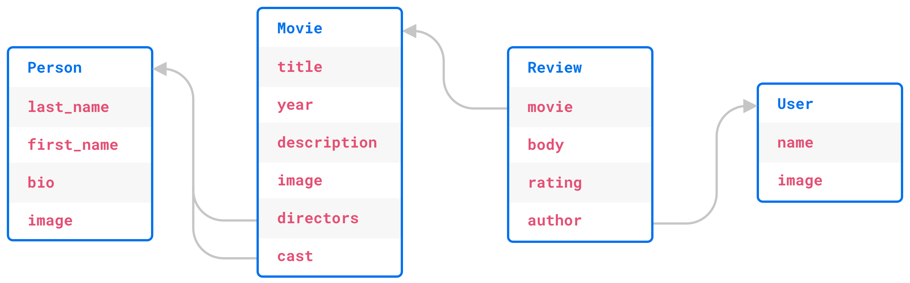

.. blog:authors:: yury elvis
.. blog:published-on:: 2019-04-11 04:00 PM EST
.. blog:lead-image:: images/reactor.jpg
.. blog:guid:: 70356c44-5992-11e9-9058-784f439c9965
.. blog:description::
    EdgeDB 1.0 alpha 1 is is available for immediate download.
    The post is a brief overview of what's new.  We explore creating
    a simple app and compare the usability and performance of
    EdgeDB to that of different databases and ORMs.

==================
EdgeDB 1.0 Alpha 1
==================

We are happy to announce that EdgeDB 1.0 alpha 1 is available for
immediate `download <download_>`_.

This post is a brief overview of what's new.  We explore creating
a simple app and compare the usability and performance of EdgeDB
to that of different databases and ORMs.  Spoiler: EdgeDB is *fast*.

What's New
==========

We released the Technology Preview almost a year ago at PyCon US.  Since
then we've been busy incorporating initial user feedback and
stabilizing :ref:`EdgeQL <docs:ref_edgeql>` and the
:ref:`EdgeDB Data Model <docs:ref_datamodel_index>`.  EdgeDB is now ready
for evaluation and testing.

.. note::
    :class: aside-nobg

    :blog:github-button:`href:https://github.com/edgedb/edgedb|size:large|title:Star EdgeDB`

It would be impossible to enumerate all new features and capabilities in
a single blog post, so here are a few that we are especially excited about.

EdgeQL is Stable
----------------

Everything from EdgeQL syntax to its type system has been systematically
thought through to ensure self-consistency and intuitiveness.

What makes EdgeQL a better query language?  Three things: a modern and safe
type system, composability, and predictability.

A good example of these traits: EdgeQL has no ``NULL``.  Because
:ref:`everything is a set <docs:ref_eql_everything_is_a_set>`, a missing value is
just an empty set.  Not having NULL leads to many things, amongst which:

* Boolean logic with two states: ``true`` and ``false``, compared to
  three states in SQL.  Every programmer knows the truth table
  for binary logic, while three-valued logic is quite unintuitive to many.

* Functions in SQL can return NULL to signal an error condition, e.g.
  the ``sum()`` aggregate will return it when no rows are selected.  That
  NULL can then propagate through your SQL query turning everything into
  a NULL masking the original issue.

  Functions and operators in EdgeQL never return an empty set to signal
  an error. They use exceptions for that, making it immediately apparent
  that the query doesn't work as expected.

Enhanced JSON Support
---------------------

:ref:`Working with JSON <docs:ref_std_json_construction>` in EdgeQL is a
breeze: any type or a lexical structure can be cast into JSON, no matter how
complex, flat, or nested it is.  This makes it simple to construct JSON
objects in your queries.  The example below casts named tuples and arrays of
them to JSON:

.. code-block:: edgeql-repl

    edgedb> SELECT <json>(t := 1000, color := 'red');
    {'{"t": 1000, "color": "red"}'}
    edgedb> SELECT <json>[
    .......     (t := 1000, color := 'red'),
    .......     (t := 12000, color := 'blue')
    ....... ];
    {'[{"t": 1000, "color": "red"}, {"t": 12000, "color": "blue"}]'}

Objects are castable to JSON just as well:

.. code-block:: edgeql-repl

    edgedb> SELECT <json>Person {
    .......     full_name,
    .......     name_len := len(.full_name)
    ....... } LIMIT 2;
    {
        '{"name_len": 16, "full_name": "Elizabeth Hester"}',
        '{"name_len": 14, "full_name": "Beverly Miller"}'
    }

A number of new standard library
:ref:`functions and operators <docs:ref_std_json>` enable all kinds of
manipulations of JSON values.

Type Safety
-----------

Type hierarchy, type casts, and operators have been formally defined
and carefully tuned for safety and usability.  For example,
unlike SQL databases, EdgeQL type system does not allow implicit
mixing of arbitrary precision numbers with floating point numbers.

Another example is how EdgeDB approaches :ref:`date/time
<docs:ref_std_datetime_intro>` handling: type conversions between
timezone-aware and local date/time values are always explicit and unambiguous:

.. code-block:: edgeql-repl

    edgedb> SELECT <local_datetime>'2019-01-01 01:01:01';
    {<local_datetime>'2019-01-01T01:01:01'}
    edgedb> SELECT <datetime>'2019-01-01 01:01:01';
    InvalidValueError: missing required timezone specification
    edgedb> SELECT <datetime>'2019-01-01 01:01:01 US/Pacific';
    {<datetime>'2019-01-01T09:01:01+00:00'}

See the :ref:`date/time API <docs:ref_std_datetime>` documentation for more
examples. Other EdgeQL functions and operators are similarly designed with
type safety in mind.

Meta Programming
----------------

In EdgeDB a user can add :ref:`annotations <docs:ref_datamodel_annotations>`
to any schema object.  Annotations can contain comments or arbitrary metadata.

All EdgeDB schema objects, including type hierarchies, operators,
standard library and user-defined functions can be
:ref:`introspected <docs:ref_eql_introspection>`.  This enables tools
that can generate a strictly typed language binding specific to you schema.
IDEs can use it for autocomplete, and frameworks to auto-generate UIs
(a-la Django admin).

Binary Protocol
---------------

EdgeDB Alpha 1 features a new binary protocol format.  We focused on making it
forward-compatible, efficient, and straightforward to implement.

The making of asyncpg gave us a good idea of why creating a high-performance
driver for PostgreSQL is difficult.

For example, the description of the result of a query in PostgreSQL is a
simple list of opaque type OIDs. In order to decode the rows, asyncpg must
perform introspection to determine which types are scalars, and which are
arrays, composite types or domains. Caching this information requires care,
as the definition of the underlying type may change, while the OID would stay
the same.

In contrast, the descriptor of an EdgeDB query contains all information
necessary to encode the query arguments and to decode the output.
Descriptors are uniquely identified by the format of the data and can be
safely cached.

A `Python client <feature_proto_py_>`_ is now also available.
It provides both blocking IO and asyncio implementations, so you can use
it in a Flask or a Sanic app equally well.

.. note::
    :class: aside-nobg

    :blog:github-button:`href:https://github.com/edgedb/edgedb-python|size:large|title:edgedb-python`

NodeJS and Golang are next in line to get a native EdgeDB driver.  In the
meantime, EdgeDB can expose HTTP endpoints that speak EdgeQL or
:ref:`GraphQL <docs:ref_graphql_index>` to your language of choice.

Let's Build an App!
===================

.. note::

    The benchmarking results below may be out of date. Refer to the `IMDBench
    repository <https://github.com/edgedb/imdbench>`_ for the latest results.

Suppose we want to build a simple movie catalog app with Python.  We need
to choose what database and which framework/ORM, if any, we want to build
it with.

.. note::
    :class: aside

    All code in this post can be found `here <bench_>`_.

But before we dive into technical details, let's define what functionality
our test app will have:

* A movie page that will display the movie title, release year, description,
  poster image, lists of directors and cast, the average rating, and the
  reviews left by other users of the app.  Every review will include its text,
  rating, and information about the author: their name and avatar.

* A person page that will display their full name, photo, bio, the list of
  movies they acted in or directed.  Each movie should include
  its poster image, title, release year, and its average rating.

* A user page that will display the name of the user, their avatar, and
  their last 10 movie reviews.  Each review should display its text,
  movie rating, and information about the movie: title, poster image,
  and the average rating.

This seems like a reasonable set of requirements for a simple movie app.
The following picture illustrates the schema we will have to implement
in our database of choice:

Now we can evaluate different technology stacks to build the app with.
We'll consider Django with PostgreSQL, SQLAlchemy with PostgreSQL,
handwritten SQL with PostgreSQL, MongoDB, and EdgeDB.

Django
------

Django is a ubiquitous Python framework.  It has a built-in ORM, which is
simple, yet capable of handling our schema.  Writing queries is relatively
straightforward, it's mostly regular Python code with list and dict
comprehensions with a bit of query building:

.. code-block:: python
    :class: collapsible

    def render(self, movie):
        result = {}

        if movie:
            directors = [rel.person for rel in
                         movie.directors_rel.order_by(
                            'list_order', 'person__last_name'
                         ).select_related('person')]
            cast = [rel.person for rel in
                    movie.cast_rel.order_by(
                        'list_order', 'person__last_name'
                    ).select_related('person')]
            reviews = movie.reviews \
                        .order_by('-creation_time').select_related('author')

            result = {
                'id': movie.id,
                'image': movie.image,
                'title': movie.title,
                'year': movie.year,
                'description': movie.description,
                'directors': [{
                    'id': person.id,
                    'full_name': person.get_full_name(),
                    'image': person.image,
                } for person in directors],
                'cast': [{
                    'id': person.id,
                    'full_name': person.get_full_name(),
                    'image': person.image,
                } for person in cast],
                'avg_rating': movie.get_avg_rating(),
                'reviews': [{
                    'id': review.id,
                    'body': review.body,
                    'rating': review.rating,
                    'author': {
                        'id': review.author.id,
                        'name': review.author.name,
                        'image': review.author.image,
                    },
                } for review in reviews],
            }

        return json.dumps(result)

It's worth mentioning that tools like Django REST Framework can
drastically simplify data fetching and response encoding in Django,
but that usually comes at a significant performance cost.

SQLAlchemy
----------

SQLAlchemy is a powerful Python ORM.  It's equipped with mechanisms to
support all kinds of relational schema designs.  Object relationships
can be fine-tuned and different relationship loading techniques can be
used to build more efficient queries than what is possible with Django.

This power comes at a cost though: in order to use SQLAlchemy to its
full potential, the user needs to work with a fairly complex API surface:
various load strategies, baked queries, etc.  This low-level nature
essentially requires the user to be proficient in both SQLAlchemy *and*
SQL itself in order to achieve maximum efficiency.

.. code-block:: python
    :class: collapsible

    def get_movie(sess, id):
        # ...

        baked_query = bakery(lambda sess: (
            sess.query(m.Movie)
                .options(
                    orm.subqueryload(m.Movie.directors_rel)
                    .joinedload(m.Directors.person_rel, innerjoin=True),

                    orm.subqueryload(m.Movie.cast_rel)
                    .joinedload(m.Cast.person_rel, innerjoin=True),

                    orm.subqueryload(m.Movie.reviews)
                    .joinedload(m.Review.author, innerjoin=True),
                )
            )
        )

        baked_query += lambda q: q.filter_by(id=sa.bindparam('id'))

        movie = baked_query(sess).params(id=id).first()

        directors = [rel.person_rel for rel in
                     sorted(movie.directors_rel, key=sort_key)]

        cast = [rel.person_rel for rel in
                sorted(movie.cast_rel, key=sort_key)]

        result = {
            'id': movie.id,
            'image': movie.image,
            'title': movie.title,
            'year': movie.year,
            'description': movie.description,
            'avg_rating': float(movie.avg_rating),
            'directors': [
                {
                    'id': d.id,
                    'full_name': d.full_name,
                    'image': d.image,
                } for d in directors
            ],
            'cast': [
                {
                    'id': c.id,
                    'full_name': c.full_name,
                    'image': c.image,
                } for c in cast
            ],
            'reviews': [
                {
                    'id': r.id,
                    'body': r.body,
                    'rating': float(r.rating),
                    'author': {
                        'id': r.author.id,
                        'name': r.author.name,
                        'image': r.author.image,
                    }
                } for r in sorted(movie.reviews,
                                  key=lambda x: x.creation_time,
                                  reverse=True)

            ]
        }
        return json.dumps(result)

MongoDB
-------

MongoDB is a document database.  Nowadays it allows running non-trivial
queries with "aggregation pipelines".  That said, writing the queries
necessary for our app turned out to be quite challenging for us compared
to Django, SQLAlchemy, or even raw SQL.

MongoDB queries are essentially lists of low-level data transformations that
resemble SQL database query planner output.  Therefore it is hard for us to
be sure whether our queries are optimal or not.  As a general observation,
MongoDB queries are hard to adjust or refactor, and composing a query out
of multiple subqueries is practically impossible.

.. code-block:: python
    :class: collapsible

    def get_movie(db, id):
        movie = db.movies.aggregate([
            {
                '$match': {
                    '_id': id
                }
            },
            {
                '$lookup': {
                    'from': 'people',
                    'localField': 'cast',
                    'foreignField': '_id',
                    'as': 'cast'
                }
            },
            {
                '$lookup': {
                    'from': 'people',
                    'localField': 'directors',
                    'foreignField': '_id',
                    'as': 'directors'
                }
            },
            {
                '$lookup': {
                    'from': 'reviews',
                    'foreignField': 'movie',
                    'localField': '_id',
                    'as': 'reviews'
                }
            },
            {
                '$unwind': {
                    'path': "$reviews",
                    'preserveNullAndEmptyArrays': True
                }
            },
            {
                '$lookup': {
                    'from': 'users',
                    'localField': 'reviews.author',
                    'foreignField': '_id',
                    'as': 'reviews.author'
                }
            },
            {
                '$sort': {"reviews.creation_time": -1},
            },
            {
                '$group': {
                    '_id': "$_id",
                    'image': {'$first': "$image"},
                    'cast': {'$first': "$cast"},
                    'directors': {'$first': "$directors"},
                    'reviews': {'$push': "$reviews"}
                }
            },
            {
                '$project': {
                    'cast': {  # Calculating `full_name` adds around 5%
                               # overhead, but all other benchmarks do this,
                               # so it is fair to test how well MongoDB
                               # performs with this kind of queries.
                        '$map': {
                            'input': '$cast',
                            'as': 'c',
                            'in': {
                                'name': {
                                    "$concat": [
                                        "$$c.first_name",
                                        " ",
                                        {
                                            '$cond': {
                                                'if': {
                                                    '$eq': ['$$c.middle_name', '']
                                                },
                                                'then': '',
                                                'else': {
                                                    "$concat": [
                                                        "$$c.middle_name", ' '
                                                    ]
                                                }
                                            }
                                        },
                                        "$$c.last_name"
                                    ]
                                },
                                'image': '$$c.image',
                                '_id': '$$c._id',
                            }
                        }
                    },
                    'directors': {  # See the comment for "cast".
                        '$map': {
                            'input': '$directors',
                            'as': 'c',
                            'in': {
                                'name': {
                                    "$concat": [
                                        "$$c.first_name",
                                        " ",
                                        {
                                            '$cond': {
                                                'if': {
                                                    '$eq': ['$$c.middle_name', '']
                                                },
                                                'then': '',
                                                'else': {
                                                    "$concat": [
                                                        "$$c.middle_name", ' '
                                                    ]
                                                }
                                            }
                                        },
                                        "$$c.last_name"
                                    ]
                                },
                                'image': '$$c.image',
                                '_id': '$$c._id',
                            }
                        }
                    },
                    'reviews': 1,
                    'image': 1,
                    'avg_rating': {'$avg': '$reviews.rating'}
                }
            }
        ])
        movie = list(movie)
        result = bson.json_util.dumps(movie[0])
        return result

Hand-written SQL
----------------

Working with a relational database using hand-written SQL is always
an option.  The programmer has full control over how exactly the data
is fetched therefore this usually is the most efficient way.

It is worth noting that with this option the choice of the database
and its client library becomes principal.  For example, since version 11,
PostgreSQL allows aggregating arrays of arbitrary row expressions.
This makes it possible to fetch deep relation hierarchies in a single
query returning an optimal data shape (i.e. without data duplication caused
by simply joining all relationships).

The problem here is that many PostgreSQL clients (including the most popular
Python driver--psycopg2), are incapable to properly unpack the results of
such queries.

Therefore, we will consider two client libraries: psycopg2 and
our own asyncpg.

.. rubric:: psycopg2

In the case of psycopg2 we have to decompose the data fetch operation into
several queries.  This is similar to what Django and SQLAlchemy do under the
hood.  Here's the code to fetch the data for a movie page:

.. code-block:: python
    :class: collapsible

    def get_movie(conn, id):
        cur = conn.cursor()
        cur.execute('''
            SELECT
                movie.id,
                movie.image,
                movie.title,
                movie.year,
                movie.description,
                movie.avg_rating
            FROM
                movies AS movie
            WHERE
                movie.id = %s;
        ''', [id])

        movie_rows = cur.fetchall()
        movie = movie_rows[0]

        cur.execute('''
            SELECT
                person.id,
                person.full_name,
                person.image
            FROM
                directors
                INNER JOIN persons AS person
                    ON (directors.person_id = person.id)
            WHERE
                directors.movie_id = %s
            ORDER BY
                directors.list_order NULLS LAST,
                person.last_name
        ''', [id])
        directors_rows = cur.fetchall()

        cur.execute('''
            SELECT
                person.id,
                person.full_name,
                person.image
            FROM
                actors
                INNER JOIN persons AS person
                    ON (actors.person_id = person.id)
            WHERE
                actors.movie_id = %s
            ORDER BY
                actors.list_order NULLS LAST,
                person.last_name
        ''', [id])
        cast_rows = cur.fetchall()

        cur.execute('''
            SELECT
                review.id,
                review.body,
                review.rating,
                author.id AS author_id,
                author.name AS author_name,
                author.image AS author_image
            FROM
                reviews AS review
                INNER JOIN users AS author
                    ON (review.author_id = author.id)
            WHERE
                review.movie_id = %s
            ORDER BY
                review.creation_time DESC
        ''', [id])
        reviews_rows = cur.fetchall()

        return json.dumps({
            'id': movie[0],
            'image': movie[1],
            'title': movie[2],
            'year': movie[3],
            'description': movie[4],
            'avg_rating': str(movie[5]),

            'directors': [
                {
                    'id': d[0],
                    'full_name': d[1],
                    'image': d[2]
                } for d in directors_rows
            ],

            'cast': [
                {
                    'id': c[0],
                    'full_name': c[1],
                    'image': c[2]
                } for c in cast_rows
            ],

            'reviews': [
                {
                    'id': r[0],
                    'body': r[1],
                    'rating': r[2],
                    'author': {
                        'id': r[3],
                        'name': r[4],
                        'image': r[5]
                    }
                } for r in reviews_rows
            ]
        })

Fetching data this way isn't very complicated, and the performance is
very reasonable.  It must also be noted, that the above code
is slightly incorrect.  To avoid data races it must be executed in a
``REPEATABLE READ`` transaction.  This also applies to ORMs.  Django,
for example, runs in auto-commit mode by default, so subsequent queries
may see a different snapshot of the database.

.. rubric:: asyncpg

With asyncpg, the client and the server use the binary data encoding, so
any kind of nested data can be decoded.  That's why we can fetch the data
in the most optimal way:

.. code-block:: python
    :class: collapsible

    async def get_movie(conn, id):
        # This query only works on PostgreSQL 11 and
        # only asyncpg can unpack it.

        movie = await conn.fetch('''
            SELECT
                movie.id,
                movie.image,
                movie.title,
                movie.year,
                movie.description,
                movie.avg_rating,

                (SELECT
                    COALESCE(array_agg(q.v), (ARRAY[])::record[])
                 FROM
                    (SELECT
                        ROW(
                            person.id,
                            person.full_name,
                            person.image
                        ) AS v
                    FROM
                        directors
                        INNER JOIN persons AS person
                            ON (directors.person_id = person.id)
                    WHERE
                        directors.movie_id = movie.id
                    ORDER BY
                        directors.list_order NULLS LAST,
                        person.last_name
                    ) AS q
                ) AS directors,

                (SELECT
                    COALESCE(array_agg(q.v), (ARRAY[])::record[])
                 FROM
                    (SELECT
                        ROW(
                            person.id,
                            person.full_name,
                            person.image
                        ) AS v
                    FROM
                        actors
                        INNER JOIN persons AS person
                            ON (actors.person_id = person.id)
                    WHERE
                        actors.movie_id = movie.id
                    ORDER BY
                        actors.list_order NULLS LAST,
                        person.last_name
                    ) AS q
                ) AS actors,

                (SELECT
                    COALESCE(array_agg(q.v), (ARRAY[])::record[])
                 FROM
                    (SELECT
                        ROW(
                            review.id,
                            review.body,
                            review.rating,
                            (SELECT
                                ROW(
                                    author.id,
                                    author.name,
                                    author.image
                                )
                                FROM
                                    users AS author
                                WHERE
                                    review.author_id = author.id
                            )
                        ) AS v
                    FROM
                        reviews AS review
                    WHERE
                        review.movie_id = movie.id
                    ORDER BY
                        review.creation_time DESC
                    ) AS q
                ) AS reviews
            FROM
                movies AS movie
            WHERE
                id = $1;
        ''', id)

        movie = movie[0]

        return json.dumps({
            'id': movie['id'],
            'image': movie['image'],
            'title': movie['title'],
            'year': movie['year'],
            'description': movie['description'],
            'avg_rating': float(movie['avg_rating']),

            'directors': [
                {
                    'id': d[0],
                    'full_name': d[1],
                    'image': d[2],
                } for d in movie['directors']
            ],

            'cast': [
                {
                    'id': c[0],
                    'full_name': c[1],
                    'image': c[2],
                } for c in movie['actors']
            ],

            'reviews': [
                {
                    'id': r[0],
                    'body': r[1],
                    'rating': r[2],
                    'author': {
                        'id': r[3][0],
                        'name': r[3][1],
                        'image': r[3][2],
                    }
                } for r in movie['reviews']
            ]
        })

This wasn't so bad, actually!  We fetch data in one query, so we don't need
to worry about data races and transactions.  The key point
here is the fact that only recent versions of PostgreSQL support these kinds
of queries, and not all database clients can handle them either.

EdgeDB
------

.. rubric:: Schema

The first step is to define the schema.  The snippet below defines
two object types: Review and Movie (find the full schema
`here <bench_esdl_>`_).  We put a great deal of effort into designing
our :ref:`Schema Definition Language <docs:ref_eql_sdl>` to be readable and
expressive:

.. code-block:: sdl

    type Review {
        required property body -> str;
        required property rating -> int64 {
            constraint min_value(0);
            constraint max_value(5);
        }

        required link author -> User;
        required link movie -> Movie;

        required property creation_time -> local_datetime;
    }

    type Movie {
        required property title -> str;
        required property year -> int64;
        required property description -> str;

        multi link directors -> Person;
        multi link cast -> Person;

        property avg_rating := math::mean(.<movie[IS Review].rating);
    }

.. rubric:: EdgeQL

EdgeQL is the primary language of EdgeDB.  Any kind of object
hierarchy can always be fetched in one query.  Any query can be
used to return the results as JSON or as data native to the client
language.

The query below illustrates how to fetch data as JSON:

.. code-block:: python

    def get_movie(conn, id):
        return conn.fetchone_json('''
            SELECT Movie {
                id,
                image,
                title,
                year,
                description,
                avg_rating,

                directors: {
                    id,
                    full_name,
                    image,
                }
                ORDER BY @list_order EMPTY LAST
                         THEN .last_name,

                cast: {
                    id,
                    full_name,
                    image,
                }
                ORDER BY @list_order EMPTY LAST
                         THEN .last_name,

                reviews := (
                    SELECT Movie.<movie {
                        id,
                        body,
                        rating,
                        author: {
                            id,
                            name,
                            image,
                        }
                    }
                    ORDER BY .creation_time DESC
                ),
            }
            FILTER .id = <uuid>$id
        ''', id=id)

.. note::
    :class: aside

    **Note:** ``fetchone_json`` has been renamed to ``query_single_json``
    in the latest python bindings (along with the other ``fetch*`` API's),
    read our :ref:`alpha 4 blog post <alpha4_fetch_rename>` for more details.

If you do want to handle the data on the server before *manually*
serializing it to JSON, there is an option for that too:

.. code-block:: python
    :class: collapsible

    def get_movie(conn, id):
        m = conn.fetchone('''
            SELECT Movie {
                id,
                image,
                title,
                year,
                description,
                avg_rating,

                directors: {
                    id,
                    full_name,
                    image,
                }
                ORDER BY @list_order EMPTY LAST
                         THEN .last_name,

                cast: {
                    id,
                    full_name,
                    image,
                }
                ORDER BY @list_order EMPTY LAST
                         THEN .last_name,

                reviews := (
                    SELECT Movie.<movie {
                        id,
                        body,
                        rating,
                        author: {
                            id,
                            name,
                            image,
                        }
                    }
                    ORDER BY .creation_time DESC
                ),
            }
            FILTER .id = <uuid>$id
        ''', id=id)

        return json.dumps({
            'id': str(m.id),
            'image': m.image,
            'title': m.title,
            'year': m.year,
            'description': m.description,
            'avg_rating': m.avg_rating,

            'directors': [
                {
                    'id': str(d.id),
                    'full_name': d.full_name,
                    'image': d.image,
                } for d in m.directors
            ],

            'cast': [
                {
                    'id': str(c.id),
                    'full_name': c.full_name,
                    'image': c.image,
                } for c in m.cast
            ],

            'reviews': [
                {
                    'id': str(r.id),
                    'body': r.body,
                    'rating': r.rating,
                    'author': {
                        'id': str(r.author.id),
                        'name': r.author.name,
                        'image': r.author.image,
                    }
                } for r in m.reviews
            ]
        })

Note that the both of the above examples use exactly the same EdgeQL query!

.. rubric:: GraphQL

Finally, GraphQL is supported out of the box in EdgeDB.  GraphQL isn't as
powerful as EdgeQL, but there's a remedy for that.  EdgeQL can expose
`complex object views <bench_gql_views_>`_ with computed properties
and backlink navigation, and GraphQL can query that.

.. code-block:: graphql
    :class: collapsible

    query movie($id: ID) {
        GraphQLMovieDetails(filter: {id: {eq: $id}}) {
            id
            image
            title
            year
            description
            directors {
                id
                full_name
                image
            }
            cast {
                id
                full_name
                image
            }
            avg_rating
            reviews(order: {creation_time: {dir: DESC}}) {
                id
                body
                rating
                author {
                id
                name
                image
                }
            }
        }
    }

Benchmarks
==========

With the test app implementations in place, let's see how they stack
up in terms of performance.

We used the NLTK Python package to generate reviews, bios, and titles
for movies and people in our test dataset. The dataset includes
100,000 people, 100,000 users, around 600,000 reviews, and over 25,000
movies cross-linked with each other.  Names were randomly generated based
on US census data.  Titles, descriptive text, bios and comments were
generated to mimic real language in terms of length and general
composition in order to approximate what real-life application data
may be like.  The size of the dataset is intentionally small enough
to fit in RAM, but big enough to make the quality of the queries matter.

.. note::
    :class: aside

    See also the full :blog:local-file:`report <res/report.html>` and
    the benchmarks repository `here <bench_>`_.

The benchmark results were obtained with the following configuration:

* Databases were run on a separate 12-core GCP instance.  The instance
  was configured to have 16GB RAM and an SSD.

* Benchmarks were run on a separate 8-core GCP instance with 12GB RAM
  and an SSD.

* The concurrency level was set to 24.  This translated to 24 separate
  OS processes for benchmarks written in Python, with each process having
  1 separate database connection.  Go benchmarks had 24 concurrent
  goroutine clients.

* Every benchmark was tested by running it in a tight loop for 30 seconds,
  with 10 seconds of warmup.

.. blog:chart:: BarLatencyChart

    {
        "options": {
            "titleField": "title",
            "stacked": true,
            "stackedCategories": ["get_movie", "get_person", "get_user"],
            "stackedCategoryField": "queryname",
            "dataField": "variations",
            "keyMetricField": "qps",
            "barYTitle": "Iterations / sec",
            "boxYTitle": "Latency (msec)",
            "height": 440,
            "colors": ["#a9d4d6", "#83b1d4", "#6e8fdc"],
            "drawLegend": true,
            "boldRegex": ".*EdgeDB.*",
            "legendMsg": "Iterations / sec. More is better."
        },
        "data": [
        {
            "title": "EdgeDB JSON asyncio",
            "variations": [{
                "qps": 6996.33,
                "queryname": "get_movie"
            }, {
                "qps": 10613.87,
                "queryname": "get_person"
            }, {
                "qps": 13959.67,
                "queryname": "get_user"
            }]
        }, {
            "title": "EdgeDB repack",
            "variations": [{
                "qps": 7779.77,
                "queryname": "get_movie"
            }, {
                "qps": 9580.3,
                "queryname": "get_person"
            }, {
                "qps": 13355.6,
                "queryname": "get_user"
            }]
        }, {
            "title": "Django ORM",
            "variations": [{
                "qps": 779.1,
                "queryname": "get_movie"
            }, {
                "qps": 537.7,
                "queryname": "get_person"
            }, {
                "qps": 736.1,
                "queryname": "get_user"
            }]
        }, {
            "title": "MongoDB",
            "variations": [{
                "qps": 1819.6,
                "queryname": "get_movie"
            }, {
                "qps": 4413.47,
                "queryname": "get_person"
            }, {
                "qps": 5449.73,
                "queryname": "get_user"
            }]
        }, {
            "title": "SQLAlchemy",
            "variations": [{
                "qps": 966.47,
                "queryname": "get_movie"
            }, {
                "qps": 4194.87,
                "queryname": "get_person"
            }, {
                "qps": 1537.7,
                "queryname": "get_user"
            }]
        }, {
            "title": "PostgreSQL asyncpg asyncio",
            "variations": [{
                "qps": 11531.8,
                "queryname": "get_movie"
            }, {
                "qps": 11416.3,
                "queryname": "get_person"
            }, {
                "qps": 17029.4,
                "queryname": "get_user"
            }]
        }, {
            "title": "PostgreSQL psycopg2",
            "variations": [{
                "qps": 5508.53,
                "queryname": "get_movie"
            }, {
                "qps": 6286.0,
                "queryname": "get_person"
            }, {
                "qps": 11075.1,
                "queryname": "get_user"
            }]
        }, {
            "title": "EdgeDB GraphQL+HTTP golang",
            "variations": [{
                "qps": 6275.51,
                "queryname": "get_movie"
            }, {
                "qps": 7392.95,
                "queryname": "get_person"
            }, {
                "qps": 9851.92,
                "queryname": "get_user"
            }]
        }]
    }

Analysis
--------

First, it's important to note that while the queries at hand look simple,
they actually require a database to do many different things efficiently.
SQL queries have to join multiple tables and use aggregate functions
to compute the average movie rating in every benchmark.  We used
the MongoDB aggregation framework to join different collections together
for each query kind.

Some comments on the results:

* We observed that Django ORM connections were CPU-bound: too much
  of inefficient Python code was run for every fetch operation.  Unlike
  SQLAlchemy, Django lacks the mechanisms to fine-tune the generated
  queries or to even precisely control how many database queries are
  executed per view.

  Adding Django REST Framework slowed things down more (see the full
  :blog:local-file:`report <res/report.html>`).

* We've done lots of tweaking and experimentation to improve the
  performance of the SQLAlchemy code.  "Baking" queries and choosing the
  optimal load strategy had the most impact.  When SQLAlchemy
  queries are written without using the advanced patterns, the performance
  is similar to that of Django ORM.

* The poor performance of MongoDB was quite surprising.  Our first guess
  was that the aggregation framework was slow, but fetching a document
  by ID should be fast.  In reality, fetching a row by ID in PostgreSQL
  is still faster than an equivalent MongoDB fetch operation.  It seems
  that in addition to slower joins on the database side, the Python
  client isn't fast either: the BSON to JSON conversion takes lots
  of CPU time.

* PostgreSQL with psycopg2 performed quite well.  The two limiting factors
  that made it slower than asyncpg: running more than one query per
  one logical fetch operation, and the fact that psycopg2 uses the
  slower text data encoding.  One thing it shows for certain: using ORMs
  in Python can make the overall request latency 5-10x larger.

* EdgeDB performed quite well.  Compared to every other solution, it
  required far less code to setup the schema and query the data.

  The performance of GraphQL and EdgeQL over HTTP is great, considering
  the HTTP overhead.  This means that EdgeDB is ready to use with any
  language that can make HTTP requests.

  The "EdgeDB repack" benchmark is a blocking IO Python client fetching
  data as rich Python objects and manually encoding them to JSON.
  The "EdgeDB JSON asyncio" benchmark is a non-blocking Python asyncio
  client requesting EdgeDB to send the query result as JSON.

  The EdgeDB Python client is heavily optimized and uses almost no CPU time.
  The performance of blocking connections and asyncio connections is
  the same, but the latter allows utilizing the server CPU more efficiently
  while using considerably less RAM.

  Finally, we are aware of several shortcomings of the current version
  of the EdgeDB server.  We will be addressing those in future releases,
  and we expect the performance to further improve.

* PostgreSQL with asyncpg showed the best performance, setting
  the bar for the future EdgeDB releases to reach.  Keep in mind,
  that asyncpg is `one of the fastest <asyncpg_post_>`_ PostgreSQL drivers
  out there, and that the kind of queries we used with it are not
  commonly written.

Conclusion
==========

Our benchmarks show that EdgeDB equips developers with an advanced
query language, which is comparable performance-wise with
hand-written SQL executed in one of the best RDBMSes with a top
of the line driver.

The demonstration in this post does not actually show the full potential
of EdgeQL, as we had to use a relatively simple schema and queries.
For example, increasing the depth of the related data being fetched is
trivial in EdgeQL, but is significantly harder with other options.

.. note::
    :class: aside

    `Drop us a line <mailto:hello@edgedb.com>`_ if you have any
    inquiries or feedback.

    `Star <github_>`_ EdgeDB on GitHub, `follow us <twitter_>`_ on
    Twitter, and stay tuned for updates!

Alpha 1 is a very important release for EdgeDB.  Go `download <download_>`_
it and tell us what you think!

.. _twitter: https://twitter.com/edgedatabase
.. _github: https://github.com/edgedb/edgedb

.. _asyncpg_post: https://www.edgedb.com/blog/m-rows-s-from-postgres-to-python

.. _bench: https://github.com/edgedb/imdbench
.. _bench_esdl: https://github.com/edgedb/imdbench/blob/master/_edgedb/default.esdl
.. _bench_gql_views: https://github.com/edgedb/imdbench/blob/master/_edgedb/default_setup.edgeql

.. _download: https://www.edgedb.com/download

.. _feature_proto_py: https://github.com/edgedb/edgedb-python
