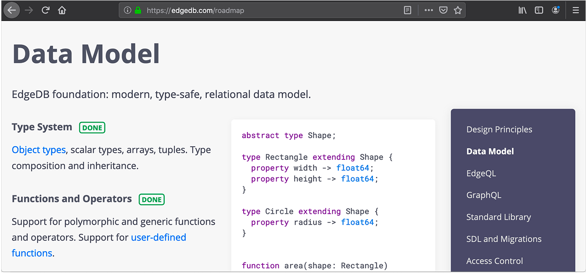

.. blog:authors:: yury elvis
.. blog:lead-image:: images/roadmap.jpg
.. blog:published-on:: 2019-06-18 03:00 PM PST
.. blog:guid:: e098128c-90cb-11e9-b4e8-784f439c9965
.. blog:description::
    We are publishing EdgeDB product roadmap and reflecting
    on history, the future, and our design approach.

========================
A Path to a 10x Database
========================

EdgeDB is the next generation relational database based on PostgreSQL.
It features a novel data model and an advanced query language.

Today we are publishing our product `roadmap`_.  It is an overview
of what is already implemented and of what to expect in the near future.
In the context of that we think it is important to share some of
EdgeDB history and reflect on our design approach.

Inception
=========

Some time ago we started as a software agency set out to build
great software.  Like many, we struggled to balance the desire
for good quality with the realities of resource constraints.

During this time we were fortunate to work on many projects across
different industries.  Naturally we have grown a set of in-house
frameworks to help us ship faster and enjoy both the process
and the result.  The key ingredient of this tooling was the database
abstraction and integration layer that allowed us to do awesome
things like:

* Define data access control rules at the schema level, so queries
  need to only be written once.

* Use schema introspection and metadata extensively to generate UIs,
  API endpoints, and data input forms with full data validation.

* Build a library of reusable schema definitions and queries that can
  be composed together to implement a variety of common application
  patterns.

The success of these ideas inspired us to develop them further into what
is now EdgeDB.

Mission
=======

The mission of EdgeDB is to give its users more *power*, *freedom* and
*confidence* when working with data, whether it's building services, doing
data science, or performing continuous deployment and SRE.

This sounds like a mouthful, so let's see what this means in terms of
some of the features:

* ability to effectively interface with any host programming language
  without costly ORMs and other abstractions;

* efficient emission and ingestion of data in common serialization formats,
  like JSON or Apache Arrow;

* ability to interface with clients using common application protocols
  like REST and GraphQL;

* support of data and schema security via a centralized, well-defined and
  easily auditable policy;

* built-in support for schema migrations and versioning;

* a large and versatile library of standard types, functions and operators.

We are solving these problems by `replacing SQL with a more capable,
modern query language <better_than_sql_>`_, rethinking how the relational
database schema is designed, and building a comprehensive set of tools
necessary to use the database effectively both in development and in production.

Design Principles
=================

.. blog:quote:: ISO 9241 (ergonomics of human-computer interaction)

    Usability: the effectiveness, efficiency, and satisfaction with which
    specified users achieve specified goals in particular environments.

EdgeDB is developed in accordance to the following principles:

* **Ergonomics**

  The data model, EdgeQL, and all aspects of EdgeDB operation
  should be straightforward to learn and reason about, and the
  user experience should be a satisfying one.

* **Performance**

  EdgeQL features, language bindings, and tooling should be
  designed with high performance, low latency operation in mind.

* **Correctness**

  Correctness should never be sacrificed in favor of ergonomics or
  performance.  Nonsensical operations must always generate an error.

These aspects affect not only the design of the database core and its
query language, but also the way the database interacts with client
languages, systems and workflows.

Let's take a look at a few examples.

EdgeDB supports fetching query results as JSON:

.. note::
    :class: aside

    **Note:** The ``fetch*`` methods have been renamed to ``query*``
    in the latest python bindings, read our
    :ref:`alpha 4 blog post <alpha4_fetch_rename>` for more details.

.. code-block:: pycon

   >>> data = conn.fetchall_json('''
   ...     SELECT Movie {
   ...         title,
   ...         release_year,
   ...     }
   ... ''')
   >>> print(repr(data))
   '[{"title" : "Blade Runner 2049", "release_year" : 2017},
   {"title" : "Dune", "release_year" : 2020}]'

The code above returns the entire query result as a single JSON string.
Sometimes it's necessary to fetch data as a sequence of JSON strings for
each entry in the result.  JSON cast can help:

.. code-block:: pycon

   >>> data = conn.fetchall('''
   ...     SELECT <json>Movie {
   ...         title,
   ...         release_year,
   ...     }
   ... ''')
   >>> print(repr(data))
   Set{'{"title": "Blade Runner 2049", "release_year": 2017}',
   '{"title": "Dune", "release_year": 2020}'}

Efficient data encoding protocols are one the main reasons why EdgeDB is
able to maintain `excellent runtime performance <alpha1_perf_>`_.

In situations where an operation may result in surprising behavior,
EdgeDB opts to require explicit input.

Exact decimal values and approximate floating point values do not mix
implicitly:

.. code-block:: edgeql-repl

   edgedb> select 1.1 + 1.1n;
   QueryError: operator '+' cannot be applied to
   operands of type 'std::float64' and 'std::decimal'.
   Hint: Consider using an explicit type cast or
   a conversion function.

Datetime values require a timezone to be specified:

.. code-block:: edgeql-repl

    edgedb> SELECT <datetime>'2019-01-01 01:01:01';
    InvalidValueError: missing required timezone specification
    edgedb> SELECT <datetime>'2019-01-01 01:01:01 US/Pacific';
    {<datetime>'2019-01-01T09:01:01+00:00'}

Computing the mean value of an empty set is an error:

.. code-block:: edgeql-repl

   edgedb> SELECT math::mean(<int64>{});
   InvalidValueError: invalid input to mean():
   not enough elements in input set
   ### SELECT math::mean(<int64>{});
   ###        ^

PostgreSQL happily returns ``NULL`` in this case::

    postgres=# SELECT avg(a) FROM (SELECT 1 WHERE False) AS q(a);
     avg
    -----

    (1 row)

Roadmap
=======

It is hard to capture the entire scope of EdgeDB in a single blog post, so
we created the new `roadmap`_ page on edgedb.com.  It is a live page that
the EdgeDB project will use to share the status and the development plans
with the community in a presentable format.

.. note::
    :class: aside-nobg

    :blog:github-button:`href:https://github.com/edgedb/edgedb|size:large|title:Star EdgeDB`

    Follow `@edgedatabase <twitter_>`_ on Twitter and stay tuned for updates!

Please take a look and `tell us <mailto:hello@edgedb.com>`_ what you think!

.. _roadmap: /roadmap

.. _twitter: https://twitter.com/edgedatabase

.. _alpha1_perf: /blog/edgedb-1-0-alpha-1#benchmarks
.. _better_than_sql: /blog/we-can-do-better-than-sql
