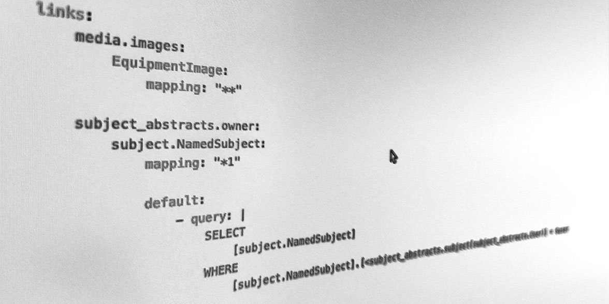
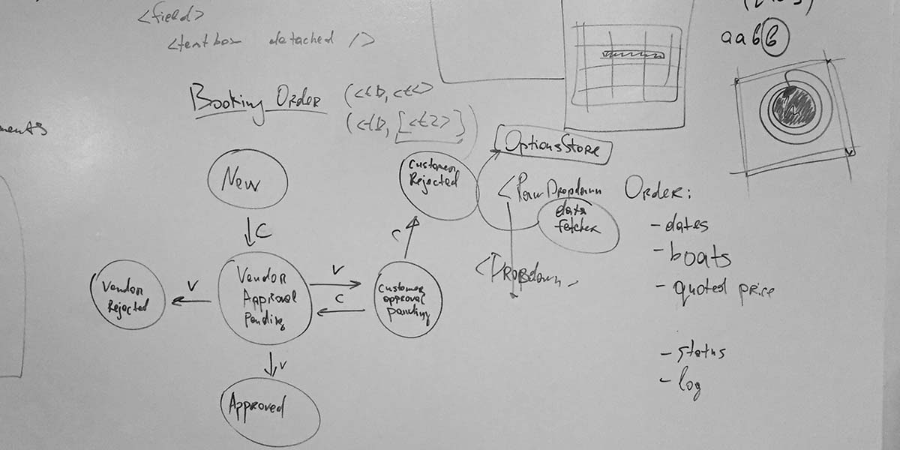
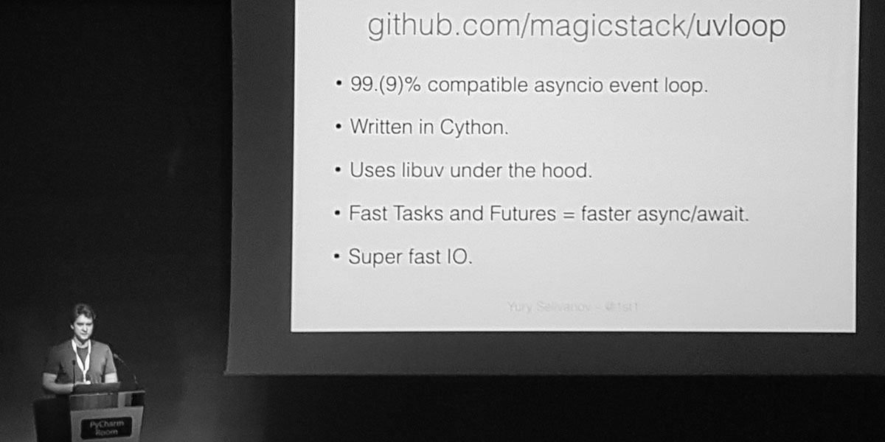
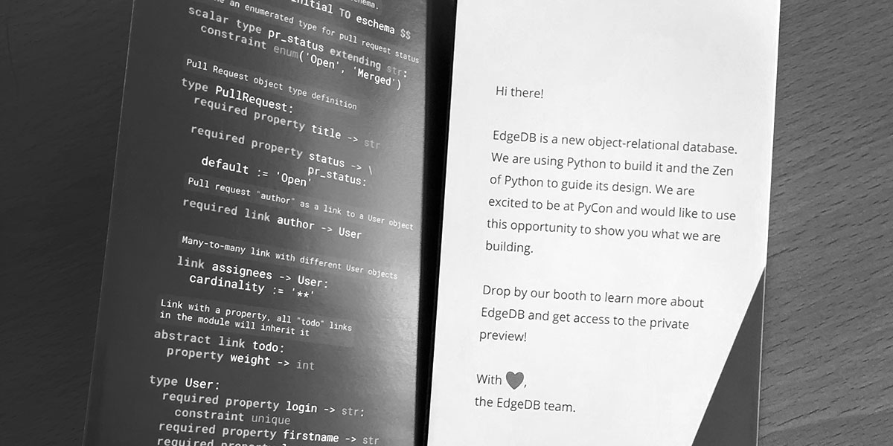
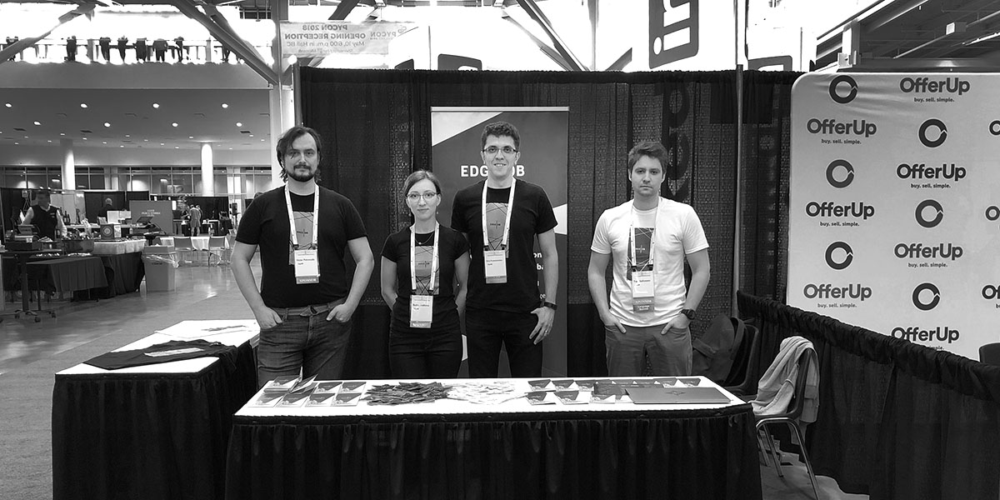
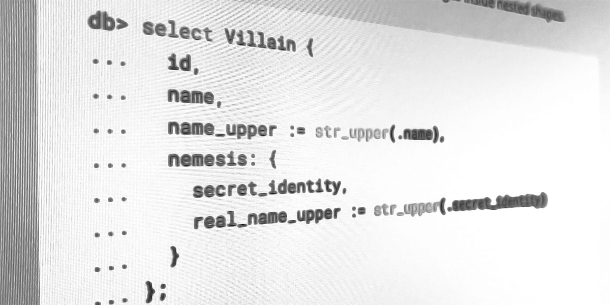
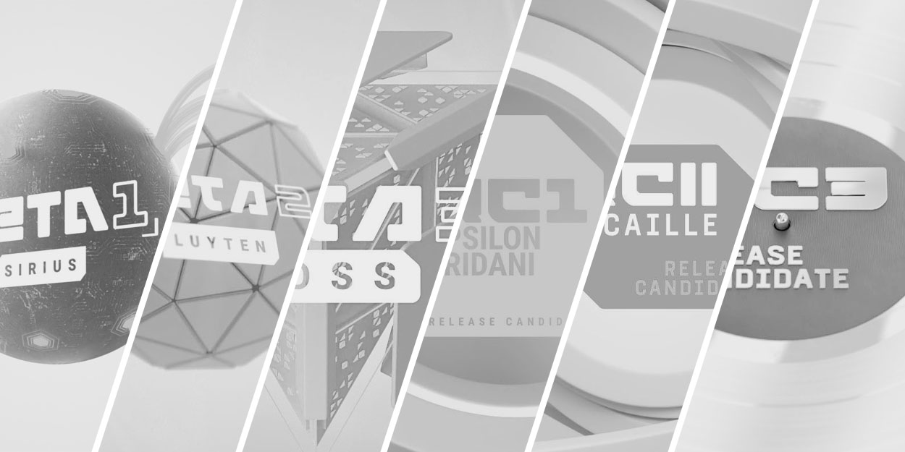

.. blog:authors:: yury
.. blog:published-on:: 2022-01-25 07:00 AM PT
.. blog:lead-image:: images/timeline_comp.jpg
.. blog:guid:: 8f1077fa-735f-11ec-b1d3-f33f155e161c
.. blog:description::
    EdgeDB 1.0 is just around the corner. Let's talk about how
    we got here.

===================================================
Building a production database in ten years or less
===================================================

.. note::

  Check out the discussion of this post on
  `Hacker News <https://news.ycombinator.com/item?id=30072712>`_.

So you've finally decided you're fed up with ``$database_name`` and simply
have no choice but to build a new database. You've got oodles of ideas, pages
of notes, and an unwavering conviction that this is the database the world
has been waiting for. All that's left is to quit your job and grind out
a 1.0 in a few months. Right?

Maybe! But—to put it mildly—that hasn't been our experience.

But before we enter into this next post-1.0 phase of EdgeDB's existence, we're
reflecting on the journey so far. The road has been deeply fulfilling, often
bumpy, and dramatically longer than we initially thought. Along the way we spun
out two major open-source projects (``uvloop`` and ``asyncpg``), helped
introduce ``async/await`` into the Python language, grew to a 10-person
open-source company, and—hopefully—learned some lessons that'll be valuable to
anyone tempted to build a new database. 🚀

On February 10th—in just a couple weeks—we're releasing the first stable
version of EdgeDB after 2100 PRs, 4600 integration tests, and 14 pre-releases.
The release will be part of the inaugural EdgeDB Day: a 2-hour
livestreamed "nanoconference" featuring lightning talks designed to answer all your questions about EdgeDB: why it's necessary, what a "graph-relational database" is, the killer features of EdgeQL, and more.

.. raw:: html

  

    <a
      href="https://lu.ma/event/evt-ER3CCiCBBTrmGzK"
      style="display: inline-block;
      background: hsla(0,0%,100%,.1);
      background: linear-gradient(90.91deg,#2981e2 8.06%,#407de0 19.04%,#5179de
      30.03%,#5f74da 41.01%,#6b70d7 52%,#776bd3 62.99%,#8166ce 73.97%,#8a60c8
      84.96%,#935bc2 95.94%,#9b55bc 106.93%);
      border-radius: 6px;
      padding: 6px 22px;
      font-size: 18px;
      font-weight: 600;
      color: #fff;"
      data-luma-action="checkout"
      data-luma-event-id="evt-ER3CCiCBBTrmGzK"
    >
      Register for EdgeDB Day
    </a>
    
    <a style="font-size: 90%;text-align: center;"
      href="https://lu.ma/edgedb">View full event schedule</a>
  

Let's go back to the beginning.

2008: MagicStack
----------------

This was the year Elvis—my EdgeDB co-founder—and I started
`MagicStack <https://magic.io>`_, a boutique software development shop.
Over the years, we've worked with a huge range of clients, from early
stage startups to Fortune 500 companies like General Electric and Microsoft.

2009-2014: total Caos
---------------------

Early on, we realized we were solving the same set of problems over and over
on every project. It was a drag, and it took time away from the fun and
creative aspects of the work.

Frustrated with the existing tech and blown away by things like Google Wave,
we started incubating a set of home-grown tools, mostly Python-based, that we
took with us from project to project.

- A component-based way to build declarative UIs. (Sound familiar?)
- A library for building RPC backends with decorators and some clever
  metaprogramming hacks.
- A bundler to let us import media assets and stylesheets directly into Python
  files.

   The first MagicStack office.

But chief among these tools was our data layer, Caos, a "super ORM" featuring:

- A YAML-like object-oriented schema definition language.
- Support for mixin-based schema composition, indexes, constraints,
  dynamically computed properties, and rich introspection.
- A query language (called CaosQL, naturally) with support for query
  composition and deep fetching.

Caos would parse CaosQL queries, validate them against the current schema, and
compile them to equivalent SQL. It was our secret sauce that let us deliver
faster and have more fun doing it. With each client project, we made it a
little bit better. Some EdgeDB's big ideas were already here—links, schema
mixins, easy deep querying, and an emphasis on introspectability.

  Early Caos syntax. Note the snippet of CaosQL used to set the ``default``
  value of the ``owner`` link.

Our code relied heavily on metaprogramming. In late 2012, the Python community
started looking for volunteers to design a better introspection API
(`PEP 362 <https://www.python.org/dev/peps/pep-0362/>`_). This was something
we needed for our RPC library, so we jumped at the chance. This was our
first major foray into open-source.

  Elvis and I chatting with a couple guys at PyCon 2013.

Shortly thereafter I started submitting PRs to ``asyncio`` and I became
a Python core dev later in 2013. From 2013-2015, Elvis and I started
contributing more heavily to the ecosystem and the language itself.

2014: the boats and the bees
----------------------------

By 2014, we'd grown a bit tired of life as consultants, so we decided to launch
a product. In Caos, we already had something exceptional on our hands, so
naturally we decided to build...Airbnb for boats. Yes, really. It was called
BoatBee.

It was a fun few months but an ill-fated endeavor. Using Caos and our
other in-house tools, Elvis and I were able to build the core product
in record time. Rather less quickly, we realized Airbnb for boats was
a non-viable business. Live and learn.

  Some state and schema diagrams for BoatBee.

In the post-mortem of this experience, we started looking critically at
the stack of tools we'd been incubating over the past 7 years. In many ways,
the state of tooling, especially in the JavaScript ecosystem, had caught up.
Our component-based UI kit was made obsolete by React. Newcomer GraphQL covered
many of the same bases as our RPC library. Our bundler was matched and
exceeded by Webpack.

But we saw no similar innovation in the database layer. In fact, it seemed to
regress; we watched in dismay as schemaless NoSQL data stores exploded in
popularity. It felt like the software world—after years of struggling against
SQL and relational data models—was collectively throwing in the towel.

Walking back from the office on a brisk Toronto evening, Elvis and I
suddenly realized Caos could represent a new way forward. But first it
had to stop being an ORM and become a database.

  The most common response to EdgeDB in the early days: "so it's just an ORM?".
  We put it on the wall for motivation.

2015: I/O struggles
-------------------

There were several key pieces of intrastructure we needed to build before we
could make headway on EdgeDB.

Our plan was to refactor Caos from a Python framework into a full-fledged
database server that could handle incoming queries over the network. For this
to scale to thousands of simultaneous connections, blocking I/O with threads
wasn't going to cut it (though that's a blog post for a different day).
EdgeDB needed an asynchronous core.

Around the same time we designing the API for a hypothetical Python client
library for EdgeDB. We quickly got hung up on the transaction API; With ``yield
from``, the coroutine syntax at the time, it was painfully verbose:

.. code-block:: python

  tx = yield from conn.start_transaction()
  try:
      print(yield from tx.query('...'))
  except Exception:
      yield from tx.rollback()
      raise
  else:
      yield from tx.commit()

We realized this could be elegantly expressed if Python supported ``async
with`` syntax natively. I started working on a PEP.

.. code-block:: python

  async with conn.transaction() as tx:
      print(await tx.query('...'))

Quickly, the proposal expanded to include ``async for``
(to support async database cursors) and of course ``async/await``.
After a few weeks of fevered work, I published
`PEP 492 <https://www.python.org/dev/peps/pep-0492/>`_, which was finalized
in April 2015 and accepted just before the Python 3.5 feature freeze.
Having such a major proposal get accepted by the Python community was
a thrill unlike anything else I've experienced.

Early 2016: Cython swings in
----------------------------

We started realizing that pure Python wasn't fast enough for handling I/O in
EdgeDB. So we began tinkering with Cython; it let us quickly prototype ideas
with Python-like syntax with near-native performance. We spent a couple of
weeks trying to marry Cython and `libuv <https://github.com/libuv/libuv>`_, an
non-blocking I/O library originally developed for Node.js.

  Presenting ``uvloop`` at EuroPython 2016.

The result was `uvloop <https://github.com/MagicStack/uvloop>`_: a drop-in
replacement for Python's built-in asyncio event loop that was 2-4x faster.
We announced it in a rather well-known `blog post <uvloop_post_>`_.
In surprisingly short order, ``uvloop`` grew to near ubiquity and now
powers EdgeDB.

Mid 2016: Postgres over the wire
--------------------------------

EdgeDB uses Postgres under the hood. Postgres truly is the world's most
advanced open-source SQL database, and it provides the ultimate foundation on
which to build a new and better database abstraction.

.. note::

  This is often a point of confusion among people who are first learning about
  EdgeDB. If Postgres is already a database, and EdgeDB is built on top of
  Postgres, then is EdgeDB an ORM (object-relational mapper)?

  We don't think so. It has its own formally-defined query language, EdgeQL,
  which matches SQL in power and surpasses it in clarity and brevity. It's
  language-agnostic, whereas most ORMs are libraries written for a particular
  language. It has its own type system, standard library, binary protocol,
  client libraries in multiple languages, CLI, workflows, and conventions. By
  any definition, EdgeDB is a database unto itself.

With ``async/await`` and a fast asynchronous event loop, we started
evaluating the state of async Postgres drivers for Python. Alas, nothing
made the cut, so we built our own. In the process, we learned a lot about
Postgres's binary protocol and its many vices and virtues.

The result was `asyncpg <https://github.com/MagicStack/asyncpg>`_, which I
`announced <https://www.youtube.com/watch?v=pi49aiLBas8&t=1375s>`_ at
EuroPython 2016 in Bilbao. True to form, we finished it just two hours before
my scheduled talk, with Elvis pushing some last minute fixes.
We `launched <https://news.ycombinator.com/item?id=12227507>`_ on Hacker News
in August, and it's since seen wide adoption and accumulated 5200 stars on
GitHub.

.. raw:: html

  <blockquote class="twitter-tweet" data-dnt="true">
<a href="https://twitter.com/hashtag/asyncpg?src=hash&amp;ref_src=twsrc%5Etfw">#asyncpg</a>: new PostgreSQL driver for <a href="https://twitter.com/hashtag/asyncio?src=hash&amp;ref_src=twsrc%5Etfw">#asyncio</a> faster than Go &amp; node.js, pure Python faster than C (libpg)! by <a href="https://twitter.com/1st1?ref_src=twsrc%5Etfw">@1st1</a> <a href="https://t.co/5uJ9iiq0Av">pic.twitter.com/5uJ9iiq0Av</a>
&mdash; Victor Stinner 🐍 (@VictorStinner) <a href="https://twitter.com/VictorStinner/status/755328206387998720?ref_src=twsrc%5Etfw">July 19, 2016</a></blockquote> 

2017-2018: let's build a database
---------------------------------

Armed with ``async/await``, Cython, ``uvloop``, and ``asyncpg``,
we had the tools we needed to make EdgeDB a reality. While still consulting
full-time, we would spend evenings at the whiteboard fleshing out designs.
The modern incarnation of EdgeDB emerged during this period: the type system,
EdgeQL syntax, and the schema declaration language. We started working on
an initial Technical Preview of what we'd designed.

To force ourselves to deliver, we signed up to be a gold sponsor at
PyCon 2018—five months in the future. We booked a booth, printed 3500
booklets showcasing EdgeDB, the whole nine yards. Naturally, we finished
the preview implementation just under the wire, pulling an all-nighter
at a random Airbnb in Cleveland.

  Our PyCon 2018 booklet. At this point, we hadn't added curly braces to EdgeDB
  SDL so it was still whitespace sensitive. Braces were added in 2019.

And we had a blast. People at PyCon loved EdgeDB. We talked to hundreds
of attendees, answered thousands of questions, and received a mountain of
feedback. We fully committed to making EdgeDB happen.

  Victor, Nadia, Elvis, and I at our PyCon booth.

Early 2019: the first alpha
---------------------------

From this point on, we only did consulting to pay the bills. We were
laser-focused on releasing the first alpha version of EdgeDB. The technical
preview was a great prototype, but we needed EdgeDB to level up before it was
ready for a first release.

We formally defined the type hierarchy and tuned the operators and
typecasting system for safety and usability. We added built-in support for
GraphQL. We designed a binary protocol—informed by our ``asyncpg`` experience
and deep familiarity with Postgres's protocol—and a Python client library that
implemented it. Over this period, the modern incarnation of EdgeQL ossified.

  Modern EdgeQL, with concise syntax for deep fetching and computed fields.

In April 2019, just under a year after presenting the Technical Preview,
we launched the first alpha. We posted it `to Hacker
News <https://news.ycombinator.com/item?id=19638701>`_ to a great response;
shortly thereafter, another blog post of ours called
:ref:`We Can Do Better Than SQL <ref_better_than_sql>` hit #1 on HN. This
reinforced what we already knew: there's a lot of latent dissatisfaction with
the developer experience of existing database options. We got back to work.

Late 2019: EdgeDB Inc.
----------------------

In late 2019 we incorporated EdgeDB Inc. in the US and relocated our
headquarters from Toronto to San Francisco.

  Our first office in the U.S.

2020: the alpha year
--------------------

The company grew from 3 engineers to 9. We released six subsequent
alpha versions.

  Our first six alpha versions.

These versions contained a slew of new tooling, including:

- a new CLI written in Rust;
- a migrations system with a CLI-based workflow;
- ongoing enhancements to the binary protocol;
- a JavaScript client library;
- dump and restore functionality;
- a new upsert construct in EdgeQL;
- and a best-in-class interactive shell.

For an excruciatingly detailed log of our progress in this period, feel free to
read the announcement posts for all six alphas on `our blog </blog>`_.
Hopefully you have better ways to spend your time.

2021: the beta year
-------------------

Our first beta came out in February 2021; over the course of the year we
released a total of three betas and three release candidates.

  Our 2021 releases: three betas and three RCs (with a fourth and final RC in
  2022).

With the core EdgeDB product getting ever more mature, we turned our focus more
heavily towards workflows. How do we make every aspect EdgeDB's developer
experience—installation, managing instances, running migrations, reading the
docs, using the CLI, running queries—better than every other database out there?

Well, with a lot of work. We re-structured our CLI (`RFC 1006
<https://github.com/edgedb/rfcs/blob/master/text/1006-simplified-cli.rst>`_).
We upgraded our client libraries with a `more ergonomic API
<https://github.com/edgedb/edgedb-js/issues/182>`_, and added new libraries for
`Go <https://github.com/edgedb/edgedb-go>`_ and `Deno
<https://github.com/edgedb/edgedb-deno>`_, exposing
TLS ALPN `API <https://github.com/denoland/deno/pull/12786>`_ in Deno along
the way. We re-wrote the docs, published an
illustrated interactive textbook called `Easy EdgeDB </easy-edgedb>`_, and
built a snazzy notebook-like `EdgeQL tutorial </tutorial>`_. And we started
building an EdgeQL query builder for TypeScript that might just make ORMs
obsolete—more on that coming soon. 👀

2022: to stability and beyond!
------------------------------

Which brings us to now. In a couple weeks, we'll officially release EdgeDB 1.0.
We hope you like it. To say the least, it's been quite a journey.

This post has been pretty light on detail about what EdgeDB actually is. If
you're curious, join us for the launch event on February 10th! It's a 2-hour
"nanoconference" where—hopefully—all your questions will be answered. Grab a
ticket below.

.. raw:: html

  

    
  

If you just can't wait to start learning about EdgeDB, check out the following
resources:

* If you're just starting out, go through 10-minute :ref:`Quickstart guide
  <docs:ref_quickstart>`.
* To dig into the EdgeQL query language, try the web-based `interactive
  tutorial </tutorial>`_ — no need to install anything.
* For an immersive, comprehensive walkthrough of EdgeDB concepts, check out
  our illustrated e-book `Easy EdgeDB </easy-edgedb>`_. It's designed to walk
  a total beginner through EdgeDB, from the basics through
  advanced concepts.
* Or jump into `the docs </docs/datamodel/index>`_!

*Thanks to Colin McDonnell and Elvis for feedback and edits on this post.*

.. raw:: html

  

.. _uvloop_post: https://magic.io/blog/uvloop-blazing-fast-python-networking/
