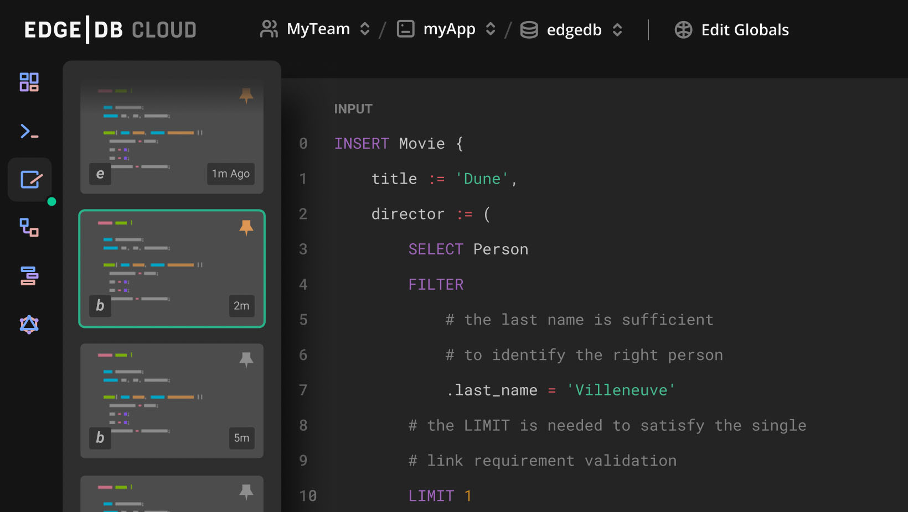

.. blog:authors:: yury
.. blog:published-on:: 2022-11-07 10:00 AM PT
.. blog:lead-image:: images/series_a.jpg
.. blog:guid:: 44aa1c72-5e5d-11ed-ab1c-7f0aef454e8f
.. blog:description::
    Announcing our Series A financing round.

===============
EdgeDB Series A
===============

.. raw:: html

    

        We are excited to announce that EdgeDB has raised a $15m Series A
        financing round! Continue reading to learn what this means for
        the product and the team behind it.
    

Core
====

Our core product is EdgeDB—an `open source <https://github.com/edgedb/edgedb>`_
graph-relational database. EdgeDB is an ambitious project: we are building
the world's most advanced database system where developer experience,
productivity, and performance
`are all a priority </blog/a-path-to-a-10x-database#design-principles>`_.
Our mission is to give developers and data engineers
more power, freedom, and confidence when working with data.

EdgeDB approaches this by implementing  a data model that feels native to
humans and integrates well with modern programming languages,
and by `replacing SQL </blog/we-can-do-better-than-sql>`_ with a more capable,
modern query language. And then, of course, we ship tools and libraries to
minimize the unnecessary toil when installing, configuring and maintaining
databases and schemas contained in them.

In July we `released EdgeDB 2.0 </blog/edgedb-2-0>`_ adding built-in
access control, rich UI, and a multitude of other exciting features.
We will continue shipping major new versions of the database regularly,
with our next big release of EdgeDB 3.0 slated for March 2023, featuring:

* Built-in full-text search
* Tools to analyze performance of queries
* New capabilities of the built-in graphical UI
* Streamlining schema migrations to enable rapid prototyping
* A number of enhancements to the query language

Cloud
=====

The #1 requested feature by our users is a hosted version of EdgeDB.
In the next few weeks we will be launching Cloud Beta (by invite)
with the goal of hitting general availability in  early 2023.
Sign up `here <https://www.edgedb.com/p/cloud-waitlist>`_ to be among the first
people to try it and help us build the best cloud database experience.

Naturally, just like with EdgeDB itself, we aim to deliver much more than
just giving you a database endpoint in a cloud with a rudimentary admin panel.
Our goal is to give users a "1-click" or "1-command" experience,
zero configuration, native integration with popular frontend hosting
platforms like Vercel or Netlify. It will certainly be an interesting
journey for us to get there, but at this point it's only a matter of time.

Community
=========

We have tens of thousands of active monthly users of EdgeDB along with a fun
and helping `Discord <https://discord.gg/edgedb>`_ community. Startups adopt
EdgeDB to power their businesses and we enjoy learning how it completely
transformed their engineering. Here's, for example, what
`BeatGig <https://beatgig.com/>`_ shared about their experience of using
EdgeDB:

.. pull-quote::

    EdgeDB's high level data model, coupled with their new query language
    EdgeQL, transformed the way we build our product. It has simplified our
    backend development and allows us to ship much faster. It solved the N+1
    problem for us since we can easily create complex queries that return all
    the info we need in a single request. We don't even need to cache anymore
    because queries run so efficiently that all the data we'd normally cache
    can be just queried in an instant.

Investors
=========

Our Series A was led by `Nava Ventures <https://nava.vc>`_ and
`Accel <https://accel.com>`_. A number of other prominent funds
(`Pear <https://pear.vc/>`_, `SVAngel <https://svangel.com/>`_)
and angels joined the round:

* Guillermo Rauch (Founder and CEO, Vercel)
* Tom Preston-Werner (Founder and former CEO, GitHub)
* Nat Friedman (ex-CEO, GitHub)
* Mathias Biilmann Christensen (co-founder and CEO, Netlify)
* James Tamplin (co-founder and ex-CEO, Firebase)
* David Cramer (co-founder and CTO, Sentry)
* Samuel J. Palmisano (ex-CEO, IBM)
* and many others.

We are excited to welcome Freddie Martignetti (Nava) and Daniel Levine (Accel)
to our Board!

Team
====

Elvis and I have been life-long open source contributors and worked with
many engineering teams of F-500 and unicorn companies. With that experience
we can confidently say that the EdgeDB team is truly best in class.
We have 14 people now and are hiring. If you are an expert
TypeScript / Rust / Python / Cloud / Compiler engineer,
please drop us a line at `jobs@edgedb.com <mailto:jobs@edgedb.com>`_.

Last but not least, sign up for our upcoming Cloud Beta
`here <https://www.edgedb.com/p/cloud-waitlist>`_! ❤️
