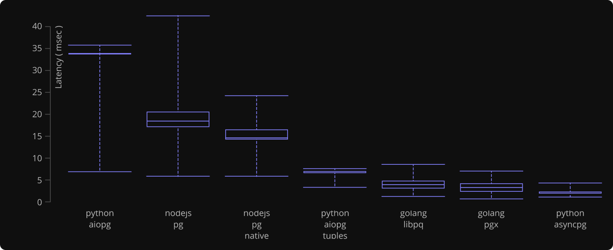

.. blog:authors:: elvis yury
.. blog:published-on:: 2016-08-04 12:01 PM EST
.. blog:lead-image:: images/asyncpg.jpg
.. blog:guid:: 24928E01-C34B-49FC-AD25-E579CBE974B0
.. blog:description::
    asyncpg is a new fully-featured open-source Python client
    library for PostgreSQL.

=================================
1M rows/s from Postgres to Python
=================================

`asyncpg`_ is a new fully-featured open-source Python client
library for PostgreSQL. It is built specifically for asyncio
and Python 3.5+ ``async`` / ``await``.  asyncpg is the fastest
driver among common Python, NodeJS and Go implementations.

Why asyncpg?
============

We are building `EdgeDB`_—the next generation object database
with PostgreSQL as a backing store. We need high-performance,
low-latency access to the advanced features of PostgreSQL.

The most obvious option was psycopg2—the most popular Python
driver for PostgreSQL.  It is well-supported, stable, proven
technology.  There is also aiopg, which provides async
interface on top of psycopg2.  With that there is an obvious
question: why reinvent the wheel?  Short answer is twofold:
**features** and **performance**. We will cover each item in
detail below.

Features
========

Data Type Support
-----------------

Our biggest gripe with psycopg2 is its mediocre support for
handling PostgreSQL data types, especially arrays and composite
types.  Rich data type system is one of the hallmarks of
PostgreSQL.  And yet, out of the box psycopg2 only supports
simple builtin types like integers, strings, and timestamps,
forcing the users to write custom "typecasters" for everything
else.  This is cumbersome and inefficient.

The reason is fundamental: psycopg2 exchanges data with the
database server in text format. This necessitates a non-trivial
amount of parsing, especially so for complex types.

Unlike psycopg2, asyncpg implements PostgreSQL **binary I/O
protocol**, which, aside from performance benefits, allows for
generic support of container types (arrays,
composites and ranges).

Prepared Statements
-------------------

asyncpg extensively uses PostgreSQL prepared statements.
This is an important optimization feature, as it allows to avoid
repeated parsing, analysis, and planning of queries.
Additionally, asyncpg caches the data I/O pipeline for each
prepared statement.

Prepared statements in asyncpg can be created and used
explicitly.  They provide an API to fetch and introspect query
results. Most query methods are also exposed on the connection
object directly, and asyncpg will create and cache a prepared
statement implicitly.

Ease of Deployment
------------------

Another important feature of asyncpg is that it has **zero**
dependencies. Direct implementation of PostgreSQL protocol means
that there is no need for libpq to be installed, and you can
just ``pip install asyncpg``. Additionally, we provide binary
wheels for Linux, macOS, and Windows.

Performance
===========

It soon became evident that by implementing PostgreSQL
frontend/backend protocol directly, we can yield significant
speed improvements. Our `earlier experience
<https://magic.io/blog/uvloop-blazing-fast-python-networking/>`_
with uvloop has shown that Cython can be used to build very
efficient libraries. asyncpg is written almost entirely in
Cython with careful buffer management and highly optimized
data decoding pipeline.

The result is that asyncpg is, on average, at least **3x faster**
than psycopg2 (or aiopg). This result is remarkable, as psycopg2,
written in C and optimized, is not slow at all. See the
benchmarks section below for more.

Benchmarks
==========

Similarly to `uvloop`_, we created a standalone `toolbench`_ to
measure and report the performance of asyncpg and other
PostgreSQL driver implementations.  We measured query
throughput (in rows per second) and latency.  The main purpose
of this benchmark is to measure the driver overhead.

For fairness, all tests were run in a single-thread
(``GOMAXPROCS=1`` for Go code) in async mode. Python drivers were
run under uvloop.

The benchmark results featured in this post were obtained
from a bare-metal server with the following setup:

* CPU: Intel Xeon E5-1620 v2 @ 3.70GHz, 64GiB DDR3
* Gentoo Linux, GCC 4.9.3
* Go 1.6.3, Python 3.5.2, NodeJS 6.3.0
* PostgreSQL 9.5.2

Driver Implementations:

* Python: asyncpg-0.5.2, psycopg2-2.6.2, aiopg-0.10.0,
  uvloop-0.5.0. aiopg is a tiny low-overhead wrapper of psycopg2
  that adds async capabilities to it.
* NodeJS: pg-6.0.0, pg-native-1.10.0
* Golang: github.com/lib/pg\@4dd446efc1,
  github.com/jackc/pgx\@b3eed3cce0

The charts show the geometric average of results obtained
by running four types of queries:

* A relatively wide row query selecting all rows from the
  ``pg_type`` table (~350 rows).  This is relatively close to
  an average application query.  The purpose is to test general
  data decoding performance. This is the titular benchmark, on
  which asyncpg achieves 1M rows/s.
  See :blog:local-file:`details <res/report.html>`.

* A query that generates 1000 rows containing a single integer.
  This benchmark is designed to test the overhead of creating
  and returning result records.
  See :blog:local-file:`details <res/report.html>`.

* A query returning 100 rows, each containing a 1KB binary blob.
  This benchmark is designed to stress the I/O and read buffers
  in particular.
  See :blog:local-file:`details <res/report.html>`.

* A query returning 100 rows, each containing an array of 100
  integers. This benchmark is designed to test the performance
  of array decoding. Here, asyncpg is slower than the fastest
  implementation (go lib/pq) due to the overhead of creating
  and freeing Python tuple objects.
  See :blog:local-file:`details <res/report.html>`.

.. note::
    "python-aiopg" benchmark uses the ``psycopg2.extras.DictCursor``
    for fairness, as other driver implementations return
    name-addressable result records. However, the performance
    penalty compared to the default tuple-returning psycopg2
    cursor is so large that we also included the default
    cursor mode.

Conclusion
==========

We firmly believe that high-performance and scalable systems
in Python are possible.  For that we need to put maximum effort
into making fast, high-quality drivers, event loops, and frameworks.

`asyncpg`_ is another step in that direction. It is the result of
careful design fuelled by our experience creating uvloop and
using Cython and asyncio efficiently.

.. _asyncpg: https://github.com/magicstack/asyncpg/
.. _uvloop: https://github.com/magicstack/uvloop/
.. _toolbench: https://github.com/magicstack/pgbench
.. _EdgeDB: https://www.edgedb.com
