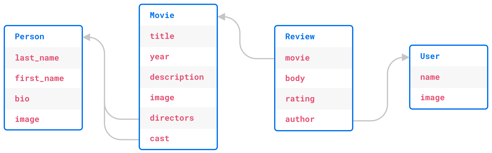
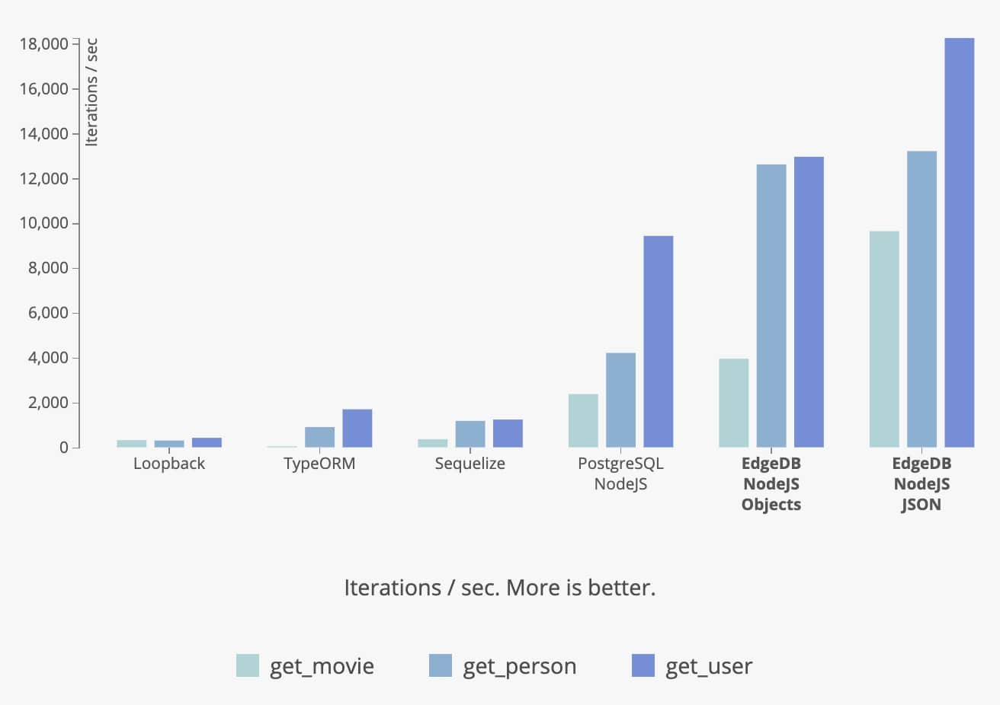

.. blog:authors:: yury elvis
.. blog:published-on:: 2020-01-27 02:00 PM PT
.. blog:lead-image:: images/alpha2.jpg
.. blog:guid:: EF900658-2DE5-462D-B3B4-790711BE47CC
.. blog:description::
    EdgeDB 1.0 alpha 2 is is available for download.
    Learn what's new and see the benchmarks comparing EdgeDB to
    different JavaScript DB solutions.

==================
EdgeDB 1.0 Alpha 2
==================

The EdgeDB team is happy to announce that EdgeDB 1.0 alpha 2 is available for
`download <download_>`_.

This post highlights some notable changes since the `Alpha 1 release <alpha1_>`_
and contains benchmarks comparing EdgeDB to different JavaScript
database solutions.

.. rubric:: What's EdgeDB

EdgeDB is an advanced `open source <github_>`_ relational database based on
PostgreSQL.  The project aims to give developers and data engineers a highly
efficient and productive database technology while addressing the
`shortcomings of SQL <bettersql_>`_ and its surrounding ecosystem:

* high-level data model and type system;
* a powerful, expressive and extensible query language that allows working
  with complex data relationships easily;
* first-class support for schema migrations;
* support for converting arbitrary strictly typed data to and from JSON
  via a simple cast operator;
* out-of-the-box interoperability via REST and GraphQL.

What's New in Alpha 2
---------------------

The alpha 2 release includes many new features, bug fixes, and standard
library updates.  Highlights of this release:

* Stabilization of the standard library and the EdgeDB binary protocol;

* Significantly increased test coverage and improvement of DDL and SDL;

* New dump/restore functionality;

* A new JavaScript driver implementing the native protocol;

* Notably improved GraphQL support.

For the full list of changes please read the
:ref:`Alpha 2 Changelog <docs:ref_changelog_alpha2>`.

New JavaScript Driver
^^^^^^^^^^^^^^^^^^^^^

EdgeDB has a new high-performance native
`EdgeDB driver <https://github.com/edgedb/edgedb-js>`_ for NodeJS 10+.

The driver is written in strict TypeScript, thoroughly tested, and has
first-class async/await support.  It is at least **twice** as efficient as
comparable current PostgreSQL JavaScript drivers.

.. note::

    In the latest JavaScript driver, ``connect()`` has been replaced
    by the ``createClient()`` API (:ref:`details <ref_rc2_pool>`), and
    ``fetchOne()`` renamed to ``querySingle()``
    (:ref:`details <alpha4_fetch_rename>`).

.. code-block:: javascript

    const edgedb = require("edgedb");

    async function main() {
      const conn = await edgedb.connect(...);
      const user = await conn.fetchOne(`
        SELECT User {
          name,
          friends: {
            name
          }
        }
        FILTER .id = <uuid>$id
      `, {id: ...})
      console.log(user);
    }

    main();

Read more about the driver in the :ref:`docs <docs:edgedb-js-intro>` and see
how it performs in the benchmarks below.

Enhanced GraphQL
^^^^^^^^^^^^^^^^

EdgeDB has advanced built-in GraphQL support.  In particular, the ability to
use it to query EdgeQL expression aliases means that it is easy to use GraphQL
with complex expressions, aggregate functions, and nested filters.

Now, with alpha 2, EdgeDB supports insert, update, and delete
:ref:`mutations <docs:ref_graphql_mutations>` as well as filtering by
traversing arbitrarily deep links, not just immediate properties:

.. code-block:: graphql

    query {
      UserGroup(
        filter: {settings: {name: {eq: "notifications"}}}
      ) {
        name
        settings {
          name
          value
        }
      }
    }

Dump / Restore
^^^^^^^^^^^^^^

The new dump / restore tooling allows a simple migration path to future
EdgeDB versions.  This is the time to start evaluating and experimenting with
EdgeDB!

Enhanced arbitrary precision types
^^^^^^^^^^^^^^^^^^^^^^^^^^^^^^^^^^

We have added the new :eql:type:`docs:std::bigint` scalar type to represent
arbitrary integral type. The motivation for the new type is that many
platforms lack a true multi-precision decimal type, but implement an
arbitrary-precision integer type (JavaScript is a prominent example).

Benchmarks
----------

Here we continue to use the benchmarking arrangement we built for comparing
`EdgeDB Alpha 1 performance <alpha1_>`_ to various Python frameworks and ORMs.

.. note::

    The benchmark source code can be found `here <bench_>`_. For a more
    complete discussion of how EdgeDB bridges the gap between SQL and ORM
    libraries, refer to this post `this post
    </blog/a-solution-to-the-sql-vs-orm-dilemma>`_.

This time we are assessing the code complexity and performance of a simple
IMDb-like website built with Loopback, TypeORM, Sequelize, Prisma, Hasura,
Postgraphile, raw SQL, and EdgeDB.

The benchmark is designed to require a relatively normalized table layout.
The below picture illustrates the benchmark schema:

Loopback / TypeORM / Sequelize
^^^^^^^^^^^^^^^^^^^^^^^^^^^^^^

Similarly to Python ORMs, each JavaScript ORM has its own API that differs
significantly between the libraries.  Combined with lack of operator
overloading in JavaScript, the ORM client code tends to be very verbose.

Here is a query to fetch a movie, along with some details, cast, and directors
expressed with Sequelize:

.. code-block:: javascript
    :class: collapsible

    async movieDetails(id) {
      const Movie = this.models.Movie;
      const Person = this.models.Person;
      const Review = this.models.Review;
      const Directors = this.models.Directors;
      const Cast = this.models.Cast;

      var result = await Movie.findByPk(id, {
        include: [
          {
            model: Person,
            as: "directors",
            attributes: [
              "id",
              "first_name",
              "middle_name",
              "last_name",
              "full_name",
              "image"
            ],
            through: { attributes: [] }
          },
          {
            model: Person,
            as: "cast",
            attributes: [
              "id",
              "first_name",
              "middle_name",
              "last_name",
              "full_name",
              "image"
            ],
            through: { attributes: [] }
          },
          {
            separate: true,
            model: Review,
            as: "reviews",
            attributes: ["id", "body", "rating"],
            include: ["author"],
            order: [["creation_time", "DESC"]]
          }
        ],
        order: [
          [{ model: Person, as: "directors" }, Directors, "list_order", "ASC"],
          [{ model: Person, as: "directors" }, "last_name", "ASC"],
          [{ model: Person, as: "cast" }, Cast, "list_order", "ASC"],
          [{ model: Person, as: "cast" }, "last_name", "ASC"]
        ],
        benchmark: true
      });

      result = result.toJSON();
      // compute the average rating from the actual fetched reviews
      result.avg_rating =
        result.reviews.reduce((total, r) => total + r.rating, 0) /
        result.reviews.length;
      // clean up directors and cast attributes
      for (let fname of ["directors", "cast"]) {
        result[fname] = result[fname].map(person => {
          return {
            id: person.id,
            full_name: person.full_name,
            image: person.image
          };
        });
      }

      return JSON.stringify(result);
    }

The same query expressed with TypeORM:

.. code-block:: javascript
    :class: collapsible

    export async function movieDetails(this, id: number): Promise<string> {
      var movie = await this.createQueryBuilder(Movie, "movie")
        .select([
          "movie.id",
          "movie.image",
          "movie.title",
          "movie.year",
          "movie.description",
          "directors.list_order",
          "cast.list_order",
          "dperson.id",
          "dperson.first_name",
          "dperson.middle_name",
          "dperson.last_name",
          "dperson.image",
          "cperson.id",
          "cperson.first_name",
          "cperson.middle_name",
          "cperson.last_name",
          "cperson.image",
          "review.id",
          "review.body",
          "review.rating",
          "user.id",
          "user.name",
          "user.image"
        ])
        .leftJoinAndSelect("movie.directors", "directors")
        .leftJoinAndSelect("directors.person", "dperson")
        .leftJoinAndSelect("movie.cast", "cast")
        .leftJoinAndSelect("cast.person", "cperson")
        .leftJoinAndSelect("movie.reviews", "review")
        .leftJoinAndSelect("review.author", "user")
        .where("movie.id = :id", { id: id })
        .orderBy("directors.list_order", "ASC")
        .addOrderBy("dperson.last_name", "ASC")
        .addOrderBy("cast.list_order", "ASC")
        .addOrderBy("cperson.last_name", "ASC")
        .addOrderBy("review.creation_time", "DESC")
        .getOne();

      movie.avg_rating =
        movie.reviews.reduce((total, r) => total + r.rating, 0) /
        movie.reviews.length;

      for (let fname of ["directors", "cast"]) {
        movie[fname] = movie[fname].map(rel => {
          return {
            id: rel.person.id,
            full_name: rel.person.get_full_name(),
            image: rel.person.image
          };
        });
      }
      movie.reviews = movie.reviews.map(rev => {
        delete rev.creation_time;
        return rev;
      });
      var result = movie;

      return JSON.stringify(result);
    }

TypeORM basically exposes a query building API that requires the user to
know SQL well.  Sequelize and Loopback have higher level APIs but still
are lacking in features compared to their Python counterparts.

Raw SQL
^^^^^^^

Using raw SQL is always an option.  For this benchmark we are using the most
popular PostgreSQL driver for NodeJS: `pg <https://www.npmjs.com/package/pg>`_.

The code we ended up to fetch movie details via the pg/SQL combination is
a bit too long for this post to be included.  Please find it
`here <rawsqlbench_>`_.

EdgeDB
^^^^^^

One of the key advantages of using EdgeDB is a common way of fetching
object hierarchies: EdgeQL.

The same query can be used to fetch results as JSON or rich objects in Python
or JavaScript.  Here's a query to fetch movie details:

.. code-block:: edgeql

    SELECT Movie {
      id,
      image,
      title,
      year,
      description,
      avg_rating,

      directors: {
        id,
        full_name,
        image,
      }
      # list_order is a property on the
      # "directors" link.
      ORDER BY @list_order EMPTY LAST
               THEN .last_name,

      cast: {
        id,
        full_name,
        image,
      }
      ORDER BY @list_order EMPTY LAST
               THEN .last_name,

      reviews := (
        # The schema defines a link from Review to Movie,
        # so here we are traversing the link in the
        # reverse direction.
        SELECT Movie.<movie[IS Review] {
          id,
          body,
          rating,
          author: {
            id,
            name,
            image,
          }
        }
        ORDER BY .creation_time DESC
      ),
    }
    FILTER .id = <uuid>$id

You can use it to fetch data as JSON with:

.. note::

    In the latest client drivers, we've renamed the ``fetch*``
    methods, see our :ref:`alpha 4 blog post <alpha4_fetch_rename>` for the
    details.

.. code-block:: javascript

    await connection.fetchOneJSON(movieQuery, { id: id });

or as JavaScript objects:

.. code-block:: javascript

    await connection.fetchOne(movieQuery, { id: id });

and here's comparable Python code:

.. code-block:: python

    await connection.fetchone_json(movie_query, id=id)
    # or
    await connection.fetchone(movie_query, id=id)

Results
^^^^^^^

The JavaScript benchmarks were run on a similar server configuration and
on the same dataset as Python benchmarks in our `alpha 1 blog post <alpha1_>`_:

* Databases were run on a separate 12-core GCP instance.  The instance
  was configured to have 16GB RAM and an SSD.

* Benchmarks were run on a separate 8-core GCP instance with 12GB RAM
  and an SSD.

* The concurrency level was set to 24, and each JavaScript client was running
  in async mode, i.e. in a single process with 24 non-blocking connections
  to the server.

* Every benchmark was tested by running it in a tight loop for 30 seconds,
  with 10 seconds of warmup.

The full report is available :blog:local-file:`here <res/jsbench.html>`.

.. .. blog:chart:: BarLatencyChart

..       {
..         "options": {
..             "titleField": "title",
..             "stacked": true,
..             "stackedCategories": ["get_movie", "get_person", "get_user"],
..             "stackedCategoryField": "queryname",
..             "dataField": "variations",
..             "keyMetricField": "qps",
..             "barYTitle": "Iterations / sec",
..             "boxYTitle": "Latency (msec)",
..             "height": 440,
..             "colors": ["#a9d4d6", "#83b1d4", "#6e8fdc"],
..             "drawLegend": true,
..             "boldRegex": ".*EdgeDB.*",
..             "legendMsg": "Iterations / sec. More is better."
..         },
..         "data": [
..             {
..                 "title": "Loopback",
..                 "variations": [{
..                     "qps": 319,
..                     "queryname": "get_movie"
..                 }, {
..                     "qps": 302,
..                     "queryname": "get_person"
..                 }, {
..                     "qps": 423,
..                     "queryname": "get_user"
..                 }]
..             }, {
..                 "title": "TypeORM",
..                 "variations": [{
..                     "qps": 42,
..                     "queryname": "get_movie"
..                 }, {
..                     "qps": 903,
..                     "queryname": "get_person"
..                 }, {
..                     "qps": 1695,
..                     "queryname": "get_user"
..                 }]
..             }, {
..                 "title": "Sequelize",
..                 "variations": [{
..                     "qps": 363,
..                     "queryname": "get_movie"
..                 }, {
..                     "qps": 1179,
..                     "queryname": "get_person"
..                 }, {
..                     "qps": 1238,
..                     "queryname": "get_user"
..                 }]
..             }, {
..                 "title": "PostgreSQL NodeJS",
..                 "variations": [{
..                     "qps": 2374,
..                     "queryname": "get_movie"
..                 }, {
..                     "qps": 4210,
..                     "queryname": "get_person"
..                 }, {
..                     "qps": 9429,
..                     "queryname": "get_user"
..                 }]
..             }, {
..                 "title": "EdgeDB NodeJS Objects",
..                 "variations": [{
..                     "qps": 3950,
..                     "queryname": "get_movie"
..                 }, {
..                     "qps": 12618,
..                     "queryname": "get_person"
..                 }, {
..                     "qps": 12957,
..                     "queryname": "get_user"
..                 }]
..             }, {
..                 "title": "EdgeDB NodeJS JSON",
..                 "variations": [{
..                     "qps": 9639,
..                     "queryname": "get_movie"
..                 }, {
..                     "qps": 13210,
..                     "queryname": "get_person"
..                 }, {
..                     "qps": 18254,
..                     "queryname": "get_user"
..                 }]
..             }
..         ]
..       }

A few comments on the benchmark results:

* JavaScript ORMs—Loopback, TypeORM, and Sequelize—typically exhibit very poor
  performance. In one case TypeORM is 50x slower than using raw SQL and
  200x slower than querying EdgeDB.  The primary reason is twofold: inefficient
  queries generated by the ORM plus expensive client-side aggregation of
  results.

* Due to the limitations of the `pg <https://www.npmjs.com/package/pg>`_
  library we are unable to effectively express all cases as a single SQL
  query so we have to issue several smaller SQL queries, which impacts
  latency due to multiple server roundtrips.  The overhead of the ``pg``
  driver also seems to be higher than that of `edgedb-js <githubjs_>`_
  in general.

* EdgeDB performs well in this benchmark.  The JSON variant of the benchmark
  performs better because it does not create rich data objects and avoids
  spending any additional CPU manually serializing data to JSON.  EdgeDB also
  requires less code to setup the database schema and fetch data than any
  JavaScript ORM library.

Next: Alpha 3
-------------

In the time since the last release we have grown our engineering team and
are accelerating our efforts to bring EdgeDB to production-ready 1.0.

Moving forward we are switching to a faster release cadence.  Alpha 3 is going
to be about improving EdgeDB schema migrations support.

In the meantime we encourage you `give EdgeDB a try <download_>`_ and
join `our github discussions <discussions_>`_!

.. _twitter: https://twitter.com/edgedatabase
.. _github: https://github.com/edgedb/edgedb

.. _githubjs: https://github.com/edgedb/edgedb-js

.. _bench: https://github.com/edgedb/imdbench

.. _alpha1: /blog/edgedb-1-0-alpha-1
.. _download: /download

.. _rawsqlbench: https://github.com/edgedb/imdbench/blob/16dde82e497752a1ebef910236742b2d3c128994/_postgres/index.js#L179-L296

.. _a2bench: /blog/edgedb-1-0-alpha-1#let-s-build-an-app
.. _jobs: /careers

.. _bettersql: /blog/we-can-do-better-than-sql

.. _discussions: https://github.com/orgs/edgedb/discussions
