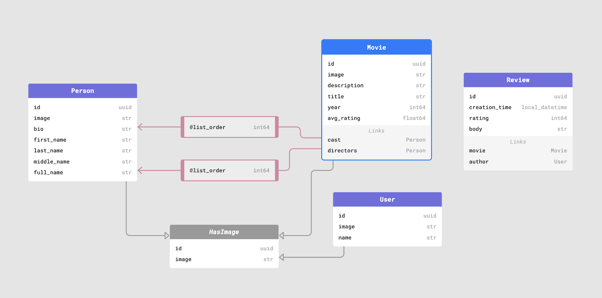
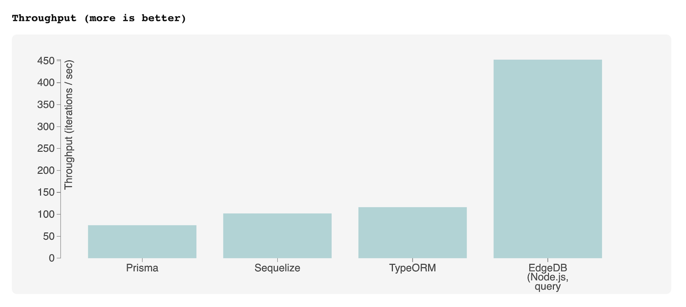
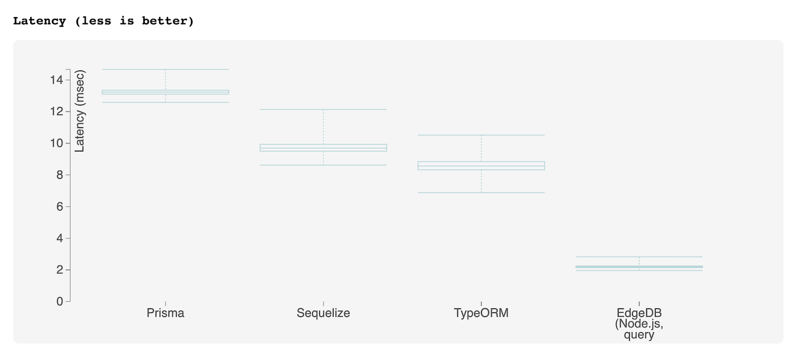
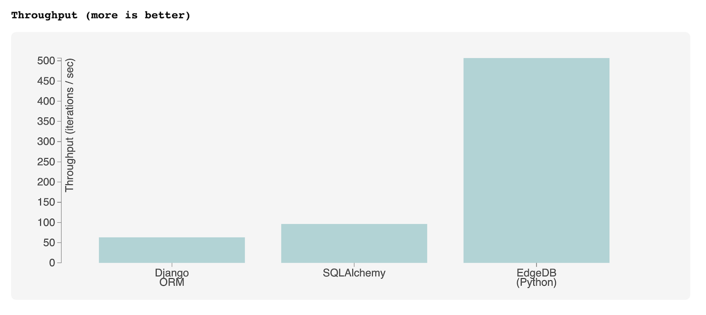
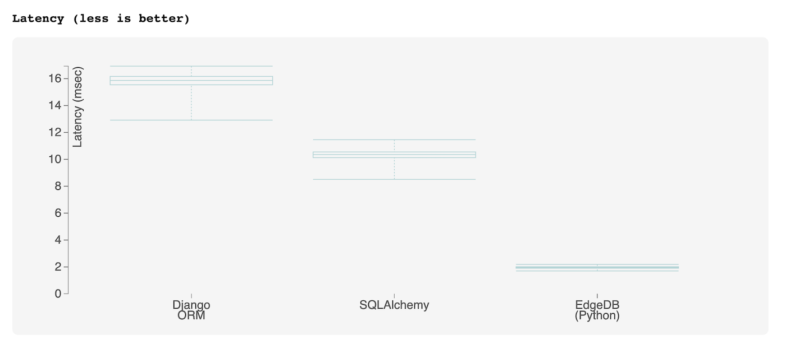
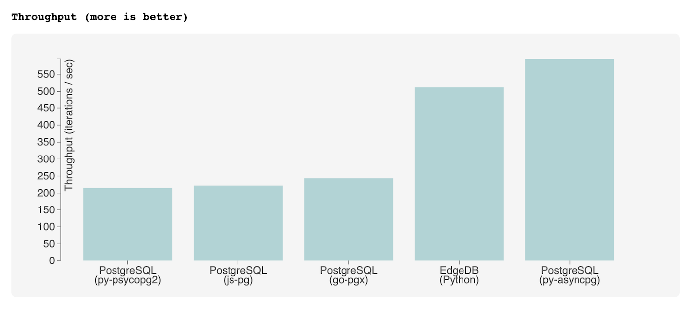
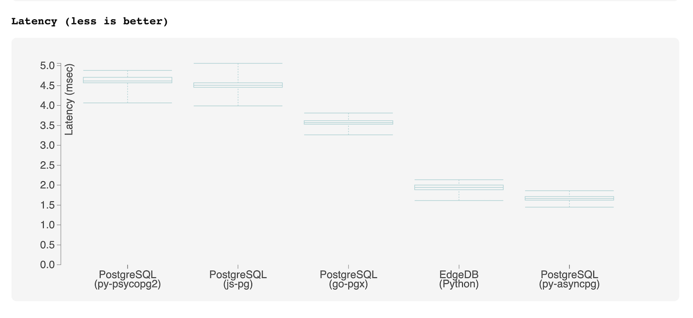

.. blog:authors:: colin
.. blog:published-on:: 2022-03-29 10:00 AM PT
.. blog:lead-image:: images/imdbench.jpg
.. blog:guid:: 41f67b63-6a4b-45c9-a9f7-bdef277dcb92
.. blog:description::
    The question of ORM performance is more nuanced than simply "they generate
    slow queries". We present a new benchmark for comparing ORM performance on
    realistic queries.

======================================
Why ORMs are slow (and getting slower)
======================================

Object-relational mapping (ORM) libraries solve some important usability
issues with relational databases and continue to grow in popularity. However,
they come with important performance tradeoffs that are often poorly
understood and quantified.

To provide some better answers to the question of ORM performance, we're
open-sourcing a new benchmarking rig called `IMDBench
<https://github.com/edgedb/imdbench>`_. The goal is to evaluate the
performance of major ORM libraries with **realistic queries** that would be
required for a hypothetical IMDB-style movie database application.

Jump to the :ref:`Results <ref_benchmark_results>` section if you failed the
marshmallow test as a child. Or stick around for a discussion of *why* ORMs
are slow in the first place.

Why are ORMs slow?
------------------

The question of ORM performance is more complex than simply "they generate
slow queries". It's important to look at the problem holistically: how long
does does it take to get all the data I need out of the database?

Query splitting 🪓
^^^^^^^^^^^^^^^^^^

It's common for ORMs to perform non-trivial operations (deep fetching,
nested mutation, inline aggregation, etc.) by opaquely executing several
queries under the hood. This may not be obvious to the end user. Even
"next-generation" ORMs do this.

For instance, the TypeScript ORM Prisma executes a separate query for each
relation you fetch. The following operation executes 3 separate SQL queries,
executed in sequence.

.. code-block:: typescript

  const result = await prisma.movies.findMany({
    select: {
      id: true,
      title: true,
      reviews: {
        select: {
          rating: true,
          author: {
            select: {id: true, name: true},
          },
        },
      },
    },
    where: {title: {startsWith: 'Iron Man', mode: 'insensitive'}},
  });

.. important:: **Data integrity**

  Unless these component queries are executed in a transaction, this opens the
  door to some hairy data integrity bugs; the data might change between two
  reads, producing unexpected results. This can be alleviated running the
  queries inside a transaction, which rapidly places unacceptable limits on
  read capacity. Different ORMs have different behavior.

Transactional mutations 🧬
^^^^^^^^^^^^^^^^^^^^^^^^^^

Nested mutations (inserts, updates, etc.) are even worse. In addition to
requiring an roundtrip query for each level of nesting, the ORM
must also ``begin`` and ``commit`` a transaction, as well as a final query to
fetch the data that was just inserted. The following operation
executes six SQL queries and five round-trips.

.. code-block:: typescript

  const results = await prisma.movies.create({
    data: {
      title: 'The Batman',
      year: 2022,
      cast: {
        create: {
          person: {
            create: {
              name: 'Robert Pattinson'
            },
          },
        },
      },
    },
  });

By contrast, EdgeDB and SQL can represent this operation as a single query requiring a single round trip.

.. code-block:: edgeql

  insert Movie {
    title := "The Batman",
    year := 2022,
    cast := (insert Person { name := "Robert Pattinson"})
  }

Aggregation (or lack thereof) 🪣
^^^^^^^^^^^^^^^^^^^^^^^^^^^^^^^^

Less mature ORMs often don't support functionality like aggregations
(counts, statistics, averages, etc.), forcing users to overfetch and perform
these calculations server-side.

While some modern ORMs provide "top-level" aggregation (``"Count the number of
movies in the database"``), even the most advanced ORMs don't support simple
relational (i.e. nested) aggregations such as ``"Select some movies,
returning the title and average rating of all its reviews"`` This (quite
simple) query requires either:

1. Overfetching all associated ``Reviews`` for each movie, or
2. Executing a separate aggregation query
3. Falling back to SQL ☹️

The first two options require two round trips. Here's how #2 might look in
Prisma:

.. code-block:: typescript

  const results = await prisma.movies.findMany({
    select: {
      id: true,
      title: true
    },
    where: { release_year: { gt: 1999 }}
  });

  const avgRatings = await prisma.reviews.groupBy({
    by: ['movie_id'],
    where: {
      movie_id: {
        in: results.map((r) => r.id),
      },
    },
    _avg: { rating: true }
  });

  // then post-process the data

The tragedy of compounding latency
----------------------------------

And things might be getting worse soon. The current trend towards multi-region
serverless or "edge computing" architectures stands to dramatically compound
this problem. Under these architectures, your server logic is executed in
emphemeral "functions" running in data centers that are geographically near
your user. **But by moving our servers closer to our users, we're often moving
them further from our database.**

The roundtrip latency of a simple ping between the ``us-east`` and ``us-west``
regions is roughly `70ms <https://www.cloudping.info/>`_; for non-trivial
payloads, it can exceed hundreds of milliseconds. If you're using an ORM that
opaquely executes 3+ roundtrip queries for common operations, your app's
responsivity can quickly crater.

This is a known gotcha and most serverless offerings (Lambda, Firebase
Functions, Vercel, Cloudflare) add disclaimers `like
<https://vercel.com/docs/concepts/functions/edge-functions#fetch>`_ `these
<https://firebase.google.com/docs/functions/locations#best_practices_for_changing_region>`_ to their documentation.

.. note::

  You could alleviate this by creating a read replica in each region. This
  comes with large operational overhead, does not help with mutating queries
  (since those still must be executed against the primary node), and is likely
  to be prohibitively expensive for smaller companies.

Long story short: for anything but the most basic of queries, ORMs require
multiple queries to fetch all the data you need. This, more than anything
else, is why ORMs are perceptually slower than raw SQL. Most existing
benchmarks use flat CRUD queries that are
`too <https://github.com/tortoise/orm-benchmarks>`_
`simplistic <https://github.com/emanuelcasco/typescript-orm-benchmark>`_ to
capture this unfortunate characteristic.

Methodology
-----------

So ORMs have some unfortunate characterics. But how slow are they really?
That's the question we set out to answer quantitatively. The result is
`IMDBench <https://github.com/edgedb/imdbench>`_,
an open-source ORM benchmarking tool. Our aim was to design a benchmark that
simulates a hypothetical production environment for a non-trivial CRUD app.

Simulated server-database latency 🐇
^^^^^^^^^^^^^^^^^^^^^^^^^^^^^^^^^^^^

The execution environment simulates a *1 millisecond* latency between the
server and database. The typical latency
`between availability zones <https://aws.amazon.com/blogs/architecture/improving-performance-and-reducing-cost-using-availability-zone-affinity/>`_
in a given region is 1-2ms. The vast majority of applications do not have the
resources to support per-availability-zone replication, so this assumption is
reasonable.

On Linux, this latency can be simulated with ``tc`` like so:

.. code-block::

  sudo tc qdisc add dev br-webapp-bench root netem delay 1ms

Dataset 🍿
^^^^^^^^^^

We are simulating an `IMDB <https://imdb.com>`_-style movie database
website. The sample dataset consists of 25k movies, 100k people, 100k users,
and 500k reviews.

The ``Movie`` type has two links (relations): ``cast -> Person[]`` and
``directors -> Person[]`` (both of which are orderable by a ``list_order``
association property). The ``Review`` type has two links: ``movie -> Movie``
and ``author -> User``.

Queries 🐣
^^^^^^^^^^

The following queries have been implemented for each target.

**InsertMovie**: Evaluates *nested mutations* and *the ability to insert and
select in a single step*.

Insert a ``Movie``, setting its ``cast`` and ``directors``
with pre-existing ``Person`` objects. Return the new ``Movie``, including
all its properties, its ``cast``, and its ``directors``.

.. code-block:: edgeql
  :class: collapsible

  with
    new_movie := (
      insert Movie {
        title := <str>$title,
        image := <str>$image,
        description := <str>$description,
        year := <int64>$year,
        directors := (
          select Person
          filter .id = <uuid>$d_id
        ),
        cast := (
          select Person
          filter .id in array_unpack(<array<uuid>>$cast)
        )
      }
    )
  select new_movie {
    id,
    title,
    image,
    description,
    year,
    directors: { id, full_name, image } order by .last_name,
    cast: { id, full_name, image } order by .last_name
  };

**GetMovie**: Evaluates *deep (3-level) fetching*.

Fetch a ``Movie`` by ID, including all its properties, its
``cast`` (in ``list_order``), its ``directors`` (in ``list_order``), and its
associated ``Reviews`` (including basic information about the review
``author``).

.. code-block:: edgeql
  :class: collapsible

  select Movie {
    id,
    image,
    title,
    year,
    description,
    avg_rating,
    directors: {
      id,
      full_name,
      image
    } order by @list_order empty last
      then .last_name,
    cast: {
      id,
      full_name,
      image,
    } order by @list_order empty last
      then .last_name,
    reviews := (
      select .<movie[is Review] {
        id,
        body,
        rating,
        author: {
          id,
          name,
          image
        }
      } order by .creation_time desc
    )
  }
  filter .id = <uuid>$id;

**GetUser**: Evaluates *reverse relation fetching* and *relation aggregation*.

Fetch a ``User`` by ID, including all its properties and 10
most recently written ``Reviews``. For each review, fetch all its
properties, the properties of the ``Movie`` it is about, and the *average
rating* of that movie (averaged across all reviews in the database).

.. code-block:: edgeql
  :class: collapsible

  select User {
    id,
    name,
    image,
    latest_reviews := (
      select .<author[is Review] {
        id,
        body,
        rating,
        movie: {
          id,
          image,
          title,
          avg_rating := math::mean(.<movie[is Review].rating)
        }
      }
      order by .creation_time desc
      limit 10
    )
  }
  filter .id = <uuid>$id;

.. _ref_benchmark_results:

Results
-------

The graphs below present the throughput/latency results for each target as a
geometric mean of the three queries. As such, it should be interpreted as a
holistic benchmark that represents the target library's collective performance
across a range of query functionality.

For per-query results, interactive charts, and latency jitter statistics,
view the full report! 👀

JavaScript ORMs [`Full Report <https://edgedb.github.io/imdbench/js.html>`__]
^^^^^^^^^^^^^^^^^^^^^^^^^^^^^^^^^^^^^^^^^^^^^^^^^^^^^^^^^^^^^^^^^^^^^^^^^^^^^

The libraries tested are:

- `Prisma <https://prisma.io>`_
- `TypeORM <https://typeorm.io/#/>`_
- `Sequelize <https://sequelize.org/>`_
- `EdgeDB (TypeScript query builder) <https://www.edgedb.com/docs/clients/01_js/index>`_

.. note::

  EdgeDB is not an ORM library, but it provides a comparable developer
  experience: declarative schema, migrations, and an object-oriented querying
  API (EdgeQL). As the EdgeQL query builder is able to return fully typed
  query results, we consider EdgeDB to qualify here.

Python ORMs [`Full Report <https://edgedb.github.io/imdbench/py.html>`__]
^^^^^^^^^^^^^^^^^^^^^^^^^^^^^^^^^^^^^^^^^^^^^^^^^^^^^^^^^^^^^^^^^^^^^^^^^

The libraries tested are:

- `Django <https://docs.djangoproject.com/en/4.0/topics/db/queries/>`_
- `SQLAlchemy <https://www.sqlalchemy.org/>`_
- `EdgeDB (Python client) <https://www.edgedb.com/docs/clients/00_python/index>`_

Raw SQL [`Full Report <https://edgedb.github.io/imdbench/sql.html>`__]
^^^^^^^^^^^^^^^^^^^^^^^^^^^^^^^^^^^^^^^^^^^^^^^^^^^^^^^^^^^^^^^^^^^^^^

For comparison, below are the benchmark results for a tuned
PostgreSQL implementation of the benchmark queries, executed using popular
Postgres drivers:

- `asyncpg <https://github.com/MagicStack/asyncpg>`_
- `psycopg2 <https://pypi.org/project/psycopg2/>`_
- `go-pgx <https://github.com/jackc/pgx>`_
- `node-postgres <https://node-postgres.com/>`_

For reference the EdgeDB results (using the `Python client
<https://github.com/edgedb/edgedb-python>`_) are also included.

.. note::

  Most Postgres drivers cannot properly decode the results of queries
  containing array-aggregated subqueries. This is necessary to retrieve usable
  results from deep queries in a performant way; as such, certain benchmark
  operations are implemented as 2+ serially-executed queries. By contrast,
  ``asyncpg`` (which was originally designed as the Postgres interface for
  EdgeDB) can express all operations as a single highly-optimized SQL query
  and represents the high-water mark for this benchmark.

Analysis
--------

We think IMDBench stands alone as an effective benchmark for those choosing an
ORM for their next project. Predictably, ORMs perform poorly on this benchmark
relative to EdgeDB or raw SQL, both of which can express more complex
operations in a single query.

However, the goal of this benchmark is not to pick on ORM libraries. They
solve some very real usability issues with relational databases. *It is a
valid decision to prioritize developer experience over performance,
especially when your expected traffic is low.*

That said, it's important to understand the limitations of ORMs if you wish to
make an informed decision regarding these technologies. Ultimately, as your
application scales in traffic and complexity, your ORM will become a
bottleneck sooner than you think, and refactoring away from it will present
challenges. This is why we built EdgeDB, to provide a "third way" that
combines the best of both SQL and ORMs, no tradeoffs required.

.. list-table::

  * -
    - **ORMs**
    - **SQL**
    - **EdgeDB**
  * - Intuitive nested fetching
    - 🟢
    - 🔴
    - 🟢
  * - Declarative schema
    - 🟢
    - 🔴
    - 🟢
  * - Structured query results
    - 🟢
    - 🔴
    - 🟢
  * - Idiomatic APIs for different languages
    - 🟢
    - 🔴
    - 🟢
  * - Comprehensive standard library
    - 🔴
    - 🟢
    - 🟢
  * - Computed properties
    - 🔴
    - 🟢
    - 🟢
  * - Aggregates
    - 🟡
    - 🟢
    - 🟢
  * - Composable subquerying
    - 🔴
    - 🔴
    - 🟢

Checkout the IMDBench repo at `github.com/edgedb/imdbench <https://github.com/edgedb/imdbench>`__.
Follow the "Run Locally" guide to replicate our results; there are also a lot
of other dials and knobs to mess with as well. We intend to continue evolving
and expanding the scope of this benchmark — contributions welcome!

To dip your toe into EdgeDB, check out our 10-minute :ref:`Quickstart
<docs:ref_quickstart>` for a gentle introduction. Or head to `the GitHub repo
<https://github.com/edgedb/edgedb>`_ for a collection of useful links.
