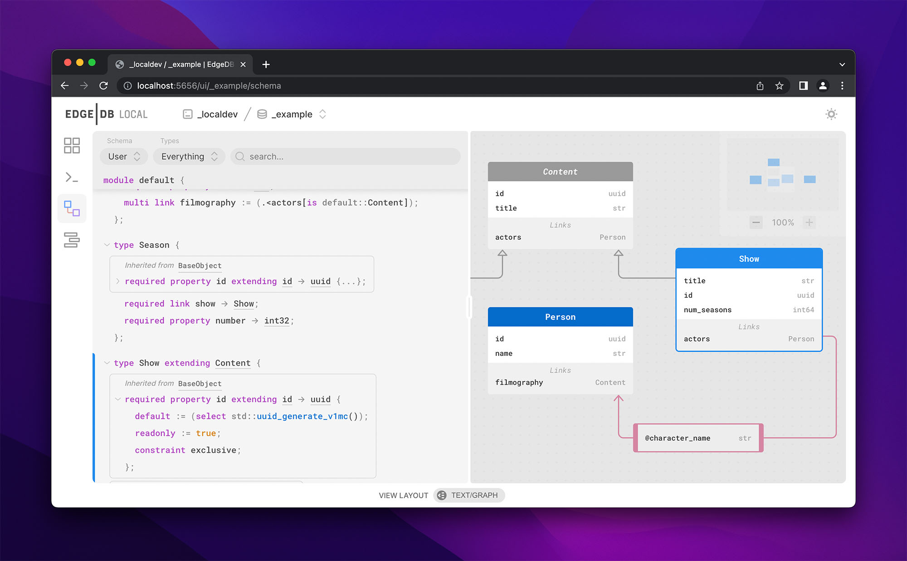

.. blog:authors:: yury elvis
.. blog:published-on:: 2022-07-28 11:00 AM PT
.. blog:lead-image:: images/blackhole.jpg
.. blog:guid:: 52cb5e26-0d07-11ed-a0e2-b3d394c5fc0b
.. blog:description::
    Today we're excited to announce the release of EdgeDB 2.0,
    the latest version of our graph-relational database.

==========
EdgeDB 2.0
==========

.. note::

  Check out the discussion of this post on
  `Hacker News <https://news.ycombinator.com/item?id=32267287>`_.
  See the recording of the live launch event on
  `YouTube <https://youtu.be/1jloGHV31Ow?t=2786>`_.

Today, just under 6 months after the release of 1.0 🏁, we're excited
to announce **EdgeDB 2.0**.

Since our 1.0 release in February, we've published 3 minor versions in the 1.x
line, started a `Discord <https://discord.gg/edgedb>`_ (750 members and
counting!), accumulated a few thousand more GitHub stars, and grown to
thousands of active users. We couldn't be happier with how things
have gone—and we have some crazy exciting stuff in the pipeline.

Back to 2.0. This release brings a slew of new features, including:

- a built-in admin UI;
- a top-level ``GROUP`` statement in EdgeQL;
- object-level security;
- range types;
- an official Rust client library (at long last!)
- ...and a lot more.

Before we dive in…
------------------

…let's briefly discuss why to use EdgeDB as the database for your next project.

EdgeDB is a new database that extends the relational model to eliminate the
object-relational impedance mismatch. This lets you model and query your data
in a more intuitive object-oriented way, while retaining the reliability and
performance of the classic relational model. We call it a `graph-relational
database <graph_rel_>`_.

By natively bridging the object-relational gap, EdgeDB eliminates the need for
additional tooling like ORMs and middleware to manage data modeling,
migrations, querying, and middleware. These are a de facto necessity when
building applications with a traditional relational database. EdgeDB
eliminates unnecessary layers from your software stack, enables powerful
querying that's impossible with ORMs and impractical with SQL, and brings
significant runtime `performance benefits <perf_>`_.

The full list of EdgeDB features printed on a thin strip of paper would
probably stretch to the moon and back. But let's enumerate some of the biggest
ones:

**A declarative schema**

…which lets you express computed properties, inheritance, functions, complex
constraints and indexes, and access control rules.

.. code-block:: sdl

  type User {
    required property email -> str {
      constraint exclusive;
    }
  }

  type BlogPost {
    required property title -> str;
    required property published -> bool {
      default := false
    };
    link author -> User;

    index on (.title);
  }

**A builtin migration system**

…consisting of a database-native migration planner, automatic migration
history tracking, and a CLI-based workflow.

.. code-block:: bash

  $ edgedb migration create
  Created dbschema/migrations/00001.edgeql
  $ edgedb migrate
  Applied dbschema/migrations/00001.edgeql

**A modern, lean query language**

…that matches the expressive power of SQL while remaining more composable
and less verbose (and eliminating ``JOIN``!)

.. code-block:: edgeql

  select BlogPost {
    title,
    trimmed_title := str_trim(.title),
    author: {
      email
    }
  }
  filter not .published

**A TypeScript query builder**

…that can express *arbitrary* EdgeQL queries and automatically infer the query
return type.

.. code-block:: typescript

  e.select(e.BlogPost, post => ({
    title: true,
    trimmed_title: e.str_trim(post.title),
    author: {
      email: true
    },
    filter: e.op("not", post.published)
  }))

And it's 100% `open source <gh_>`_ and **powered by Postgres** under the
hood.

For a more philosophical treatment of our motivations for building EdgeDB,
check out our `EdgeDB 1.0 announcement <v1_>`_. In the meantime, let's talk
about 2.0.

What's new in 2.0?
------------------

EdgeDB 2.0 improvements touch every aspect of the database: the type system,
the query language, the client libraries and binary protocol, and the
developer experience of building an app with EdgeDB.

.. note::

  Refer to the `v2.0 changelog <changelog_>`_ for an overly detailed list of
  features and fixes and instructions for upgrading your projects to EdgeDB
  2.0.

EdgeDB UI
---------

EdgeDB UI is a beautiful, feature-rich admin panel baked directly into all
EdgeDB 2.0+ instances. Open it by running ``edgedb ui`` in your project
directory, which will open a ``localhost`` page in your default browser. It
ships with:

* a data browser and editor;
* a REPL for writing and executing EdgeQL queries;
* a schema introspection tool with text-based and graphical
  visualizations of the schema.

Use EdgeDB UI to populate your new database with some test data, debug that
complex EdgeQL query, or scroll around your schema graph admiringly.

Needless to say that this is just the beginning. In the future releases we'll
continue to add new features to the UI, like a query plan visualizer, built-in
documentation, and administration tools.

The ``GROUP`` statement
-----------------------

The new top-level `GROUP <group_>`_ statement can be used to partition and
aggregate data. The output of ``GROUP`` is a set of objects—just like any old
``SELECT`` query. Each object represents a group and contains three fields:
``grouping``, ``key``, and ``elements``. Here's a simple example:

.. code-block:: edgeql-repl

    db> group Movie by .release_year;
    {
      {
        key: {release_year: 2016},
        grouping: {'release_year'},
        elements: {
          default::Movie {title: 'Captain America: Civil War'},
          default::Movie {title: 'Doctor Strange'},
        },
      },
      {
        key: {release_year: 2017},
        grouping: {'release_year'},
        elements: {
          default::Movie {title: 'Guardians of the Galaxy Vol. 2'},
          default::Movie {title: 'Spider-Man: Homecoming'},
          default::Movie {title: 'Thor: Ragnarok'},
        },
      },
      ...
    }

You can also group by arbitrary EdgeQL expressions, nested fetch properties
and links on ``elements``, and run complex analytical queries with grouping
sets (hello ``CUBE`` and ``ROLLUP``!). Though its true power lies in its
ability to *compose* with the rest of the language:

.. code-block:: edgeql-repl

    db> with
    ...   groups := (
    ...     group Movie
    ...     using
    ...       starts_with_vowel := re_test('(?i)^[aeiou]', .title),
    ...     by starts_with_vowel
    ...   )
    ... select groups {
    ...   starts_with_vowel := .key.starts_with_vowel,
    ...   count := count(.elements),
    ...   mean_title_length := math::mean(len(.elements.title))
    ... };
    {
      {starts_with_vowel: false, count: 12, mean_title_length: 19.75},
      {starts_with_vowel: true, count: 3, mean_title_length: 19.66},
    }

In SQL, ``GROUP BY`` is a clause tacked onto the end of the ``SELECT``
statement that dramatically changes the intent of the query and imposes a list
of requirements. (For instance, all columns other than the grouped keys are to
be referenced only as arguments to aggregate functions.) By contrast, the
EdgeQL syntax allows for *frictionless composability*, giving it an edge (😘)
over SQL.

Object-level security and global variables
------------------------------------------

EdgeDB's powerful schema currently supports a full set of primitive datatypes,
descriptive object syntax, type mixins, dynamically computed properties and
links, complex constraints and indexes, user-defined functions, and more. It's
more than capable of representing a data model of any complexity.

With EdgeDB 2.0, we're taking this to the next level. With **object-level
security** you can implement your application's access control logic at the
schema level. EdgeDB will transparently enforce it everywhere and act as a
single source of truth in your infrastructure.

In practice, this means adding *access policies* to your object types that
restrict the set of objects that can be selected, inserted, updated, or
deleted for a particular type. Let's start with a simple blog schema with no
access policies.

.. code-block:: sdl

  type User {
    required property email -> str {
      constraint exclusive;
    };
  }

  type BlogPost {
    required property title -> str;
    link author -> User;
  }

We're going to add an access policy to ensure that posts can only be updated
by their ``author``. But how do we communicate to the database who is
executing a particular query?

.. code-block:: sdl-diff

  +   global current_user -> uuid;

      type User {
        required property email -> str {
          constraint exclusive;
        };
      }

      type BlogPost {
        required property title -> str;
        link author -> User;
      }

We add a **global variable** called ``current_user``. Global variables
are a new mechanism for defining a *context* for query execution. Once a
global has been declared in your schema, you can easily set a value for it via
the client API or in REPL.

.. tabs::

  .. code-tab:: typescript

    import createClient from 'edgedb';

    const client = createClient();

    const myApiHandler = async (userId: string) => {
      const scopedClient = client.withGlobals({
        current_user: userId,
      });

      return await scopedClient.query(
        `select global current_user;`
      );
    }

  .. code-tab:: python

    import edgedb

    client = edgedb.create_client()

    async def my_api_handler(user_id):
        scoped_client = client.with_globals({
            'current_user': user_id,
        })

        return await scoped_client.query(
          "select global current_user;"
        )

  .. code-tab:: edgeql-repl

    db> set global current_user :=
    ...   (SELECT User FILTER .email = 'elvis@edgedb.com').id;
    OK: SET GLOBAL

    db> select global current_user;
    {<uuid>"5b4d1530-0e0b-11ed-ae2a-133197f4faf5"}

.. note::

  Our client libraries efficiently pack and transfer global variables
  as well as transparently handle the necessary client-side connection pooling
  and protocol-level magic for you.

Importantly (and unlike :ref:`query parameters <docs:ref_eql_params>`) you can
reference global variables in any context, including in your schema. Let's use
``current_user`` to add a new access policy to ``BlogPost``.

.. code-block:: sdl-diff

      global current_user -> uuid;

      type User {
        required property email -> str {
          constraint exclusive;
        };
      }

      type BlogPost {
        required property title -> str;
        link author -> User;
  +     access policy own_posts
  +        allow all
  +        using (.author.id ?= global current_user)
      }

The new *access policy* is called ``own_posts`` and it *allows* **all**
operations—select, update, insert, delete—if the post's ``.author.id``
property is equal to the value of ``current_user`` global variable.

We are excited about how flexible the design of access policies turned out
to be:

- Policies can ``allow`` or ``deny`` access to specific operations, including
  ``select``, ``insert``, ``delete``, and ``update`` (which can be further
  subdivided into ``update read`` and ``update write``);
- The ``using`` expression can correspond to an arbitrary EdgeQL expression;
- You can add as many policies as you like.

This is a new versatile mechanism that can be used to implement a broad
range of access logic. Here's an example on how to use access policies
to implement a temporal mixin type:

.. code-block:: sdl

  abstract type Temporal {
    required property validity_period -> range<datetime>;

    access policy hide_invalid allow all using (
      contains(.validity_period, datetime_of_transaction())
    )
  }

Refer to the :ref:`documentation <docs:ref_datamodel_access_policies>`
for more details and examples.

…and so much more!
------------------

**Rust.** The official Rust `client <edgedb_tokio_>`_ is here, finally! 🎉
While we are using Rust pretty extensively (e.g. our CLI is 100% Rust),
it took us some time to figure out and tune the API design of the client
library. This brings the list of first-party client libraries to 4,
including `TypeScript <js_>`_, `Python <python_>`_, and
`Go <go_>`_, along with community-maintained packages for
`.NET <dotnet_>`_ and `Elixir <elixir_>`_.

**Protocol.** EdgeDB's `binary protocol <proto_>`_ reached version 1.0,
receiving multiple enhancements:

* Fully stateless: this enables having multiple concurrent sessions
  within one connection, as well as tunneling the protocol over HTTP.
  The HTTP tunneling is already used to implement the REPL experience
  of the new UI, and can later be used to enable new experiences, such
  as integration with environments like `Next.js Live <nextjs_live_>`_.

* Support for global variables and local state. Upon connecting clients
  receive the full state descriptor to be able to serialize values
  for global variables and configuration.

* Optimized parse/execute flow. Clients require even fewer back
  and forth communications with the server, improving latency.

**Efficient local development.** EdgeDB 2.0 supports socket activation for
development instances, which means that it doesn't run on your devbox until
you actually try to use it. And when you do use it, all internal process pools
autoscale to use the minimal amount of resources. This conserves your machine's
RAM and CPU and allows you to work on multiple EdgeDB projects without
experiencing any slowdowns.

**Ranges.** EdgeDB 2.0 `supports range types <ranges_>`_ that can represent
intervals of values, such as date/time values or 64-bit integers. Ranges
implement a number of operators and built-in functions, and support casting
to JSON and back.

**Date/time.** Date/time API was `tweaked <datetime_>`_ to make
arithmetic on local date and local time more sound. A new
`cal::date_duration <datedur_>`_ type was added along with a several new
helper functions.

The list continues, read it in full in the v2 `changelog`_!

Future
------

We plan to release EdgeDB 3.0 in about 6 months. We're sticking to a fast
release cadence because there's so much we want to do! Currently topping the
todo list:

* ``EXPLAIN`` command to analyze EdgeQL queries;
* user-definable error types (exceptions);
* support for splats in EdgeQL shapes;
* role-based access control;
* full-text search support.

Last, but not least, we are close to launching a preview of **EdgeDB Cloud**,
a fully-managed hosted EdgeDB service that will make it possible
to spin up production-ready instances with a single CLI command.
Sign up below to be the first to experience it. ⛅

.. raw:: html

  

    <a
      href="https://www.edgedb.com/p/cloud-waitlist"
      style="display: inline-block;
      background: hsla(0,0%,100%,.1);
      background: linear-gradient(90.91deg,#2981e2 8.06%,#407de0 19.04%,#5179de
      30.03%,#5f74da 41.01%,#6b70d7 52%,#776bd3 62.99%,#8166ce 73.97%,#8a60c8
      84.96%,#935bc2 95.94%,#9b55bc 106.93%);
      border-radius: 6px;
      padding: 6px 22px;
      font-size: 18px;
      font-weight: 600;
      color: #fff;"
    >
      Join Cloud Waitlist
    </a>
  

In the meantime, join us on `Discord <discord_>`_, give us a star on `GitHub
<gh_>`_, and—most importantly—go build something wonderful with EdgeDB! ❤️

.. _perf: /blog/why-orms-are-slow-and-getting-slower
.. _tsqb: /blog/designing-the-ultimate-typescript-query-builder
.. _v1: /blog/edgedb-1-0
.. _gh: https://github.com/edgedb/edgedb
.. _changelog: /docs/changelog/2_x
.. _upgrade: /docs/changelog/2_x#try-it-out
.. _group: /docs/edgeql/group
.. _group_rfc: https://github.com/edgedb/rfcs/blob/master/text/1009-group.rst
.. _access: /docs/datamodel/access_policies
.. _access_pg: https://www.postgresql.org/docs/current/ddl-rowsecurity.html
.. _proto: /docs/reference/protocol/index
.. _nextjs_live: https://vercel.com/live
.. _edgedb_tokio: https://crates.io/crates/edgedb-tokio
.. _ranges: /docs/stdlib/range
.. _graph_rel: https://www.edgedb.com/#what_is_a_graph_relational_database_
.. _discord: https://discord.gg/edgedb
.. _elixir: https://github.com/nsidnev/edgedb-elixir
.. _dotnet: https://github.com/quinchs/EdgeDB.Net
.. _python: https://github.com/edgedb/edgedb-python
.. _go: https://github.com/edgedb/edgedb-go
.. _js: https://github.com/edgedb/edgedb-js
.. _datetime: https://github.com/edgedb/rfcs/blob/master/text/1013-datetime-arithmetic.rst
.. _datedur: /docs/stdlib/datetime#type::cal::date_duration
