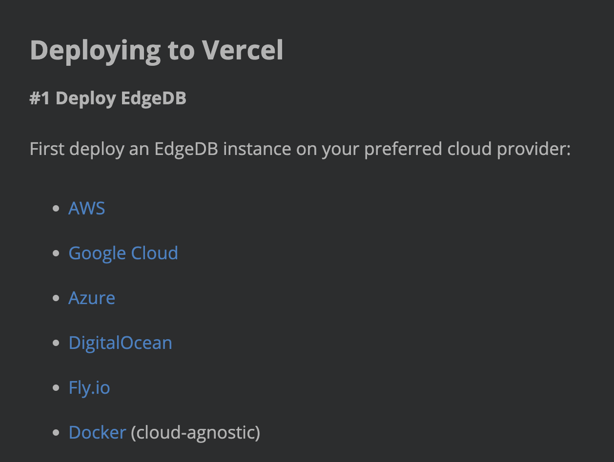

.. blog:authors:: devon
.. blog:published-on:: 2023-08-04 12:00 PM PT
.. blog:lead-image:: images/ryl-post-thumbnail.jpg
.. blog:guid:: 8b2cc982-e721-40d6-96d7-4e3733bbb9d3
.. blog:description::
    DRY is great for code, but it's not always the right principle for
    documentation. Learn our approach at EdgeDB and why we prioritize DX over
    more convenient maintenance of our docs.

========================================================
Make your users happy by keeping it RYL in documentation
========================================================

One of the first principles you learn as a developer is DRY: don't repeat
yourself. In some cases, DRY should be ignored — like to avoid
over-abstraction or tight coupling, and when it might have a problematic impact
on performance — but, in *most* cases, it's a principle that serves developers
well. It makes code easier to maintain, easier to test, and less buggy (since
there's just less of it in general).

Many of us find ourselves at some point writing documentation for the software
we've built. DRY is so useful when writing software that we want to bring it
over with us and use it when we write our documentation too. It *can* have
benefits in documentation… but it can also do more harm than good. Let's look
at some examples from :ref:`the EdgeDB documentation <ref_intro>` to show when
DRY works and when it doesn't.

The most repeated piece of EdgeDB documentation
===============================================

This is the most foundational thing we document… and it's, by no coincidence,
the most repeated bit of documentation on our entire site. If we don't tell you
how to install EdgeDB, there's not really much point in telling you anything
else. 😅

We have at least four instances of the installation instructions:

.. blog:gallery::
  .. figure:: images/installation-instructions-home-page.png

      Home page

      Installation instructions on the EdgeDB home page

  .. figure:: images/installation-instructions-quickstart.png

      Quickstart

      Installation instructions on the EdgeDB quickstart

  .. figure:: images/installation-instructions-cli.png

      CLI docs

      Installation instructions in the EdgeDB CLI documentation

  .. figure:: images/installation-instructions-nextjs-tutorial.png

      Next.js blog tutorial

      Installation instructions in the EdgeDB Next.js blog tutorial

Messy, right? Now, if the command for installing EdgeDB changes, we have to
change it in four different places — and that's the best case scenario. What
happens if the person updating it doesn't know to look for these additional
instances? Then, three instances don't get updated and end up leading someone
in the wrong direction.

This is exactly the reason we use DRY when writing software. So, why wouldn't
we also apply it when writing documentation? The DRY approach would be to pick
a single location to house the canonical installation instructions and then to
link back to it from anywhere else we need to tell someone how to install. Why
make life hard on those of us writing and maintaining documentation?

Only because the alternative is worse.

The cost of DRY documentation
=============================

It's not that there's *never* a cost associated with keeping code DRY. There
is. It can mean code is spread across more files and that things are a bit
harder to work with. The nice thing though is that, usually when you're
re-using code, you by necessity leave a breadcrumb trail that leads to the one
canonical source of the code in question. Most of the time, those pains a small
price to pay for the gains.

But the critical point is *who* pays the cost of DRY code: your developers.
Maybe they have to search around a little to find the function they need to
refactor… but that *is* the job. It's just part of what we do as developers.

When we use DRY in documentation though by insisting every atom of
documentation is located in one and only one place, the largest cost is paid
**by our users** when they try to *use* the documentation. Take our
:ref:`Next.js blog tutorial <ref_guide_nextjs_pages_router>` shown in one of the examples
above. Imagine that it instead linked out of the tutorial to the "Install" page
for installation instructions. Now, instead of the tutorial being a one-stop
shop for pretty much everything you need to build the app, the user has to jump
out to another page, perform that step, and then come back.

OK, now I can hear you across time and space saying: "Big deal! It's one click
and a few seconds on a different page." This is true, but the problem is that
the Next.js blog tutorial aggregates all sorts of information from all across
the documentation and even from documentation for other non-EdgeDB projects. To
avoid repeating ourselves — or repeating *anyone* — we would have links out to:

- Next.js documentation
- our CLI documentation
- our schema quickstart
- our migration quickstart
- our JavaScript client documentation
- our page on the JavaScript query builder
- Vercel documentation
- and probably a few others I've missed

The Next.js tutorial would no longer be a tutorial, and instead it would become
just an aggregation of links. Instead of one click and a few seconds to figure
out how to install, the tutorial now requires globetrotting all across the
internet just to build a simple project. This creates a subtle shift in what
this piece of documentation is: it's no longer teaching users to build a
Next.js blog; it's teaching users to *learn* to build a Next.js blog. The
burden of the actual "teaching" though now falls to them.

Now take that friction and multiply it by every instance of repeated
documentation across our docs. You can see how the constant added friction
would make learning and using EdgeDB incredibly frustrating.

Wait, what's that? It's another whisper across the void. I hear you saying,
"but if DRY is good enough for developers and we're documenting a project
targeted at developers, then DRY documentation should be good enough for them."
The key difference is DRY code forces developers *we employ* to do a little
more work whereas DRY documentation forces our *users* or maybe *customers*,
who granted might also happen to be developers, to do more work. Do we really
want to start that relationship by making their lives harder? (Spoiler: the
answer is "no, we don't." 😜)

Many users will check out. They just won't do it, and I can't blame them. I
wouldn't do it either if I were in their shoes! It's not that they don't want
to learn. It's that there's *someone* out there writing documentation that will
make their heart smile by not forcing them do so much work. It's easier and
smarter to jump ship instead of jumping through the hoops *we* erected to make
life easier on *us*.

In software, DRY is transparent to your user. To them, your app would work the
same if you rewrote the same function 14 times for the 14 different contexts
you call it in or if you wrote it once and calling it in those 14 contexts. But
in documentation, DRY changes the user experience, often for the worse.

Instead, we want to use a principle I'm calling RYL: repeat yourself liberally.
(Not only does this accurately describe the concept, but it also allows me to
giggle to myself as I use it to riff on a slang idiom with "keeping it RYL."
😁)

The "liberally" part does some heavy lifting here. I *don't* mean to imply you
should repeat everything all the time. Let's look at why.

When DRY works for documentation
================================

DRY is bad for documentation, so maybe you should ARY (always repeat yourself),
right? Well, no, that's not really the best solution either. As with so many
questions in software development, the answer to the question, "Should I
reproduce an existing piece of documentation in this other context where it
might be needed?" is the dreaded "it depends."

If we skip down near the end of the Next.js tutorial, we'll find a section on
deploying the app. The first step in deploying is to deploy an EdgeDB instance.

          AWS, Google Cloud, Azure, DigitalOcean, Fly.io, and Docker

Readers have as many ways to do this as there are cloud providers, and we have
instructions for many of them. Each of these deployment guides is fairly
extensive which means including even *one* of them would have a massive impact
on the tutorial's word count. A user will probably have a strong preference for
one deployment method over the others — maybe they already have some
infrastructure on Google Cloud, or maybe they're familiar with AWS because they
used it at a previous job — and only need to deploy to one target, so seeing
all of the deployment guides inline in this tutorial will almost never be
useful.

.. note::

    ☁️ The easiest way to deploy EdgeDB is now in beta: EdgeDB Cloud! `Sign up
    </p/cloud-waitlist>`_ to try it for yourself.

Repeating the deployment guides here also doesn't work because it will create a
ton of noise in the guide, and there's nothing particular to this tutorial
about setting up the EdgeDB instance. You simply set up an instance. Then, the
Next.js guide takes over again when it's time to connect that instance with
your app. Repeating this mountain of deployment information within the tutorial
would make it harder to use.

Maybe at this point, you find yourself convinced that RYL is a useful principle
when applied to tutorials which naturally aggregate information from different
sources. Can RYL still be useful in other kinds of documentation where
aggregation isn't their primary purpose?

Being RYL outside of tutorials
==============================

In addition to giving the basic information about how features work,
documentation needs to tell users about behavior that may not be intuitive or
that they might not expect. This kind of information is a great candidate for
RYL. My philosophy is this: if the behavior is likely to cause a user
frustration when they're using EdgeDB, make the warning about it easy to trip
over in the documentation. Here's an example where we describe how to specify
your server version for EdgeDB.

.. blog:gallery::
  .. figure:: images/version-pinning-instance-create.png
      :alt: Description of how version specifications work on the "edgedb
            instance create" command documentation page. "By default, when you
            specify a version, the CLI will use the latest release in the major
            version specified. This command, for example, will install the
            latest 2.x release: edgedb project init --server-version 2.6 You
            may pin to a specific version by prepending the version number with
            an equals sign. This command will install version 2.6: edgedb
            project init --server-version =2.6"

      edgedb instance create

  .. figure:: images/version-pinning-project-init.png
      :alt: Description of how version specifications work on the "edgedb
            project init" command documentation page. "By default, when you
            specify a version, the CLI will use the latest release in the major
            version specified. This command, for example, will install the
            latest 2.x release: edgedb project init --server-version 2.6 You
            may pin to a specific version by prepending the version number with
            an equals sign. This command will install version 2.6: edgedb
            project init --server-version =2.6"

      edgedb project init

  .. figure:: images/version-pinning-edgedb.toml.png
      :alt: Description of how version specifications work in the edgedb.toml
            config file's documentation page. "server-version- The server
            version of the EdgeDB project. NOTE: The version specification is
            assumed to be a minimum version, but the CLI will not upgrade to
            subsequent major versions. This means if the version specified is
            3.1 and versions 3.2 and 3.3 are available, 3.3 will be installed,
            even if version 4.0 is also available. To specify an exact version,
            prepend with = like this: =3.1. We support all of the same version
            specifications as Cargo, Rust’s package manager."

      edgedb.toml

There is no "right" way to specify a dependency version. People have different
expectations about how it should work. This means that, if you build a way to
specify a version that is intuitive for one group, it will surprise another.
Even though the way we do it will be surprising for some, it isn't "broken" and
as a result, it can't be "fixed." What we *can* do is to document it properly
and put that documentation where users can find it.

You can specify your version when you create an instance or when you initialize
a project. Maybe you want to hand-write an ``edgedb.toml`` file and bring up a
project from it. All three are perfectly valid. It would be silly to try link
users from the ``edgedb.toml`` documentation across to the ``edgedb instance
create`` documentation for information on how version specification works,
especially since we're just talking about repeating a paragraph or two of text.
As part of maintaining our documentation, we will take on the burden of
maintaining this information in multiple places to take the burden of finding
the information or having to bounce all over our documentation off our users.
By using RYL, we can ensure our users will have the information they need no
matter what circumstances they find themselves in.

One other nice thing about repeating this is that we can change up the text to
fit the context. The first two examples are nearly identical, except that the
command examples are changed to reflect the command we're talking about. Could
someone figure this out on their own? Yeah, probably, but why would we make
them?

Sometimes, DRY works tutorials better in non-tutorial docs too
==============================================================

Being DRY in other documentation is also useful. A great example is :ref:`our
CLI's connection flags <ref_cli_edgedb_connopts>`. Most of the CLI's commands
need to connect to an EdgeDB instance in order to be useful, and we provide
many different options to make that easy for you. The current count is 13
different connection flags. They work the same way across all commands, and the
documentation on them is not trivial.

Here's a case where duplicating this information across a couple dozen
documentation pages doesn't make sense and linking to it is the better choice.
It's just too much, and the usage doesn't change across the various commands.

Keep it RYL… when that makes sense
==================================

In plenty of cases, keeping documentation DRY makes sense, but not always. DRY
is less useful in documentation than it is in code because of the burden DRY
documentation shifts to your users.

Add RYL to the equation when you're thinking about how best to support your
users with documentation. When you should and shouldn't use it is more art than
science. It'll be up to you to define where that balance lies for your project,
but you want to use every tool you can find to make sure your users can be
successful. RYL is often the right tool for documentation, to make sure your
users find exactly what they need when they need it.
