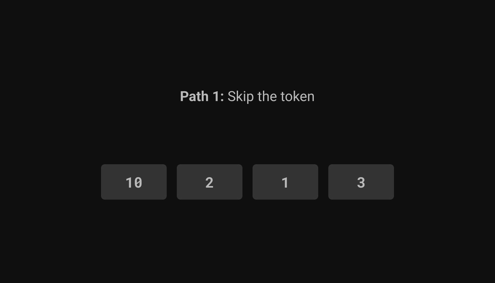
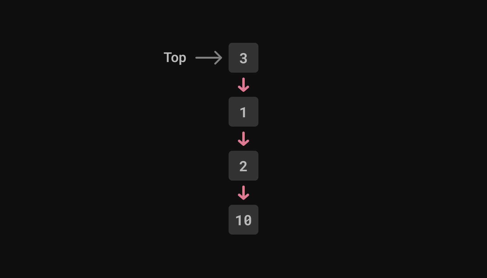
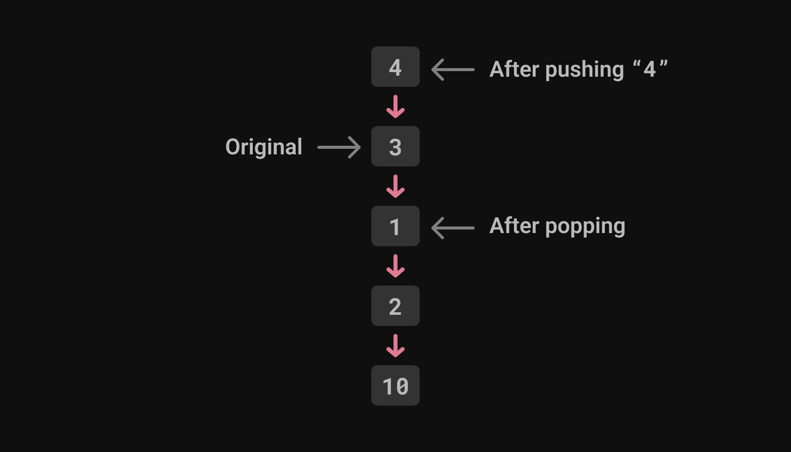

.. blog:authors:: aljaz
.. blog:published-on:: 2023-10-24 11:00 AM PT
.. blog:lead-image:: images/parser-thumb.jpg
.. blog:guid:: 8B4D588D8-E725-49D1-832E-7B0FC09E1134
.. blog:description::
   EdgeDB needs support for Language Server Protocol, but we couldn't even
   start down the path of building it with our existing parser. We explored
   four fixes and ended up with all the pieces in place… and 26% faster query
   compilation we can start enjoying now!

==============================================================
Python, Rust, Chumsky, Tree-sitter, and EdgeDB walk into a bar
==============================================================

One of the first mottos EdgeDB used to introduce itself to the world
is that it was "designed for devs, not suits". In other words, developers
should find the experience as intuitive and enjoyable as working with their
favorite programming languages. Strong typing, automatic migrations, and
helpful compiler messages are some of the areas that make the EdgeDB
experience an intuitive and pleasant one.

But there's one major tool that EdgeDB is still working on: a Language
Server Protocol (LSP). LSPs are what allow you to type ``in`` inside your
favorite IDE and automatically see suggestions like ``integer`` and
``interface`` before you even reach the third key. LSP benefits like code
completion, error highlighting, automatic code formatting… all of these add
up to a better developer experience, and when you start talking about that,
our ears perk up.

Problem is, there's one piece of EdgeDB that wasn't yet where it needed to be
to make an LSP possible: **the parser.** In order to make an LSP feasible, we
would first need to do some work on our parser.

We evaluated four different options, and eventually landed on one that
positions everything just right for future development of that LSP. But before
we explore the options, let's take a look at what we had to start with.

EdgeDB's existing Python parser
-------------------------------

EdgeDB had a parser written in Python using a package called `parsing
<parsing_>`_. ``parsing`` was originally written by Jason Evans, the
creator of `jemalloc <jemalloc_>`_. It allows defining your grammar via Python
classes and methods. The production rules are parsed from the method's doc
string and the body of the method maps the production’s CST (concrete syntax
tree) node onto the appropriate AST (abstract syntax tree) node. With Jason’s
approval, we continued development of the package and used it to declare all
of `EdgeQL grammar <edgeql_grammar_>`_ and mappings into AST nodes.

For example, this is more or less the grammar definition for EdgeQL's tuples:

.. code:: python

    class Tuple(Nonterm):
        def reduce_non_empty(self, _l, first, _comma, others, _r):
            """reduce LPAREN Expr COMMA OptExprList RPAREN"""
            self.val = qlast.Tuple(elements=[first.val] + others.val)

        def reduce_empty(self):
            """reduce <e>"""
            self.val = qlast.Tuple(elements=[])

.. note::

    This is not *exactly* how it’s defined — we also have a setup to generate
    the doc string from the method name… but that’s just syntactic sugar.

This setup of using the method’s doc string may seem quite “magical” in the
sense that it is using Python reflection to generate the parser spec, but it
has a few advantages:

1. New productions are easy to add
2. Mapping from CST to AST is defined close to the grammar definitions
3. AST construction is type-checked and discoverable via the Python LSP's
   “Go to definition” feature

Those advantages alone won't cut it though if the goal is to ultimately have
an LSP. What we needed was more in the realm of error recovery, which boiled
down to these requirements:

- Produce multiple errors, allowing the IDE to show all syntax errors at once
  instead of stopping at the first one,
- Produce a partially valid AST, even in presence of syntax errors, which
  could be used for further compilation.

Ideally, we would also have the parsing *rewritten in Rust*, so it could be
accessible to our CLI and WASM builds. So, what were our options to achieve
error recovery in our parser? We explored four of them.

Option 1: Chumsky
-----------------

The first option we looked at was `Chumsky
<https://github.com/zesterer/chumsky>`_, a Rust library for creating `parser
combinators`_ that supports error recovery out of the box. Here is an example
of what the grammar for our tuple looks like in Chumsky:

.. code:: rust

   let tuple_parser = inner_expr_parser
     .clone() // clone the parser, not the AST node
     .separated_by(token(Token::Comma))
     .allow_trailing()
     .delimited_by(Token::OpenParen, Token::CloseParen),
     .map(|elements| ExprKind::Tuple(Tuple { elements }))
     .recover_with(nested_delimiters(
         Token::OpenParen, Token::CloseParen, [],
         |_| ExprKind::SyntaxErrorExpr(SyntaxErrorExpr {}),
     ));

Chumsky is great because it keeps advantages 2 and 3 of what we already have —
namely mapping from CST to AST close to the grammar definitions and a
type-checked AST construction — but we also found a few downsides when giving
it a try:

- The grammar rules are hidden in Rust code in a less visible way than
  what we already had.
- When you upset the Rust type-checker, it produces not-so-friendly error
  messages.

.. edb:collapsed::
  :summary: Feeling brave? Click here to see an example of one of the error
            messages produced by Chumsky.

  When removing this line:

  .. code:: rust-diff

      let anchors2 = choice((ident("__new__"), ident("__old__")))
    -     .map(append(AnchorKind::SpecialAnchor(
            SpecialAnchor { kind: None })));

  …one would hope to see this sort of message:

  .. code::

    Error: `anchors2` is a parser producing `&str`, but a parser
      producing `(&str, AnchorKind)` is expected.

  …but you are instead treated to the following:

  .. code::

    error[E0277]: the trait bound `impl chumsky::Parser<tokenizer::Token<'_>, String, Error = chumsky::error::Simple<tokenizer::Token<'_>>>: chumsky::Parser<tokenizer::Token<'_>, (String, ast::AnchorKind)>` is not satisfied
        --> edb/edgeql-parser/src/parser/expr.rs:204:17
        |
        204 |             .or(anchors2)
        |              -- ^^^^^^^^ the trait `chumsky::Parser<tokenizer::Token<'_>, (String, ast::AnchorKind)>` is not implemented for `impl chumsky::Parser<tokenizer::Token<'_>, String, Error = chumsky::error::Simple<tokenizer::Token<'_>>>`
        |              |
        |              required by a bound introduced by this call
        |
        = help: the following other types implement trait `chumsky::Parser<I, O>`:
          <&'a T as chumsky::Parser<I, O>>
          <Arc<T> as chumsky::Parser<I, O>>
          <Box<T> as chumsky::Parser<I, O>>
          <BoxedParser<'a, I, O, E> as chumsky::Parser<I, O>>
          <DelimitedBy<A, L, R, U, V> as chumsky::Parser<I, O>>
          <Foldl<A, F, O, U> as chumsky::Parser<I, O>>
          <Foldr<A, F, O, U> as chumsky::Parser<I, U>>
          <Just<I, C, E> as chumsky::Parser<I, C>>
          and 60 others
        = note: required for `Choice<(impl Parser<Token<'_>, String, Error = ...>, ..., ...), ...>` to implement `chumsky::Parser<tokenizer::Token<'_>, (String, ast::AnchorKind)>`
        = note: the full type name has been written to '/home/aljaz/EdgeDB/edgedb/target/debug/deps/edgeql_parser-1e11b2dfdf55249a.long-type-15879293124063691176.txt'
        note: required by a bound in `chumsky::Parser::or`
        --> /home/aljaz/.cargo/registry/src/github.com-1ecc6299db9ec823/chumsky-0.9.2/src/lib.rs:915:12
        |
        915 |         P: Parser<I, O, Error = Self::Error>,
        |            ^^^^^^^^^^^^^^^^^^^^^^^^^^^^^^^^^ required by this bound in `Parser::or`

        error[E0599]: the method `map` exists for struct `Or<Map<Map<Or<Map<..., ..., ...>, ...>, ..., ...>, ..., ...>, ...>`, but its trait bounds were not satisfied
        --> edb/edgeql-parser/src/parser/expr.rs:205:14
        |
        203 |           let anchors = anchors1
        |  _______________________-
        204 | |             .or(anchors2)
        205 | |             .map(|(name, kind)| Anchor { name, kind })
        | |             -^^^ method cannot be called due to unsatisfied trait bounds
        | |_____________|
        |
        |
        ::: /home/aljaz/.cargo/registry/src/github.com-1ecc6299db9ec823/chumsky-0.9.2/src/combinator.rs:22:1
        |
        22  |   pub struct Or<A, B>(pub(crate) A, pub(crate) B);
        |   -------------------
        |   |
        |   doesn't satisfy `_: Iterator`
        |   doesn't satisfy `_: Parser<_, _>`
        |
        = note: the full type name has been written to '/home/aljaz/EdgeDB/edgedb/target/debug/deps/edgeql_parser-1e11b2dfdf55249a.long-type-4054597089871732625.txt'
        = note: the following trait bounds were not satisfied:
          `chumsky::combinator::Or<chumsky::combinator::Map<chumsky::combinator::Map<chumsky::combinator::Or<chumsky::combinator::Map<impl chumsky::Parser<tokenizer::Token<'_>, String, Error = chumsky::error::Simple<tokenizer::Token<'_>>>, [closure@edb/edgeql-parser/src/parser/expr.rs:193:46: 193:52], String>, chumsky::combinator::Map<impl chumsky::Parser<tokenizer::Token<'_>, String, Error = chumsky::error::Simple<tokenizer::Token<'_>>>, [closure@edb/edgeql-parser/src/parser/expr.rs:194:48: 194:54], String>>, [closure@edb/edgeql-parser/src/parser/expr.rs:198:18: 198:24], ast::SpecialAnchorKind>, impl Fn(ast::AnchorKind) -> (String, ast::AnchorKind), ast::AnchorKind>, chumsky::primitive::Choice<(impl chumsky::Parser<tokenizer::Token<'_>, String, Error = chumsky::error::Simple<tokenizer::Token<'_>>>, impl chumsky::Parser<tokenizer::Token<'_>, String, Error = chumsky::error::Simple<tokenizer::Token<'_>>>, impl chumsky::Parser<tokenizer::Token<'_>, String, Error = chumsky::error::Simple<tokenizer::Token<'_>>>), chumsky::error::Simple<tokenizer::Token<'_>>>>: chumsky::Parser<_, _>`
          which is required by `&chumsky::combinator::Or<chumsky::combinator::Map<chumsky::combinator::Map<chumsky::combinator::Or<chumsky::combinator::Map<impl chumsky::Parser<tokenizer::Token<'_>, String, Error = chumsky::error::Simple<tokenizer::Token<'_>>>, [closure@edb/edgeql-parser/src/parser/expr.rs:193:46: 193:52], String>, chumsky::combinator::Map<impl chumsky::Parser<tokenizer::Token<'_>, String, Error = chumsky::error::Simple<tokenizer::Token<'_>>>, [closure@edb/edgeql-parser/src/parser/expr.rs:194:48: 194:54], String>>, [closure@edb/edgeql-parser/src/parser/expr.rs:198:18: 198:24], ast::SpecialAnchorKind>, impl Fn(ast::AnchorKind) -> (String, ast::AnchorKind), ast::AnchorKind>, chumsky::primitive::Choice<(impl chumsky::Parser<tokenizer::Token<'_>, String, Error = chumsky::error::Simple<tokenizer::Token<'_>>>, impl chumsky::Parser<tokenizer::Token<'_>, String, Error = chumsky::error::Simple<tokenizer::Token<'_>>>, impl chumsky::Parser<tokenizer::Token<'_>, String, Error = chumsky::error::Simple<tokenizer::Token<'_>>>), chumsky::error::Simple<tokenizer::Token<'_>>>>: chumsky::Parser<_, _>`
          `chumsky::combinator::Or<chumsky::combinator::Map<chumsky::combinator::Map<chumsky::combinator::Or<chumsky::combinator::Map<impl chumsky::Parser<tokenizer::Token<'_>, String, Error = chumsky::error::Simple<tokenizer::Token<'_>>>, [closure@edb/edgeql-parser/src/parser/expr.rs:193:46: 193:52], String>, chumsky::combinator::Map<impl chumsky::Parser<tokenizer::Token<'_>, String, Error = chumsky::error::Simple<tokenizer::Token<'_>>>, [closure@edb/edgeql-parser/src/parser/expr.rs:194:48: 194:54], String>>, [closure@edb/edgeql-parser/src/parser/expr.rs:198:18: 198:24], ast::SpecialAnchorKind>, impl Fn(ast::AnchorKind) -> (String, ast::AnchorKind), ast::AnchorKind>, chumsky::primitive::Choice<(impl chumsky::Parser<tokenizer::Token<'_>, String, Error = chumsky::error::Simple<tokenizer::Token<'_>>>, impl chumsky::Parser<tokenizer::Token<'_>, String, Error = chumsky::error::Simple<tokenizer::Token<'_>>>, impl chumsky::Parser<tokenizer::Token<'_>, String, Error = chumsky::error::Simple<tokenizer::Token<'_>>>), chumsky::error::Simple<tokenizer::Token<'_>>>>: Iterator`
          which is required by `&mut chumsky::combinator::Or<chumsky::combinator::Map<chumsky::combinator::Map<chumsky::combinator::Or<chumsky::combinator::Map<impl chumsky::Parser<tokenizer::Token<'_>, String, Error = chumsky::error::Simple<tokenizer::Token<'_>>>, [closure@edb/edgeql-parser/src/parser/expr.rs:193:46: 193:52], String>, chumsky::combinator::Map<impl chumsky::Parser<tokenizer::Token<'_>, String, Error = chumsky::error::Simple<tokenizer::Token<'_>>>, [closure@edb/edgeql-parser/src/parser/expr.rs:194:48: 194:54], String>>, [closure@edb/edgeql-parser/src/parser/expr.rs:198:18: 198:24], ast::SpecialAnchorKind>, impl Fn(ast::AnchorKind) -> (String, ast::AnchorKind), ast::AnchorKind>, chumsky::primitive::Choice<(impl chumsky::Parser<tokenizer::Token<'_>, String, Error = chumsky::error::Simple<tokenizer::Token<'_>>>, impl chumsky::Parser<tokenizer::Token<'_>, String, Error = chumsky::error::Simple<tokenizer::Token<'_>>>, impl chumsky::Parser<tokenizer::Token<'_>, String, Error = chumsky::error::Simple<tokenizer::Token<'_>>>), chumsky::error::Simple<tokenizer::Token<'_>>>>: Iterator`

  Note how the full type names are often so long that they don't even show up
  on the terminal! Chumsky writes them to a separate file for your convenience
  instead.

This alone might have been a surmountable challenge, but the main show-stopper
with Chumsky was the sheer number of productions that our EdgeQL grammar
contains: 1,912(!) in total, all of which would have had to be rewritten. This
is doable, but because our grammar is LR(1) and Chumsky is a PEG (the
difference is nicely summarized in Python’s `Guide to the Parser
<parser_guide_>`_), this would not be a 1-to-1 translation and would require a
lot of time to get exactly right.

Let's see what our next option brings to the table…

Option 2: Tree-sitter
---------------------

The next option was `Tree-sitter <treesitter_>`_, a parser generator whose
grammar definitions are used by quite a few text editors. It uses a grammar
defined in JavaScript, compiles it to JSON grammar spec, and generates
C source code that could be compiled and shipped with EdgeDB's server. Some
projects use Tree-sitter as their main parser, but primarily it is used by
text editors. That’s probably because it has great error recovery and even
better incremental update performance.

The parsers it produces are `LR <lr_parser_>`_, with a very simple and robust
approach to error recovery.

At this point in exploring Tree-sitter we had begun investigating how
error recovery works in practice, and that brought us to an even better idea…

Option 3: Extending our parser
------------------------------

Working with Tree-sitter's LR parsing got us into an LR state of mind. To help
explain where our train of thought was at the time, let's take a quick look at
how LR parsing works.

LR parsers work with a stack. Its top node determines the current state of
the parser.

          1, and 3 respectively. Collectively, they are labeled The Stack. The
          rightmost rectangle (3) is labeled Current state

Each of the parser states has a set of possible actions that can be taken
from this state. When a token is parsed, the parser determines which of the
available actions to take.

For example, we might have:

.. code::

    State 3:
    - "," -> shift, go to state 10
    - ")" -> production of 2 nodes, go to state 6
    - "+" -> shift, go to state 5

The actions could be either:

- Shift, which just pushes the token on the stack and transitions
  into the next state, or
- Production, which pops a number of nodes off the stack and combines
  them into a CST node.

But sometimes a token surfaces with no associated action. This is when syntax
errors pop up. To recover from the error, we could either:

- Skip this token

          in a horizontal row. They are labeled 10, 2, 1, and 3 respectively.

or

- Insert one of the possible tokens, and then try this token again. In our
  example, there are 3 possible tokens, resulting in 3 possible paths. Each
  token will trigger either a Shift or a Production.

.. blog:gallery::
  .. figure:: images/path2.png
      :alt: Path 2: Insert comma. Below that, five rectangles are arranged
            in a horizontal row. They are labeled 10, 2, 1, 3 and 10
            respectively. The final rectangle (10) is outlined in green since
            it has been inserted.

      Path 2: Insert ","

  .. figure:: images/path3.png
      :alt: Path 3: Insert right parenthesis. Below that, three rectangles
            are arranged in a horizontal row. They are labeled 10, 2, and 6
            respectively. The final rectangle (6) is outlined in green
            since it has been inserted.

      Path 3: Insert ")"

  .. figure:: images/path4.png
      :alt: Path 4: Insert plus symbol. Below that, five rectangles are
            arranged in a horizontal row. They are labeled 10, 2, 1, 3,
            and 5 respectively. The final rectangle (5) is outlined in green
            since it has been inserted.

      Path 4: Insert "+"

Inserting possible tokens is what leads to helpful compiler messages like the
following where the parser is able to determine that the user might be missing
a comma:

.. code-block:: edgeql-repl

    edgedb> select count(foo bar);
    error: EdgeQLSyntaxError: Missing ','
      ┌─ <query>:1:17
      │
    1 │ select count(foo bar);
      │                 ^ error

Because we cannot know which of the two approaches will work in a given
scenario and even which token to insert, we must try all of the available
options. Sometimes this extends more than a few recovery steps deep. Ideally
we would want the shortest path, which makes this a *breadth-first* search.

It also means we need multiple versions of the stack so that we can have them
available when entering error recovery. This means using multiple parsers,
each trying a different recovery path and each having its own stack.

Because stacks can become really large with complex grammars, an efficient
implementation should *not* clone the whole list of nodes, while allowing
arbitrary pushing and popping of nodes. This can be achieved instead using a
single-linked-list, where each node is pointing to its parent. The whole stack
is stored as the reference to the top node, which transitively references all
of the parent nodes.

          pair pointing downward to the rectangle below. They are labeled 3,
          1, 2, and 10 from top to bottom. The top rectangle (3)
          is labeled Top.

To push a new node to the stack, you create a new node and point to the parent node of
your choice. To pop a node, you use the parent of the current node as the new top node.

          pair pointing downward to the rectangle below. They are labeled 4,
          3, 1, 2, and 10 from top to bottom. The top rectangle (4) is labeled
          After pushing 4. The second rectangle down (3) is labeled Original.
          The third rectangle down (1) is labeled After popping.

Once you have this data structure, the error recovery algorithm is
surprisingly easy to implement.

And that’s precisely what we did. With the correct approach identified, it was
time to do the rewrite.

Option 4: The rewrite in Rust
-----------------------------

A plain LR1 parser is very simple to implement — `in our case <plain_parser_>`_
it was implemented in under 100 lines of code.

The forked stack data structure is a bit more difficult in Rust due to the
(in)famous borrow checker. Each of the nodes needs to live as long as all of
its descendants, which is hard to express with Rust’s lifetimes. Instead of
tracking lifetime of each node separately, we used an arena allocator and kept
all of the nodes for the full duration of parsing.

Having a parser in Rust allowed us to clean up some code that was converting
tokens to Python objects and strings, which had been a significant performance
burden.

The result was a Rust parser that produces CST, passing that to Python where
it is mapped to AST with the existing methods from our grammar.

If you are curious about the recovery code itself, you can see it
`here <recovery_code_>`_ on our main repo.

Time to optimize!
-----------------

The Rust parser is in place, but our job isn't done yet. We can optimize!

A lot of these nodes are just picking one of the arguments and discarding the
rest. Take a production like this for example:

.. code:: python

  def parenthesized_expr(self, _l_paren, inner, _r_paren):
      "%reduce LPAREN Expr RPAREN"
      self.val = inner.val

This would produce a CST node that looks something like this:

.. code:: json

  {
    "production_id": "parenthesized_expr",
    "args": [
        { "terminal": "LPAREN" },
        { ... }, // the inner expression
        { "terminal": "RPAREN" }
    ]
  }

This is a bit unnecessary, as we are only interested in the inner expression.
Because passing the CST from Rust to Python is not free in terms of CPU
cycles, we added a Python decorator ``@parsing.inline(n)``, which replaces
the whole CST node with its n-th argument:

.. code:: python

  @parsing.inline(1)
  def parenthesized_expr(self, _*):
    "%reduce LPAREN Expr RPAREN"

…which now produces just:

.. code:: json

  { ... } // the inner expression

The benefits and the numbers
----------------------------

So what did the rewrite mean in practice once it was finished? The benefits
were twofold:

- Unlocked error recovery during the parser
- 26%(±1%) faster overall EdgeQL query compilation (not just the parsing step)
  as measured using our `EdgeDB Performance Service <benchmarks_>`_.

With these benefits unlocked today, even more exciting benefits are in store
for the future. Once we've completed our LSP, developers' lives will get
even easier as they write EdgeQL thanks to features like formatting
and linting. We're excited that, thanks to our new Rust parser, we're
positioned to push EdgeDB even further as the world's most developer-friendly
database.

.. lint-off

.. _parsing: https://github.com/MagicStack/parsing
.. _jemalloc: http://jemalloc.net
.. _edgeql_grammar: https://github.com/edgedb/edgedb/blob/bfbb3465b484a0396350f04fde660c61946e8473/edb/edgeql/parser/grammar/expressions.py
.. _Chumsky: https://github.com/zesterer/chumsky
.. _parser combinators: https://en.wikipedia.org/wiki/Parser_combinator
.. _parser_guide: https://devguide.python.org/internals/parser/index.html
.. _treesitter: https://github.com/tree-sitter/tree-sitter
.. _lr_parser: https://en.wikipedia.org/wiki/LR_parser
.. _benchmarks: https://github.com/edgedb/edgedb-perf
.. _plain_parser: https://github.com/edgedb/edgedb/blob/be09351a3d39040bc54b4057ccddcb2ac05262fe/edb/edgeql-parser/src/parser.rs#L301-L384
.. _recovery_code: https://github.com/edgedb/edgedb/blob/master/edb/edgeql-parser/src/parser.rs#L57-L163

.. lint-on
