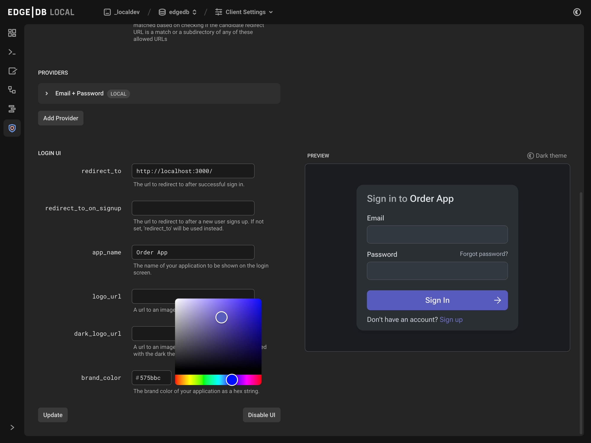
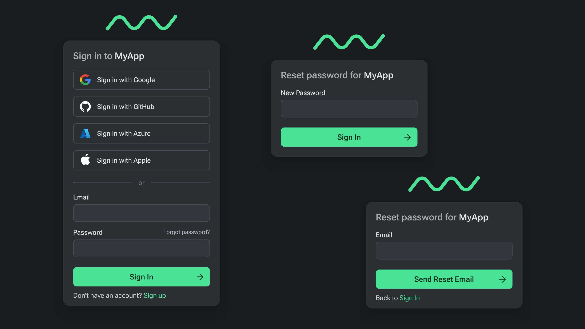

.. blog:authors:: scott
.. blog:published-on:: 2023-11-22 10:00 AM PT
.. blog:lead-image:: images/splash.jpg
.. blog:guid:: 0e348ee2-53d4-4bdf-8fad-49a0db0f4e93
.. blog:description::
     It's hard enough to come up with an idea worth trying. See how EdgeDB and
     our new authentication extension makes it easy to go from idea to working
     application in record time using Next.js.

===============================================================
Stop building auth, start building apps with EdgeDB and Next.js
===============================================================

One of the very first tasks a developer faces when working on a new idea, after
picking a base tech stack, is to add some form of user authentication. Most
apps, after all, have some concept of a "who" at the core of the domain.

Choosing EdgeDB to build your application's data layer, you quickly discover
that all of the usual ceremony around shaping your data, transforming it into
your application domain, and properly serializing it becomes a much more simple,
even enjoyable enterprise. So much logic and linking become a part of your
database schema and querying that, on the outside, your application code can now
be much more focused on the specifics of your business logic and problem domain.

One of those features that just makes EdgeDB querying feel so effortless
compared to traditional approaches to building with relational or document-based
databases is our `access policies <docs_access_>`_. They are a powerful tool that
lets you move a lot of filtering and access control directly into the database.
That not only simplifies your application code, it also becomes a backstop for
safety, helping you to avoid accidental data leaks.

Let's look at a small part of an imaginary Next.js application. Notice how much
of the business logic lives in the database itself, making the actual
application code a very thin wrapper mostly concerned with (de)serializing,
handling the database connection, and shaping the data in a way that is
appropriate for the caller in a single highly optimized query using EdgeDB's
query language, EdgeQL.

.. tabs::

  .. code-tab:: sdl
    :caption: dbschema/default.esdl

    module default {
        global currentUserId: uuid;

        scalar type ShipmentStatus extending enum<
            'Pending', 'Shipped', 'Delivered'
        >;
        scalar type OrderStatus extending enum<
            'Pending', 'PartiallyShipped', 'Shipped', 'Complete'
        >;

        type User {
            required name: str;
        }

        type Shipment {
            required status: ShipmentStatus;
            required order: Order;
        }

        type Order {
            required createdAt: datetime;
            required orderedBy: User;

            shipments := .<order[is Shipment];
            status := OrderStatus {
                using (
                    if all(.shipments.status = 'Delivered')
                    then OrderStatus.Complete
                    else (
                        if all(.shipment.status = 'Shipped')
                        then OrderStatus.Shipped
                        else (
                            if any(.shipment.status = 'Shipped')
                            then OrderStatus.PartiallyShipped
                            else OrderStatus.Pending
                        )
                    )
                )
            }

            access policy ordered_by_has_full_access
                allow all using (
                    .orderedBy.id ?= global currentUserId
                );
        }
    }

  .. code-tab:: typescript
    :caption: edgedb.ts

    import { createClient } from "edgedb";

    export { default as e } from "@/dbschema/edgeql-js";

    export const client = createClient();

  .. code-tab:: typescript
    :caption: order-actions.ts

    "use server";
    import { redirect } from "next/navigation";

    import { e, client } from "@/edgedb";

    export async function getOrdersWithStatus({
      limit = 10,
      offset = 0,
    }: {
      limit?: number;
      offset?: number;
    }) {
      declare const currentUserId: string | null;
      if (!currentUserId) {
        redirect("/");
      }

      const authenticatedClient = client.withGlobals({ currentUserId });

      return await e
        .select(e.Order, (order) => ({
          id: true,
          status: true,
          limit,
          offset,
        }))
        .run(authenticatedClient);
    }

The schema here describes a simplified order taking application that has a
``User`` type, an ``Order`` type, and a ``Shipment`` type. ``Order``\ s have
many ``Shipment``\ s and ``Order``\ s are associated with the ``User`` that
placed the ``Order`` through an ``orderedBy`` link. Furthermore, we are
restricting access using an access policy. Only the ``User`` who placed the
``Order`` has any access to this object.

We are then creating an EdgeDB ``Client`` object, and using that object in a
Next.js Server Action to get a paginated list of ``Order`` objects associated
with the requesting ``User`` along with the computed ``orderStatus``.

Drawing the rest of the owl
===========================

.. image:: images/how_to_draw_an_owl.jpg
  :alt: A two-step how-to article on how to draw an owl that tells you to
        "draw some circles", and then "draw the rest of the fucking owl".

You will no doubt notice that the ``currentUserId`` is being declared out of
thin air here. But this is the essence of authentication, answering the question
"Who is this user?" In the past, your options for integrating authentication
have been to either roll your own, use a hosted service such as Clerk or Auth0,
or set up an adapter-based solution like Auth.js. When we set out to build an
authentication solution for EdgeDB, we wanted to build the most seamless and
easy-to-integrate solution possible. That focus lead us to choose a deeply
integrated strategy that includes everything you need right inside of the EdgeDB
server itself.

All you need to do to set up EdgeDB Auth with Next.js is configure a few
important details using our built-in UI, use our helper libraries to easily
implement the few HTTP endpoints necessary for authentication, and you
now have a fully authenticated client instance to run your queries with. Let's
have a quick tour of doing exactly that.

Configuring the auth extension
==============================

EdgeDB Auth is configured in the same manner as the rest of your EdgeDB
system: using the built-in configuration system. That means you can script the
configuration with your favorite infrastructure tools, write custom scripts, or
change configuration right from the EdgeDB REPL. However, the best and easiest
way to configure EdgeDB Auth is using our new UI.

        preview the built-in UI.

There are a few important values to set up here, and some URLs that you might
need if you plan on using OAuth or our built-in UI. See our `Auth Guide
<docs_auth_guide_>`_ for detailed information on how to configure each part. The
UI even shows you a preview of the what the built-in UI will look like with
various providers. Here we've configured the Email and Password provider, and
are now customizing the built-in UI to match our brand colors.

An authenticated client, the easy way
=====================================

Once your user completes an authentication flow, whether with email and password
or with one of the social identity providers, we attach an ``HttpOnly`` cookie that
carries a token provided by EdgeDB. Our Next.js helper library then uses that
cookie to create an authenticated client. You don't have to worry about all of
the plumbing.

.. tabs::

  .. code-tab:: sdl-diff
    :caption: dbschema/default.esdl

    + using extension auth;
    +
      module default {
    -     global currentUserId: uuid;
    +     global currentUser := (
    +         select User
    +         filter .identity ?= global ext::auth::ClientTokenIdentity
    +     );

          scalar type ShipmentStatus extending enum<
              'Pending', 'Shipped', 'Delivered'
          >;
          scalar type OrderStatus extending enum<
              'Pending', 'PartiallyShipped', 'Shipped', 'Complete'
          >;

          type User {
              required name: str;
    +         required identity: ext::auth::Identity;
          }

          type Shipment {
              required status: ShipmentStatus;
              required order: Order;
          }

          type Order {
              required createdAt: datetime;
              required orderedBy: User;

              shipments := .<order[is Shipment];
              status := OrderStatus {
                  using (
                      if all(.shipments.status = 'Delivered')
                      then OrderStatus.Complete
                      else (
                          if all(.shipment.status = 'Shipped')
                          then OrderStatus.Shipped
                          else (
                              if any(.shipment.status = 'Shipped')
                              then OrderStatus.PartiallyShipped
                              else OrderStatus.Pending
                          )
                      )
                  )
              }

              access policy ordered_by_has_full_access
                  allow all using (
    -                  .orderedBy.id ?= global currentUserId
    +                  .orderedBy ?= global currentUser
                  );
              }
          }

  .. code-tab:: typescript-diff
    :caption: edgedb.ts

      import { createClient } from "edgedb";
    + import createAuth from "@edgedb/auth-nextjs/app";

      export { default as e } from "@/dbschema/edgeql-js";

      export const client = createClient();
    +
    + export const auth = createAuth(client, {
    +   baseUrl: "http://localhost:3000",
    + });

  .. code-tab:: typescript
    :caption: app/auth/[...auth]/route.ts

    import { redirect } from "next/navigation";
    import { client, auth } from "@/edgedb";
    import e from "@/dbschema/edgeql-js";

    export const { GET, POST } = auth.createAuthRouteHandlers({
      async onBuiltinUICallback({ error, tokenData, isSignUp }) {
        if (isSignUp) {
          await e.insert(e.User, {
            name: "",
            identity: e.assert_exists(
              e.select(e.ext.auth.Identity, (identity) => ({
                filter_single: { id: tokenData.identity_id },
              }))
            ),
          });
          redirect("/onboarding");
        }
        redirect("/");
      },
      onSignout() {
        redirect("/");
      },
    });

  .. code-tab:: typescript-diff
    :caption: order-actions.ts

      "use server";

      import { redirect } from "next/server";

    - import { e, client } from "@/edgedb";
    + import { e, auth } from "@/edgedb";

      export async function getOrdersWithStatus({
        limit = 10,
        offset = 0,
      }: {
        limit?: number;
        offset?: number;
      }) {
    -   declare const currentUserId: string | null;
    +   const session = auth.getSession();
    -   if (!currentUserId) {
    +   if (!(await session.isSignedIn())) {
          redirect("/");
        }

    -   const authenticatedClient = client.withGlobals({ currentUserId });
    +   const authenticatedClient = session.client;

        return await e
          .select(e.Order, (order) => ({
            id: true,
            status: true,
            limit,
            offset,
          }))
          .run(authenticatedClient);
      }

Now let's walk through the few small changes here:

In the schema, we enabled the ``auth`` extension, and created a computed global
that links to whatever ``User`` object happens to link to the
``ext::auth::ClientTokenIdentity`` global that is defined in the EdgeDB Auth
extension. This extension global is the secret sauce that ties together the
authentication token issued by the EdgeDB Auth extension and your own
application data.

In the database configuration module, we set up the EdgeDB Auth Next.js helper
library by passing in the plain unauthenticated client, and export the resulting
``auth`` object for use elsewhere in the app.

EdgeDB Auth uses Proof Key of Code Exchange, or PKCE, to securely communicate
the auth token from the EdgeDB Auth server back to the application. In order for
that exchange to work, there are a few endpoints that need to be set up.
Luckily, we provide an easy way to set these up, and provide a convenient way to
hook into the authentication lifecycle.

In the new route handler module, we're setting up a redirect back to the root of
the application when the built-in UI authentication is completed. It is called
with any errors that might have occured. It also can signal to the application
if you're signing up for the first time, or a returning user. For new users, we
create a new ``User`` object linked to the newly created ``ext::auth::Identity``
and redirect them through a special onboarding flow.

And finally, in our server action, we can now use the ``auth`` object we
exported above and get our authenticated client, assuming the user is logged in.
Easy enough!

Why choose EdgeDB Auth?
=======================

Among the alternatives are some well-loved and excellent services and libraries.
We've taken a lot of inspiration from these excellent products. However, there
are some very clear wins with using EdgeDB Auth, even in this early state where
it is outclassed in areas like "number of providers" and "number of
authentication strategies". If you are looking for a simple yet robust
authentication solution to use right now to get your ideas off the ground, here
are some reasons why you should try out EdgeDB Auth over the other options:

Built-in UI
-----------

        UI utilizing custom graphics and theme colors with different providers.

Enable the built-in authentication UI to get maximum speed. Not only do we take
care of the plumbing, we built you a nice little starter home that you can enjoy
while you focus on what makes your idea truly worth building. Later, once you're
ready to build your own UI, you can pack up and move into your own shiny custom
UI with the perfect matching design.

Deeply integrated
-----------------

This might not seem like a huge deal, but it goes along with our ethos of
treating development as a first-class citizen. Every EdgeDB server comes with
the auth server, and it is configured and deployed the same way in development
as it is in production.

Much like other solutions such as the fantasic NextAuth/Auth.js library, your
authentication data lives directly along side your application data. This
eliminates latency, reduces the distributed complexity of your application, and
simplifies the operational overhead: deploying EdgeDB means you deploy EdgeDB
Auth. Simple.

However, since EdgeDB Auth is shipped as an extension, unlike Auth.js, there is
no need to add noise to your schema related to Auth and configure adapters:
everything is initialized for you with just ``using extension auth;``.

Priced for growth
-----------------

Since EdgeDB Auth is simply an extension of the EdgeDB server, there is no
additional "per seat" or "per monthly active user" overhead. No dreaded growth
cliff where your project suddenly goes from being affordable to chopping off a
good chunk of your runway.

And this is just the beginning
==============================

At present, EdgeDB Auth is a dependable, if somewhat simple, authentication
platform that comes as a complete solution for most applications. But, we're not
stopping here! The near-future looks bright: multi-factor authentication;
passwordless authentication such as email-based magic links and WebAuthn; more
integrations with social providers and third-party authentication solutions.
Also, built-in auditing, more integrations with our world-class database UI, and
custom email templates. We have a lot of ideas, and we can't wait to bring more
features and capabilities to EdgeDB Auth over the coming releases.

Come join us on `Discord <discord_>`_ and share with us your experiences
building with EdgeDB Auth, and help us shape its future.

.. _docs_access: /docs/datamodel/access_policies
.. _docs_auth_guide: /docs/guides/auth/index
.. _discord: https://discord.gg/edgedb
