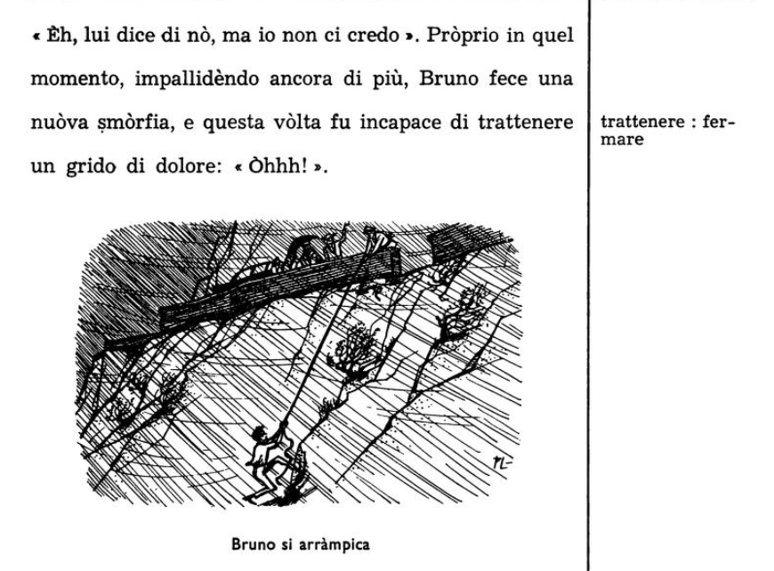

.. blog:authors:: dave
.. blog:published-on:: 2023-12-07 10:00 AM PT
.. blog:lead-image:: images/splash.jpg
.. blog:lead-image-alt::
   An open book with white pages lies on a vibrant green background that
   features abstract, white circuit board patterns.
.. blog:guid:: 8B4D588D8-E725-49D1-832E-7B0FC09E1143
.. blog:description::
   So you've built a game-changing database and developers love it. How do
   you help them move from EdgeDB curious to EdgeDB expert? A special
   technique used to learn natural languages does the trick.

======================================================================
Porting the world's best natural language learning technique to EdgeDB
======================================================================

Sometimes people wonder whether programming languages should be called
languages at all. After all, fundamentally they are
`quite different <http://www.itchyfeetcomic.com/2020/03/snake-tongued.html>`_.

A programming language is essentially a set of instructions on what to do,
and how to do it. The "listener" (the computer) follows the instructions
exactly the way they are laid out, with results that are often just as
hilarious as they are tragic. There is no back and forth between you and the
computer using the same language, just your instructions and then a result that
hopefully matches what you intended to happen. Fortunately, your "listener" is
infinitely patient, and you have the chance to rewrite your instructions over
and over until the result matches what you hoped to see.

          have avocados, get six." Without precise enough instructions, the
          man comes back with six cartons of milk because, as he explains,
          "they had avocados".

A natural language is also used to achieve some desired goal, but in a much
different and often more `roundabout manner
<https://archive.org/details/in.ernet.dli.2015.30957/page/n90/mode/1up>`_.
"Let's get a cup of coffee sometime" does not mean "let's drink two beverages
together and return to our previous state once they are consumed." It means "I
want to get to know you better…" or maybe even "I *don't* want to get to know
you better" when used by someone who is trying to quickly end a conversation!
Natural languages live in the moment. They involve more muscle memory and
context, `culture
<https://www.labourmobility.com/anglo-dutch-translation-guide/>`_, and even
mood. You don't have an unlimited number of tries to get your point across
either, generally only about two or three before your listener runs out of
patience. But the roundabout nature of natural languages has an upside too,
because 100% precision and correctness isn't necessary. Saying "That there
book...please... give you me, okay?" gets the point across just as well as
"Could you hand me that book?" Even just grunting and making an impatient
gesture towards the book can sometimes be enough for the listener to
understand and hand it to you.

Nevertheless, both natural and programming languages are used to achieve a
common goal: being understood in order to get something done. Both are simply
methods of bending reality to your own will a little bit by trying to get
someone else, or something else, to do what you want them to do.

Meanwhile, others around you are also using their natural languages and
their programming languages to try to achieve their own goals, and there are
many more of them than there are of you. And because of that, both types of
languages are used for the most part in the same way: passively. This is why 
people `spend more time <https://www.speakeasyinc.com/hearing-vs-listening/>`_
reading than writing and more time listening than speaking, and developers
spend a lot more time `reading external code`_ than they do writing their own.
So the two are quite similar in this respect: you want a good passive
understanding of what is around you, with the ability to actively form your
own phrases to get the results that you expect.

.. lint-off

.. _reading external code:
  https://bayrhammer-klaus.medium.com/you-spend-much-more-time-reading-code-than-writing-code-bc953376fe19

.. lint-on

These similarities are fortunate, because they allow you to port learning
techniques used for one to the other. My own experience learning both has
shown the same. While I personally took to programming at a young age, 
I then put it off entirely and spent the next few decades with natural
languages. (It wasn't until 
`much later <https://github.com/Dhghomon/programming_at_40>`_ that I
properly learned to code, and thanks to Rust no less!) Natural languages began
with Japanese and a move to Japan not long after high school, 
`then to Korean <http://www.pagef30.com/2013/02/how-i-learned-korean.html>`_ 
which took me to Korea where I live now, and soon turned into a lifelong
addiction with a large collection of languages at varying degrees of
proficiency. The desire to know more and more languages led to experimentation
with a lot of learning methods, but they all had one thing in common:
they involved a ton of 
`passive input <https://medium.com/@lingosteve/i-was-wrong-stephen-krashen-was-right-content-is-king-the-linguist-f32580b4dfc3>`_
with interesting content created by native speakers.

On the natural language side this meant doing things like reading the whole
set of `Urusei Yatsura <https://en.wikipedia.org/wiki/Urusei_Yatsura>`_ ( a
fantastic Japanese manga from the 1980s), and for Rust it was only after
watching a user named Brookzerker go through the Rust Book 
`page by page <https://youtu.be/SRDqvQqWAuE?list=PLrmY5pVcnuE_dyWibakRuGJcuiwAkhGZB>`_
that the language started to click. (Live coding being the programming
language equivalent of native speaker content for natural languages)

Finding just the right content for you takes time, however, and is only
enjoyable if you are motivated. Is there a method that distills this approach
into a single piece of content so that new learners don't have to search
through tons of content to put it together themselves? Indeed there is,
and it's pretty close to perfect.

The idea of making the perfect learning method is a most attractive one.
If it's possible to put together a textbook that is as dry as dust to the
point that even the most enthusiastic learner *can't* make use of it, then
its mirror opposite should be possible too: the perfect book.
Such a book would completely absorb the reader, who is then incapable of
putting it down, ends up reading the whole thing, and comes out the other
side knowledgeable and excited to learn more. Well, a book that is so
enrapturing that it can't be put down is certainly more theory than reality,
but it turns out that natural languages have a technique that is
*pretty close* to ideal, and it comes from an idea known as
"comprehensible input."

Comprehensible input: the learning sweet spot
---------------------------------------------

Comprehensible input is most famously laid out by linguist Stephen Krashen in
`a hypothesis on language learning`_
which treats it as one of the most effective ways to learn a language.
Comprehensible input should ideally should be a consistent flow of what is
called "i+1". "i" refers to the learner's current level, while "+1" is the next
level: language that is "just beyond" the reader's current level of
competence. When putting a textbook together, maintaining this i+1 throughout
is key.

.. lint-off

.. _a hypothesis on language learning:
  https://www2.montgomeryschoolsmd.org/siteassets/district/curriculum/esol/cpd/module2/docs/krashenFINALtext.pdf

.. lint-on

Anything else is less than ideal. Interacting with content at or below your
level gets boring quickly, while content far beyond what you are comfortable
with just doesn't click and can be frustrating. 

The language learning method that best encapsulates this is called the
"natural method" or the "direct method." It involves simply diving into the
target language. But how do you do that when you are an absolute beginner?
The answer is surprisingly simple: even just a few words is enough to start
forming understandable sentences. You then repeat them in varied forms,
adding new words slowly, and before you know it you find yourself
understanding a new language. Meanwhile, readers who already know the basics
of a language can simply skim the first few chapters until the level of the
material reaches their current level and make that the starting point.

You can see this method in action in a number of existing books. One popular
series of books from the mid-20th century by the Nature Method Institute taught
`English
<https://archive.org/details/english-by-the-nature-method/page/n8/mode/1up>`_,
Italian, French, and many other languages. Their *English By The Nature Method*
book shows just how simple the sentences in the first chapter are:

.. pull-quote::

   Mr. Smith is a man. Mrs. Smith is a woman. John is a boy. Helen is a girl.
   The baby is also a girl. Helen and the baby are girls...

By the end of the first chapter, the language has already become a bit more
complex, simply by gradually adding new words and concepts in context:

.. pull-quote::

   The three (3) children are the son, the daughter, and the baby daughter
   of Mr. and Mrs. Smith. The father, the mother, the son, the daughter,
   and the baby daughter are a family of five (5) persons.

So far, so good! As the author of such a book, now your task is to keep the
reader around for the full length of the book. For that you need a story.
After all, nobody is going to stick around for hundreds of pages just to
encounter more and more complex ways to talk about the members of a family.

Story is exactly what these books deliver. Let's skip forward five chapters,
by which point the reader has already been exposed to a full 30 pages of the
target language:

.. pull-quote::

   Are trees the only plants in the garden? No, there are also other plants
   in the garden. Is Helen the only girl in the family?

Still quite simple, but not bad. Let's skip ahead another five chapters:

.. pull-quote::

   This morning John asked his father, "Father, when will you take us
   to the lake?" "I shall take you there today," his father answered.
   "Will you come with us, George?" he asked his brother.

By reading this content that is easy to understand yet just new enough to be
interesting, near the end of the book the reader has naturally come to
understand content like this:

.. pull-quote::

   I wonder if you can help me to come to a decision," he continued,
   pulling a small object out of his pocket. When Storm showed it to him,
   Marshall saw that it was a very small book of songs, in fine leather
   with gold letters printed on the back.

That's the method in a nutshell. It's simple and effective, and it feels almost
magical. Of the books I've read that use the method, my two favourites are
`L'italiano Secondo Il Metodo Natura
<https://archive.org/details/LitalianoSecondoIlMetodoNatura>`_ for Italian, and
`Lingua Latina per se Illustrata
<https://hackettpublishing.com/lingua-latina-per-se-illustrata-series>`_ for
Latin, precisely because of their stories. Both of them do a fantastic job
introducing the language and region in question, but they aren't just bland
expositions. The Italian book has Bruno, a young man who introduces a lot of
Italian history and culture, and who would have been in danger of being a bland
character were it not for the fact that for some reason he keeps on just barely
cheating death throughout the book: is hit by a car,

almost drowns in the ocean,

falls off a cliff,

you name it. Others include Bruno wandering with his friends in the woods
facing possible death by freezing and starvation, Bruno alone in the dark
with bottles trying to find a gas station to fill them up to bring back to
the car, Bruno and his friends evading a car chasing them from behind...

Meanwhile the Latin book has a fan favorite named Marcus, who is a
`bit of a Calvin <https://www.gocomics.com/calvinandhobbes/2009/03/10>`_:
his grades at school are right at the bottom, but he also has the quickest wit
and is clearly bored with the whole thing.

You can tell that the authors had a great time writing these books, and
the stories are unique enough that you find yourself reading all the way
to the end just to find out how they end.

Interestingly, this simple yet magical method is also *tiring* in the same way
that physical exercise is tiring. This seems counterintuitive, but then again,
a marathon is simply putting one foot in front of the other, and swimming 50
laps is simply pushing yourself forward in the water over and over again, but
*those* are still tiring. It's the repetition over a long period of time that
leads to growth, and the natural method books have repetition in spades because
they are *long*. (The one for French clocks it at over 1,100 pages!) You can't
have immersion if there isn't enough content to immerse you for a long period
of time. This length is key, because you don't want a reader who has finished
one of these books to *decipher* the target language anymore. Instead, they
should immediately recognize words and phrases without effort because they have
already appeared so many times in the book.

I followed the idea of comprehensible input in two books that I put together,
`one for a language called Occidental
<https://en.wikibooks.org/wiki/Salute,_Jonathan!>`_, and the next year for a
book called `Easy Rust <https://github.com/Dhghomon/easy_rust>`_ that I wrote
not long after learning Rust to try to make the experience easier for someone
completely new to programming. Both of them use this approach, with the
Occidental book being somewhat more faithful to the method as it also has a
background story in the same way that the Natural Language books do. Although
this time it wasn't my own story: I translated Bram Stoker's *Dracula* into
the language over the space of 100 chapters, starting with the simplest
language possible.

(That's one tip for anyone wanting to try this method out: you don't
necessarily have to come up with your own story! You can rewrite or
borrow an existing one.)

This is when EdgeDB and I finally got together. EdgeDB is both type safe and
extremely expressive, and the query language is quite easy to pick up. But 
"easy to pick up" still means sitting down for a while and getting used to 
how it works. As a new database, EdgeDB needed to have a way to convince people
to drop what they are doing, sit down, and give the query language some time
to allow it to gel. Interacting with the query language in a natural and fun
way is the easiest way to not just hear about, but to get a feel for the
advantages it brings.

This point is crucial, because when developing a new product there are
two challenges. The first challenge is fairly simple: the world is still
unaware of what you have made, so you have to start telling people about it.
This is when the second challenge begins, which is a more subtle one. At
this point there is a danger that what you have put together to introduce
your product only captures the audience's attention for a minute or two. The
danger here is that people might end up *thinking they know* what it is,
actually don't, and don't take the time to properly give it a try.

A quick movie analogy here might help. Take *The Truman Show*, one of the
best movies of all time. What are the ways you could introduce the movie
to your friends so that they feel the same? Your friends are probably in
one of the two following groups:

- They haven't heard about it at all. That's fine, because they are ready
  to hear about it from you.
- They've heard the name before and maybe that it's good. This is even better,
  because they are anticipating a first impression of the movie but have a
  mind that is receptive to what it might be. They are ready to view the
  movie without any preconceptions except that it will probably be good.

Moving from this stage to "knowing" it is the risky part. Your friends might
do the following, which is good:

- They watch the movie and absolutely love it. Task complete! They gave
  the movie their full attention, and now both understand and love it.

or they might alternatively do the following, which is bad:

- They read a few spoiler-filled reviews about it, or the movie comes on while
  they are talking amongst themselves and fiddling around with their phones.
  They end up "knowing" the movie as "the one about the guy that's in a show
  or something" but never really *felt* it. Worse, that sensation of already
  knowing it makes them less likely to give it a second look. (This, by the
  way, is why people that want you to check out a movie they *really* like
  are so ardent that you give it your full attention.)

The same applies to something like a database, where first impressions are
critical. Ideally you want someone to not only know, but also have a *feel*
for what it is. A quick overview of the features and the query language's
syntax might do the trick, but it might fail to capture its spirit. 

The way to counteract this risk is to put together a single source that
outright immerses and entertains a reader for a good length of time — the
longer the better. This is what *Easy EdgeDB* was created to fulfill, 
and it follows the steps of the natural method books listed above.
Fortunately, the book *Dracula* turned out to be a perfect fit for this book
as well. Not only is it still an entertaining read after over 125 years, but
the book itself is written in a so-called epistulary format: a collection of
letters and other writings from the characters, complete with dates and
locations. You can see this style right from the first paragraph:

.. pull-quote::

   3 May. Bistritz.—Left Munich at 8:35 P. M., on 1st May, arriving at Vienna
   early next morning; should have arrived at 6:46, but train was an hour
   late. Buda-Pesth seems a wonderful place, from the glimpse which I got of
   it from the train and the little I could walk through the streets. I feared
   to go very far from the station, as we had arrived late and would start as
   near the correct time as possible. The impression I had was that we were
   leaving the West and entering the East; the most western of splendid
   bridges over the Danube, which is here of noble width and depth, took us
   among the traditions of Turkish rule.

That's perfect for a database! Right away we are dealing with dates,
locations, characters and events. And the vivid settings in the book made it
easy to come up with illustrations that fit the mood. In our case, we modified
them a bit to give them a steampunk feel to add a techy vibe to the original
setting.

*Easy EdgeDB* imagines that we are taking the first steps to create a fantasy
game based on the setting in the book, and are just beginning to put our
schema together as we encounter EdgeDB for the first time.

In practical terms that means lots of migrations, starting from the absolute
simplest schema as we continue to hammer away at it and make improvements.

Following the natural method, the first examples in the chapter couldn't be
simpler. The book starts with an empty type called NPC:

.. code-block:: sdl

   type NPC;

We then give the NPC a name and a list of places visited, because our first
NPC named Jonathan Harker (the poor fellow who visits Dracula unaware of what
a monster he truly is) mentions a few locations that would be nice to put
into a database. We start with strings for both Jonathan's name and the places
that he has visited:

.. code-block:: sdl

   type NPC {
     required name: str;
     places_visited: array<str>;
   }

With this schema in place, we insert our first object, the ``NPC`` named
Jonathan Harker.

.. code-block:: edgeql

   insert NPC {
     name := 'Jonathan Harker',
     places_visited := ["Bistritz", "Munich", "Buda-Pesth"],
   };

Next, we put together a ``City`` type:

.. code-block:: sdl

   type City {
     required name: str;
     modern_name: str;
   }

Then insert some ``City`` objects:

.. code-block:: edgeql

   insert City { name := 'Munich' };

   insert City {
     name := 'Buda-Pesth',
     modern_name := 'Budapest'
   };

   insert City {
     name := 'Bistritz',
     modern_name := 'Bistrița'
   };

At this point we have naturally worked into the concept of links, because
we have a problem: Jonathan Harker isn't linked to anything! He is an NPC
object that holds the names of a few cities, but there is nothing connecting
him to the existing ``City`` objects in the database. Time for a schema
migration! Schema migrations are a breeze in EdgeDB, which is why they
are so common in the book.

.. code-block:: sdl

   type NPC {
     required name: str;
     multi places_visited: City; # This is now a link to City objects
   }

In no time at all, the reader of Easy EdgeDB is already used to EdgeDB's
strict types, schema migrations, and links just by traveling with
Jonathan Harker and all the rest of the characters through their harrowing
adventure. The database schema gets more and more complex as we try to
put something together that might be a good for a game based on the story.

You can see this increased complexity just five chapters later in the same
``NPC`` type, which now looks like this:

.. code-block:: sdl

   scalar type HumanAge extending int16 {
     constraint max_value(120);
   }

   abstract type Person {
     required name: str;
     multi places_visited: Place;
     lover: Person;
     property is_single := not exists .lover;
   }

   type NPC extending Person {
     age: HumanAge;
   }

But to the reader it doesn't look complex at all, because over the
past four chapters we have iterated over the existing types so many times
over so many migrations that it feels like the reader's own project.
The fun of following the story is what pulls you through the 74,000 or so
words that the book contains (a length just shy of the first novel in the
Harry Potter series). Of course, many readers will stop halfway and begin
building their own EdgeDB projects, which is precisely the point — just
in the same way that you can stop reading *Français par la méthode nature*
to go fly to France and start trying out what you know. For these books,
length is key. It's a long immersive experience that you can follow all the
way to the end, or stop midway and pick up again later if you feel like it.

It's thanks to these books that when I see a word like *iubeō* or *prāvē*
I think of the poor teacher Diodorus trying to get Marcus to pay attention
to his studies, as opposed to a dry vocabulary card saying that *iubeō* means
*I order* (you to do something) or that *prāvē* means *incorrect*. Similarly,
readers who finish *Easy EdgeDB* will see ``constraint max_value()`` and
remember how it was used to constrain humans to a certain maximum age
(as opposed to vampires who don't have it), or see a page on EdgeDB's
``sequence`` type and remember how it was used to keep track of the player
characters in the imaginary game around which the book is based.

The future
----------

*Easy EdgeDB* has also gone through some changes since it was first put
together, most recently with a fairly large expansion in 2023 to match
the changes in EdgeDB 2.0 and 3.0, which were possibly EdgeDB's largest
releases. EdgeDB is now approaching feature maturity with new releases
now taking place every four months, making the set of features added
to EdgeDB 4.0 during the joint EdgeDB 4.0 / EdgeDB Cloud release smaller
than the previous two versions. Aaccordingly, future changes to
*Easy EdgeDB* will probably also be more gradual than the 2023 expansion.

Nevertheless, there are some upcoming changes that are planned:

- An interactive database allowing the reader to interact with the schema
  and objects per chapter without having to install EdgeDB, in the same way
  that `our tutorial </tutorial>`_ does.
- More artwork. The first few chapters of the book are beautifully decorated
  but thereafter the images drop off. Having images throughout the book
  will make the experience even more immersive.
- Changing the existing content to add newer features that fit better than
  existing implementations. For example, one part of the book imagines a type
  used to keep track of ship visits to ports so that any player characters
  visiting a city will be able to see any ships docked at that point in time.
  EdgeDB 4.0 added a type called ``multirange`` that might help here: a ship
  could visit a location over a ``multirange`` of ``local_date`` to allow
  a single property to encompass a single ship's entire length of visits.
- Maybe your ideas for the book? If you have any requests to make the experience
  even better, let us know `on our community Discord
  <https://discord.gg/edgedb>`_!
