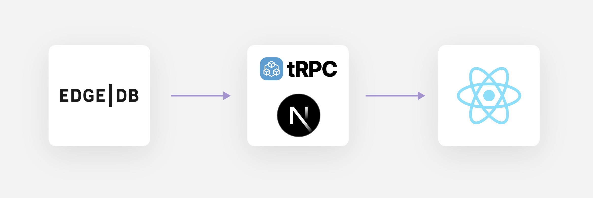
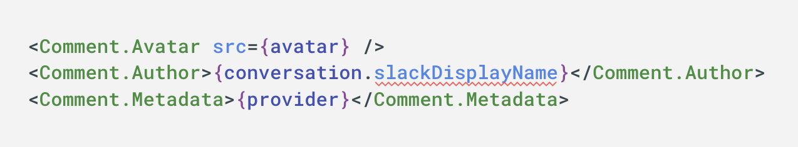
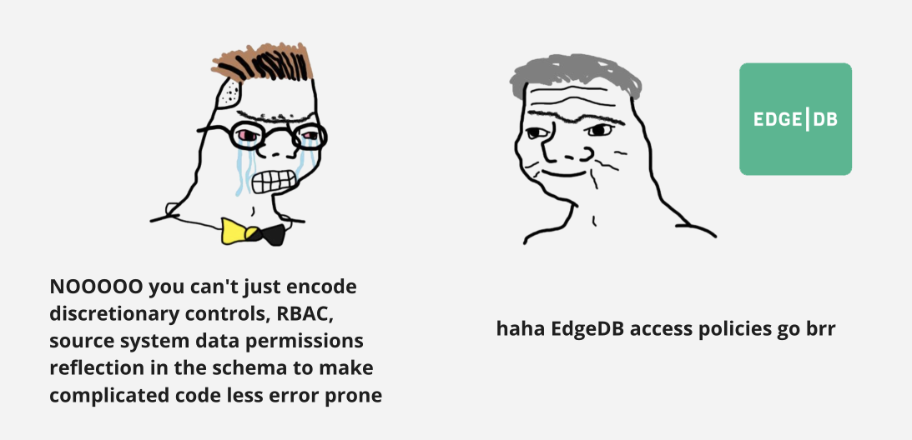

.. blog:authors:: credaljack
.. blog:published-on:: 2024-01-09 10:00 AM PT
.. blog:lead-image:: images/splash.jpg
.. blog:lead-image-alt::
   The Credal.ai logo and EdgeDB logo stacked vertically with a plus sign
   between on a yellow background with faint concentric circles in the
   background
.. blog:guid:: 847b095f-b82b-4bfa-a0f4-4acbd58cad0e
.. blog:description::
   Jack of Credal.ai discusses how using EdgeDB accelerates product development
   and enhances data safety in their enterprise AI product. Learn about
   EdgeDB's impact on developer productivity and error minimization in the
   fast-paced enterprise AI sector.

=======================================
Speedrunning our AI startup with EdgeDB
=======================================

I’m `Jack <https://www.linkedin.com/in/jackfischer11/>`_, the founder of
`Credal.ai <https://www.credal.ai/>`_, where we make
heavy use of EdgeDB to iterate faster on our product. Credal helps
organizations including unicorn startups and publicly traded companies use
their internal data with AI to reap the productivity benefits that AI promises
while protecting sensitive information. We take care of things like mirroring
permissions from data source systems, audit logging, and private data redaction
to give IT and security teams what they need, while letting users integrate
data and `retrieval-augmented generation <rag_>`_ (RAG) to create copilots and
tools that can accelerate their entire organization.

.. lint-off

.. _rag:
  https://en.wikipedia.org/wiki/Prompt_engineering#Retrieval-augmented_generation

.. lint-on

Why EdgeDB?
===========

When I built applications in the past, I remained floored by the amount of
boilerplate and wiring involved even in simple apps, the unworkability of ORMs,
and how much attention was drawn away from the purpose of whatever you’re
building and towards simply making tools cooperate. Persistence appeared to be
a particularly bad offender: interacting with databases remains surprisingly
error prone and time consuming, and tools like ORMs often seem to make it worse
and not better.

When I saw `EdgeDB on Hacker News in 2019
<https://news.ycombinator.com/item?id=19638701>`_, I finally knew I wasn’t
crazy, and that this was by far the most promising option I had come across.

We’re building in enterprise AI which is one of the fastest moving and most
competitive areas in software right now. Industries experiencing this kind of
growth could be thought of as following an evolutionary process in which there
is strong selective pressure for certain characteristics.

          The diagram shows a sequence of three images of giraffes eating
          leaves from a tall tree. Two of the giraffes have long necks and can
          reach the leaves. The third giraffe with the shorter neck dies in the
          second image and decomposes in the third as the other two continue to
          feed. The question asks which theory the diagram below it best
          illustrates, with multiple-choice answers listed as: a. Lamarck's
          theory of evolution, b. Darwin's theory of evolution, c. Malthus's
          principles, and d. Lyell's theory about past changes. The exam taker
          has crossed through these options and added their own: e. Giraffes
          are heartless creatures.

For giraffes in the infamous textbook graphic above, the selective pressure is
on the length of your neck, but for us I would suggest that it is actually
speed of iteration. Developer productivity and the ability to correctly get
your ideas into bits as quickly as possible is a matter of life and death for
us. When we founded Credal, I knew we should give EdgeDB a try.

We’ll touch on important iteration speed benefits we gain from EdgeDB:
enforcing type safety across our entire app, and how we take advantage of
EdgeDB access policies to move fast and be less error prone.

Full stack type safety
----------------------

It’s the kind of thing that should be easy in 2023, but between all of the
boundaries in a typical web app — schema to query, to server code, to API
serialization, to network, to component tree — there are 1) a lot of places for
type enforcement to fail and 2) a lot of tool boundaries to finagle in order to
reap the benefits you’d want.

With EdgeDB, we get full stack type checking from schema to component.

          includes three cards in a horizontal line, each connected by a
          rightward-facing arrow, indicating the direction of data flow or
          interaction. The cards, from left to right, are labeled with the names
          and/or logos of EdgeDB, tRPC/Next.js, and React.

Like many web apps, we run on Next.js, but we also use a tool called tRPC
(TypeScript RPC) to generate React hooks for our endpoints including the
inferred input and output types of the API code. In front end code we simply
use the hooks, they bring in certain types, and RPC is abstracted.

This is a nice start, but it gets really cool when that API code is making
EdgeDB queries, and thanks to the native EdgeDB TypeScript client we get type
inference off of those queries, and those inferred types are used to infer the
input/output types on the endpoint.

That means that changes from a migration in the schema or a change to a query
is immediately reflected everywhere, even in that random bit of UI code that
you forgot about.

Let’s look at a realistic example.

Suppose we have a data model for chat conversations. We have a conversation
object and messages objects that are attached to conversations. Say we’d like
to rejigger this a little: we used to store the username on the conversation
object, but now maybe we want to have multiple participants in the
conversation, so we want to move it down to the message object where it can
vary by message.

.. code-block:: sdl-diff

      type Conversation {
    -   slackDisplayName: str;
      }
      type Message {
        required single conversation: Conversation;
    +   slackDisplayName: str;
      }

(As a side note, luckily EdgeDB makes a migration like this quite easy: we can
add the property and backfill it by traversing the link to the conversation and
pulling in the old username, then dropping all the usernames on conversation.)

After we’ve run this migration, the query that pulls in conversation data now
has a different shape, and that affects the return type of the relevant API
endpoint, which in turn affects the types of data used in the component, and,
boom, EdgeDB has immediately let us find the exact places that are broken as a
result of this change. We suddenly receive static errors in our component code.

          slackDisplayName is accessed on the conversation, which was its
          former location before performing the migration above. The editor has
          marked this reference with a squiggly red underline to indicate a
          static error.

Permissions and access policies
-------------------------------

Permissions and access policies happen to be an important part of our offering
at Credal, but they ultimately crop up somewhere in nearly every business
application. When dealing with sensitive data, mistakes don’t just harm our
customer’s business and our own business, but could also cause serious
consequences in the real world. Unfortunately, even the best developers are
human and can make mistakes: beyond all the best practices,
the solution to this is to minimize the surface area of authz that developers
have to worry about in the first place. Freeing them from having to manually
check certain conditions or rules, which are often further parameterized by
auth scheme or user role, and otherwise hold complicated systems in their heads
removes opportunities to introduce problems at all.

At Credal, we accomplish this using EdgeDB access policies. We encode our logic
for RBAC, certain discretionary controls, data permissions from the source
systems that we touch, and of course multitenancy, into EdgeDB access policies.

          character with tears streaming down its face, wearing a bow tie, and
          looking distraught. The character is expressing frustration with the
          text that reads: NOOOOO you can't just encode discretionary controls,
          RBAC, source system data permissions reflection in the schema to make
          complicated code less error prone. On the right panel, a smugly drawn
          character is facing towards the EdgeDB logo with a text caption: haha
          EdgeDB access policies go brr.

This means that for ~90% of work, the developer doesn’t have to worry about
access controls and permissions. We can still safely work on most code in a low
stakes way, even when we’re tired or not doing meticulous reviews, and
centralize the important logic, and any evolution of that logic, in one place:
our EdgeDB schema.

Here’s an example API endpoint, again using tRPC.

.. code-block:: typescript

    someEndpoint: trpc.query(({ ctx }) => {
      return someSelectQuery(ctx.edgedbClient);
    })

In our code that initializes API requests and does things like parse the user’s
JWT, we also create an EdgeDB client object specific to the user. This is what
the developer receives in their API code. From there the developer can write
EdgeDB queries, and access policies just work™.

Even if we write a bad query, or in some extreme case where logic is exposed in
the wrong way or to the wrong user, the safety net of EdgeDB kicks in, and we
simply receive a runtime error instead of a data leak.

Of course in certain places we want to run operations without access policies,
such as to edit certain permissioning data. For these cases we run a custom
ESLint rule that finds and makes us document each of the uses of EdgeDB clients
that have access policies disabled, so that we can be especially meticulous
about those queries.

Other databases support access policies in different forms, but as we evolve
our product, our data model gets more complicated, and features have different
interlocking permissions, the convenience, reliability and readability of
layering these systems on top of the graph relational model means we can easily
go way beyond what people normally use schema level access policies for — like
a safety net for multi-tenancy — if they use them at all.

Speed is Survival
=================

In the limit, iteration speed is what matters.

It’s been awesome to use tools that were designed to work together, and shrink
the surface area of what developers have to think about when they go about
their daily work. We get both productivity and safety improvements from EdgeDB.
These variables often trade off against each other, but EdgeDB’s design and
tooling break us out of this compromise.

Check us out at `Credal.ai <https://www.credal.ai/>`_, and `we’re hiring
<https://www.credal.ai/careers>`_!
