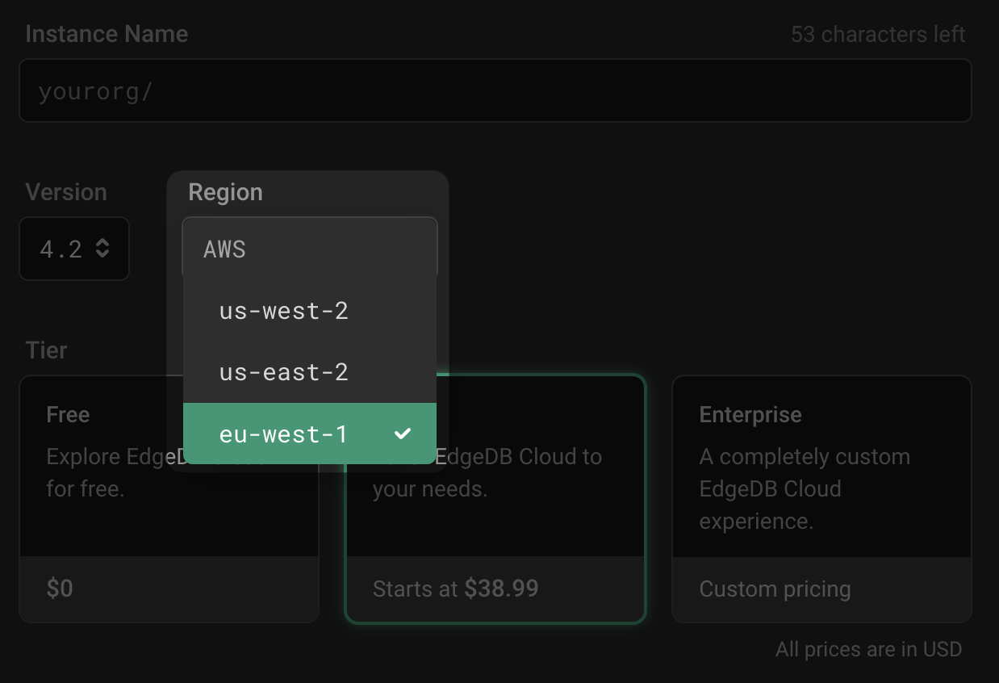

.. blog:authors:: devon
.. blog:published-on:: 2024-01-22 02:00 PM PT
.. blog:lead-image:: images/splash.jpg
.. blog:lead-image-alt::
   A globe centered on Europe on top of a purple background. Superimposed over
   the globe is the name of the new region — eu-west-1 — above EdgeDB Cloud.
.. blog:guid:: c97feef0-e39c-4b81-b1ea-3f18fff48db5
.. blog:description::
   EdgeDB Cloud has always been fast, but now it gets even faster if you're in
   and around Europe: today, we are launching our brand new EU region!

================================
EdgeDB Cloud EU region launches!
================================

Performance is already one of the top reasons for picking EdgeDB Cloud. Today,
that becomes even more true for users in and around Europe: we're launching the
EdgeDB Cloud EU region! Get started by selecting it from the region dropdown
when you create a new EdgeDB Cloud instance.

          dropdown with the new eu-west-1 region highlighted.

If you already have an EdgeDB Cloud instance but would like to move it to the
new EU region, here's how:

1. ``edgedb dump -I <org>/<source-instance-name> <dump-path>`` to dump the
   contents of your existing instance to a file
2. ``edgedb instance create <org>/<target-instance-name> --region eu-west-1`` to
   create a new instance in the newly launched region
3. ``edgedb restore -I <org>/<target-instance-name> <dump-path>`` to restore to
   your new instance

`Get started with EdgeDB Cloud today <cloud/>`_ in the EU. Look for additional
regions launching in the future!
