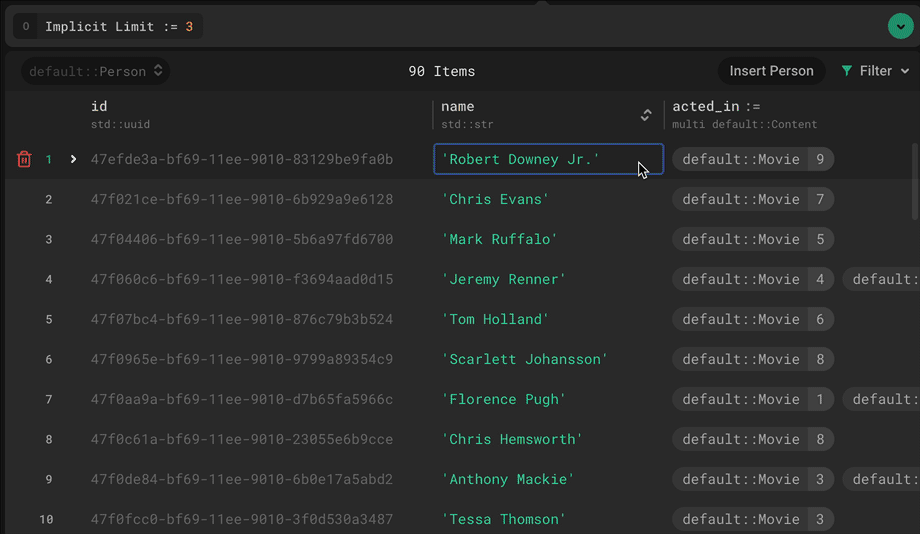

.. blog:authors:: fiorivictor
.. blog:published-on:: 2024-02-01 10:00 AM PT
.. blog:lead-image:: images/splash.jpg
.. blog:lead-image-alt::
   The Credal.ai logo and EdgeDB logo stacked vertically with a plus sign
   between on a yellow background with faint concentric circles in the
   background
.. blog:guid:: 9b89efa3-9cb3-47f4-9b77-80a168d45d25
.. blog:description::
   Fiori picked EdgeDB because it mixes the best of Postgres (strong typing)
   and Mongo (nested data). They stayed to easily put business logic in the
   database.

==================================================================
Why putting logic in your database is pretty great (with Fiori.ai)
==================================================================

At `Fiori <https://fiori.ai/?utm_source=edgedb>`_, a Munich-based AI startup,
we’re on a mission to make personalized soft skills coaching accessible to
everyone. We've found that coaching in communication and thinking skills is an
effective way to reach professional goals but tends to be pricey, impersonal,
or inflexible. `Our recently launched public beta
<https://www.fiori.ai/blog/introducing-fiori?utm_source=edgedb>`_ aims to
address this by allowing you to learn new negotiation strategies on demand and
practice them in a natural conversation with an AI opponent. A virtual coach
provides you with feedback and evaluates your performance in the form of an
overall score. (Try beating my high score of 24 out of 30!) While users have
reported they’d already love Fiori to prepare for salary negotiations and HR
interviews, we’re not planning on stopping here but aim to expand to other
skills in the near future.

.. blog:gallery::
  .. figure:: images/fiori-screenshot.jpg
    :alt: Screenshot of an online training module interface titled 'Salary
          Negotiation for a Dream Job Offer' on Fiori. The interface is
          divided into two sections. On the left, a menu with the items
          'Theory', 'Demo Scenario', and 'Role Play Practice' which has a
          jigsaw puzzle icon illustrating the 'Partial Agreement approach'.
          On the right, the main panel shows a practice conversation with an
          avatar named Jenny, who is currently speaking. The user is prompted
          to 'Listen to the response'. Above Jenny's avatar is a button to
          'Show Transcription'. On the right, a list of tasks is displayed:
          'Identify and prioritize package elements', 'Negotiate key elements
          sequentially', and 'Propose combined package deal'. At the bottom, a
          helper named Michella offers assistance with a 'Request Hint' button.
          On the bottom right, a prompt for the user to 'Exchange at least a
          few messages in order to finish the practice' with a 'Finish
          Practice' button currently unclickable in a desaturated orange.

    The Fiori.ai lesson UI

So how did Fiori cross paths with EdgeDB, and why did we decide to make it an
essential part of our tech stack? Let me take you on a brief journey.

Adopting EdgeDB
===============

Given the nature of our small team around Matthias (`LinkedIn
<https://linkedin.com/in/matthias-j-walter>`__), Niko
(`LinkedIn <https://linkedin.com/in/nikolaus-landgraf>`__), and me
(`LinkedIn <https://linkedin.com/in/victor-pr%C3%BCfer>`__), our engineering
capacity is limited, and we handle our resources with care. Managing our data
schema, writing queries, and taking care of database deployments shouldn't
require a dedicated backend engineer as we aim to move swiftly with a flexible
full-stack team, without compromising quality, robustness, or scalability.

In previous projects, we've experienced the pros and cons of various database
systems, such as MongoDB and Postgres. We liked the flexibility that a NoSQL
database like MongoDB offers (I can shove documents into other
documents—amazing!), yet we also appreciated Postgres' strictly typed schema.
We've tested the limits of ORMs such as Django and faced incomprehensible SQL
queries when trying to move away from it. In short, there was always a
downside, and EdgeDB seemed too good to be true at first: it combines the power
of Postgres-like typing with a MongoDB-like ability for nested data structures,
a GraphQL-like query language, and lots of syntactic sugar.

When we were building our first prototype for Fiori, we knew it would be the
perfect opportunity to try out EdgeDB in a production environment. In the end,
it not only helped us iterate over our prototype very quickly but also became a
permanent complement to our tech stack, which revolves around TypeScript, Deno,
and Vue.js/Nuxt.

Advantages of EdgeDB
====================

There are various EdgeDB features we've grown fond of, such as the declarative
data schema and query language, enabling compact, boilerplate-free, and
readable code. Having used several ORMs in the past, we appreciate EdgeDB for
being a thin layer rather than a heavyweight black box. The EdgeDB Cloud UI
is a convenient way to quickly validate or edit content; in fact, even
colleagues without a technical background are able to use it.

          starts by clicking the 'acted_in' link of the 'Robert Downey Jr.'
          object in an MCU database. This takes the user to a list of movies.
          The user finds the movie object 'Avengers 2' and double-clicks it,
          renaming it 'Avengers: Age of Ultron.' The user then clicks the
          'Review Changes' button in the UI and confirms the change.

What I personally value the most, however, is the way EdgeDB allows us to
incorporate business logic and constraints at the database level. Let me
provide you an example to demonstrate how.

Putting business logic in the database
======================================

We were once faced with the following engineering task: finding a lesson's
overall completion date. Fiori’s educational content is organized into lessons
for users. Each lesson covers a specific soft skill strategy, first explaining
how it can be applied and then allowing practice in a virtual conversation with
an AI opponent. To reflect this model in our database schema, we have a
``Lesson`` type that is linked to multiple ``Section``\s (such as theory and
practice sections). The user completes sections one by one, which updates the
respective ``completed_at`` date. Now, here is the challenge: in addition to
the completion date at the section level, we also required a completion date at
the lesson level, which follows two constraints:

- If not all sections are completed (i.e. have a ``completion_date``) the
  lesson is also not completed and should have no ``completion_date``.
- If all sections are completed, the lesson’s completion date should be set to
  the latest completion date of all sections.

So, where in your software architecture is the ideal place to enforce those
constraints? Some might say in the backend; others might even place the logic
in the frontend code. However, both approaches come with some drawbacks:
redundancy between the section’s and lesson’s completion date, additional code,
and error-proneness (e.g. forgetting to update the lesson’s completion date
when restarting a section, introducing edge cases when the lesson’s completion
date does not align with the sections anymore).

.. blog:gallery::
  .. figure:: images/fiori-schema.png
    :alt: Fiori's EdgeDB schema graph showing several interconnected object
          types, primarily focused on a 'Lesson' type in the center. The
          'Lesson' type has properties 'id', 'created_at', 'status',
          'completed_at', and 'medal'. Links connect 'Lesson' to the other
          types 'Coach', 'User', 'Concept', 'Section', 'Skill', 'LearningPath',
          and 'Actor'. Two other types, 'SectionTheory' and 'SectionRolePlay',
          link to the 'Section' type. 'Section' has properties 'id', 'format',
          'sequence_number', and 'completed_at', with links to 'SectionConfig'
          and 'Lesson'. 'SectionTheory' includes properties 'format', 'id',
          'about', 'sequence_number', 'application', 'benefit', and 'timing'.
          'SectionRolePlay' mirrors the structure of 'SectionTheory' with
          similar properties. The schema is laid out against a dark background
          with the types and connections color-coded to illustrate
          relationships. The image fades at the bottom to indicate the entire
          schema is not being shown.

    Part of Fiori's EdgeDB schema

This led us to two conclusions. First, we are engineers, so of course we love
to overthink simple problems. Second, the more you think about it, the more
obvious it seems to define this kind of business logic in the database itself,
using the computed properties EdgeDB provides. It eliminates any kind of
error-proneness as it is dynamically computed based on the sections and
therefore doesn’t need to be set manually when the section or lesson is
updated. Furthermore, it avoids redundancy for the same reason. Here is a slice
of our schema (liberally commented with explanations) so you can see how we
implement this:

.. code-block:: sdl
    :class: collapsible

    type Lesson {

      # ...

      # link to the soft skill strategy this lesson is about
      required strategy: Strategy;

      # link to the user the lesson belongs to, with cascading
      # deletion rule to avoid orphan lessons in case user is
      # deleted
      required user: User {
        on target delete delete source;
      };

      # A lesson can have multiple sections of different formats: They
      # point to the lesson. Those sections can simply be accessed
      # by the multi backlink here to avoid complex joins in queries.
      # The backlink is correctly sorted by a section property
      # (sequence_number, which reflects the order of the sections).
      multi sections := (
        select Section filter .lesson = Lesson
          order by .sequence_number asc
      );

      # Business logic: the lesson is completed if all of its sections
      # are completed. If so, then the lesson's completion date is the
      # latest section completion date. Otherwise, the lesson's
      # completion date is an empty set.
      completed_at := (
          if (
            exists (
              select .sections filter not exists .completed_at
            )
          ) then (
              <datetime>{}
          ) else (
              max(.sections.completed_at)
          )
      );
    }

    # A lesson consists of multiple sections of different formats.
    # Those different section formats are reflected in a section
    # taxonomy, where the common fields are grouped in an abstract
    # parent type `Section`.
    abstract type Section {

      # ...

      # link to lesson this section belongs to
      required link lesson: Lesson {
        on target delete delete source;
      };

      # completion date, set once user has completed section
      completed_at: datetime;
    }

    # a section type that provides theoretical information about a
    # soft skill strategy
    type TheorySection extending Section {

      # ...

      # the lesson's strategy, added at section level for convenience
      strategy := (.lesson.strategy);

      # theory content about the strategy
      introduction: str;
      application: str;
      application_examples:
        array<tuple<title: str, description: str>>;
    }

    # a section type that provides a practical scenario in which the
    # user can apply and practice the strategy
    type PracticeSection extending Section {

      # ...

      # the scenario that the user has chosen to simulate
      required scenario: PracticeScenario {
        on target delete delete source;
      };

      # the messages the user has exchanged with the opponent
      multi link messages: Message {
        on target delete delete source;
      };

      # the assessment evaluating the user's performance
      assessment: PracticeAssessment {
        on target delete delete source;
      };
    }

Given my history in Swift programming, computed properties have been a
“missing piece” for me in many languages that I’ve used, as they reduce
redundancy and boilerplate code while seamlessly integrating into the model.
You can imagine my surprise to finally see them again, in a database schema
language!

Those examples aren't all though. We also use it to award our "medals" — awards
for achieving high scores on assessments:

.. code-block:: sdl

    type PracticeSection {

      # ...

      # Automatically compute the achieved medal based on the
      # assessment score
      medal := get_medal(.assessment.score);
    }

    scalar type Medal extending enum<"gold", "silver", "bronze">;

    # function to map integer score to medal enum
    # (i.e. bronze, silver, or gold medal)
    function get_medal(grade: int64) -> optional Medal using (
      if (grade >= 25) then (
        default::Medal.gold
      ) else if (grade >= 20) then (
        default::Medal.silver
      ) else if (grade >= 15) then (
        default::Medal.bronze
      ) else (
        {}
      )
    );

Going beyond schema, we've reduced even more of the burden on our application
code with a polymorphic query to fetch any section by its ``id``, regardless of
the section type.

.. code-block:: edgeql

    select Section {
      # access all common base section fields such as completion_date
      *,
      # access specific theory section fields in case section_id
      # refers to a theory section
      [is TheorySection].introduction,
      [is TheorySection].application,
      [is TheorySection].application_examples,
      # ...
      # access specific practice section fields in case section_id
      # refers to a practice section
      [is PracticeSection].scenario: { * },
      [is PracticeSection].messages: {
        *,
        sender: { * }
      } order by .date asc,
    } filter .id = <uuid>$section_id;

Looking ahead
=============

We're excited about the potential of EdgeDB Auth to further streamline our
development process. Moreover, the anticipated performance enhancements in
EdgeDB 5.0 promise to elevate our application's efficiency and user experience.
Our journey with EdgeDB is just beginning!
