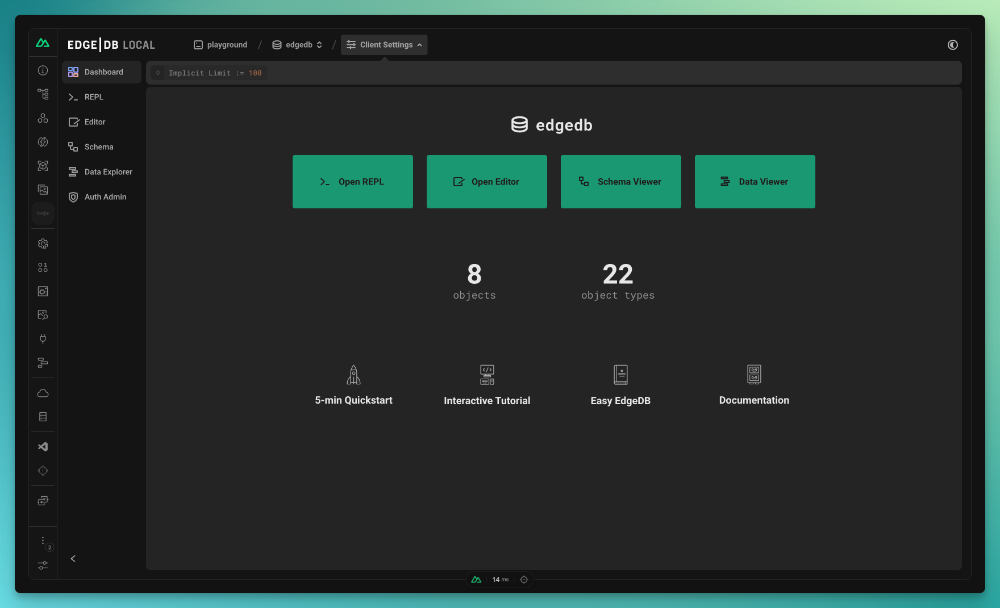

.. blog:authors:: nuxtyael
.. blog:published-on:: 2024-02-07 10:00 AM PT
.. blog:lead-image:: images/splash.jpg
.. blog:lead-image-alt::
   An open book with white pages lies on a vibrant green background that
   features abstract, white circuit board patterns.
.. blog:guid:: 3dbf1ff6-a85c-4bfe-9ad4-bf1c25e1570a
.. blog:description::
   Discover how EdgeDB is a perfect match for Nuxt 3, transforming it into a
   Laravel-like framework based on TypeScript!

===================================================
EdgeDB and Nuxt: a fullstack app at your fingertips
===================================================

Nuxt 3's emphasis on providing a similar developer experience on both the
frontend and the backend parts of your project makes it an excellent pair with
EdgeDB.

-  EdgeDB's ``dbschema/`` directory looks in line with Nuxt's
   filesystem-based developer experience
-  Nuxt auto-imports are a match made in heaven for EdgeDB's generation
   features like its query generators, query builder, and TypeScript
   interfaces.
-  Since it handles *database schema*, *migrations* and *authentication*,
   adding EdgeDB almost turns Nuxt 3 into a Laravel-like framework, but fully
   built around TypeScript.
-  EdgeDB UI feels right at home in the Nuxt DevTools UI. You might not even
   believe they're two different tools!
-  Not being locked to third-party hosting is a key point for Nuxt.
   With EdgeDB, you can safely self host or move faster by hosting
   with EdgeDB Cloud. Not being locked into a particular vendor guarantees you
   remain the captain of your ship!

``nuxt-edgedb`` embraces *both* technologies to make your development
experience a more rewarding one.

A new layer for your Nuxt project
=================================

Let’s add a database to your project and showcase how every EdgeDB feature
feels like it was built specifically with Nuxt in mind.

Add the ``nuxt-edgedb`` module to your project:

.. code-block:: bash

    $ pnpm add nuxt-edgedb-module

Configure it in your ``nuxt.config`` file:

.. code-block:: tsx

    // nuxt.config.ts

    export default defineNuxtConfig({
      modules: [
        'nuxt-edgedb-module'
      ],
      // Toggle `auth` and/or `oauth` depending on your needs
      edgeDb: {
        auth: true,
        oauth: true,
      },
      // Enable the devtools; we will need them later 😊
      devtools: { enabled: true },
    })

.. note::

    Learn more about the module options in the `nuxt-edgedb readme
    <https://github.com/Tahul/nuxt-edgedb#module-options>`__.

Write your first schema in ``dbschema/default.esdl``:

.. code-block:: sdl

    module default {
      type BlogPost {
        content: str {
          default := 'My new blog post.';
        };
        description: str {
          default := 'My blog post description.';
        };
        title: str {
          default := 'My blog post title.';
        };
      }
    }

.. note::

    You can find default templates in ``nuxt-edgedb``\'s `playground directory
    <https://github.com/Tahul/nuxt-edgedb/tree/main/playground>`__.

The next time you run ``nuxt dev``, the module will automatically detect your
environment and prompt you with the steps to get your project running. It will
prompt you to setup `EdgeDB's CLI <https://www.edgedb.com/docs/intro/cli>`__ if
you do not already have it. It will also run your migrations and generate your
`queries <https://www.edgedb.com/docs/clients/js/queries>`__ and `query builder
<https://www.edgedb.com/docs/clients/js/querybuilder>`__.

Maybe that won’t be useful to you on the first run, but think of the
pain it used to be to share a database layer with your coworkers. Now
getting your full database layer running from scratch locally is as easy
as running your Nuxt project. 🚀

A database for your ``server/`` directory
=========================================

Now that you’ve added a database to your Nuxt project, let’s see how you can
use it in your `server/
<https://nuxt.com/docs/guide/directory-structure/server>`__ directory.

The module will auto-import three functions: ``useEdgeDb``,
``useEdgeDbQueries``, and ``useEdgeDbQueryBuilder``.

Calling `useEdgeDb <https://github.com/Tahul/nuxt-edgedb#useedgedb>`__ returns
the `EdgeDB TypeScript client
<https://www.edgedb.com/docs/clients/js/driver>`__ with proper typings.

.. code-block:: tsx

    // server/api/blogpost/[id].ts
    import { defineEventHandler, getRouterParams } from 'h3'

    export default defineEventHandler(async (req) => {
      const params = getRouterParams(req)
      const id = params.id
      const client = useEdgeDb()

      const blogpost = await client.querySingle(`
        select BlogPost {
          title,
          description
        } filter .id = ${id}
      `)

      return blogpost
    })

The `useEdgeDbQueries <https://github.com/Tahul/nuxt-edgedb#useedgedb>`__
function will return an object containing TypeScript query functions generated
from any ``.edgeql`` files in ``dbschema/queries``.

The client will be passed to these queries automatically. You only need
to pass them properly typed arguments.

.. code-block:: edgeql

    // queries/getBlogPost.edgeql
    select BlogPost {
      title,
      description
    } filter .id = <uuid>$blogpost_id

.. code-block:: tsx

    // server/api/blogpost/[id].ts
    import { defineEventHandler, getRouterParams } from 'h3'

    export default defineEventHandler(async (req) => {
      // Get parameters
      const { id } = getRouterParams(req)

      // Query blogpost
      const { getBlogpPost } = useEdgeDbQueries()
      const blogPost = await getBlogpost({ blogpost_id: id })

      return blogpost
    })

`useEdgeDbQueryBuilder
<https://github.com/Tahul/nuxt-edgedb#useedgedbquerybuilder>`__ exposes the
EdgeDB query builder with proper typings.

.. code-block:: tsx

    // server/api/blogpost/[id].ts
    import { defineEventHandler, getRouterParams } from 'h3'

    export default defineEventHandler(async (req) => {
      const params = getRouterParams(req)
      const id = params.id
      const client = useEdgeDb()
      const e = useEdgeDbQueryBuilder()

      const blogPostQuery = e.select(
        e.BlogPost,
        (blogPost) => ({
          id: true,
          title: true,
          description: true,
          filter_single: { id }
        })
      )

      const blogPost = await blogPostQuery.run(client)

      return blogpost
    })

.. note::

    Learn how to use the query builder in the `EdgeDB query builder
    documentation </docs/clients/js/querybuilder>`__.

A database that fits in your DevTools
=====================================

Nuxt recently released `Nuxt DevTools
<https://nuxt.com/blog/nuxt-devtools-v1-0>`__, pushing forward the level of
developer experience module authors can provide. It's the perfect place to
inject the `EdgeDB UI <https://www.youtube.com/watch?v=iwnP_6tkKgc>`__.

This is what the EdgeDB tab looks like inside `Nuxt DevTools
<https://github.com/nuxt/devtools>`__:

          Nuxt DevTools. EdgeDB Local. The interface has a dark theme with
          elements in shades of green and gray. On the left side, there is a
          vertical navigation bar with icons for Dashboard, REPL, Editor,
          Schema, Data Explorer, Auth Admin, and other settings. The main area
          of the interface shows several options, such as "Open REPL", "Open
          Editor", "Schema Viewer", and "Data Viewer", each with a
          corresponding button. There are also sections titled "5-min
          Quickstart", "Interactive Tutorial", "Easy EdgeDB", and
          "Documentation". At the bottom of the interface, there is a status
          bar indicating a response time of "14 ms". In the top right corner,
          there's a path indicator that reads "playground / edgedb / # / Client
          Settings".

An authentication layer that scales with you
============================================

At this point, we've added a strongly typed database layer to your Nuxt
project, but what if we also want to authenticate your users?

EdgeDB offers a `batteries-included auth
solution <https://www.edgedb.com/docs/guides/auth/index#auth>`__ and
``nuxt-edgedb`` will bridge the last gap to integrate it inside Nuxt.

Enable the authentication feature in your ``nuxt.config``:

.. code-block:: typescript

    export default defineNuxtConfig({
      modules: ['nuxt-edgedb-module'],
      edgedb: {
        // Enables email/password auth
        auth: true,
        // Enables oauth providers
        oauth: true
      }
    })

Enable the ``auth`` extension inside your ``dbschema/default.esdl`` schema:

.. code-block:: sdl

    using extension auth;

    module default {
      global current_user := (
        assert_single((
          select User { id, name }
          filter .identity = global ext::auth::ClientTokenIdentity
        ))
      );

      type User {
        required name: str;
        required identity: ext::auth::Identity;
      }

      type BlogPost {
        property content: str {
          default := 'My blog post content.';
        };
        property title: str {
          default := 'My blog post';
        };
        required author: User;

        access policy author_has_full_access
          allow all
          using (.author ?= global current_user);

        access policy others_read_only
          allow select;
      }
    }

.. note::

    Refer to the `official EdgeDB Auth examples
    <https://www.edgedb.com/docs/guides/auth/index#example-usage>`__ for more
    examples of integrating the extension.

Don't forget to run ``edgedb migration create`` and ``edgedb migrate`` to lock
in those schema changes and complete activation of the extension.

Now, you may use ``EdgeDBAuth`` components on the client:

.. lint-off

.. code-block:: tsx

    <template>
      <EdgeDbAuthEmailLogin
        v-slot="{ email, updateEmail, password, updatePassword, submit, loading }"
        redirect-to="/"
      >
        

          <input
            type="email"
            :value="email"
            placeholder="your@email.com"
            @change="(e) => updateEmail(e.target.value)"
          >
          <input
            type="password"
            :value="password"
            placeholder="password"
            @change="(e) => updatePassword(e.target.value)"
          >
          <button
            type="button"
            @click="(e) => !loading && submit()"
          >
            {{ loading ? 'Loading' : 'Login' }}
          </button>
        

      </EdgeDbAuthEmailLogin>
    </template>

.. lint-on

.. note::

    Looking for OAuth implementation? Visit the `nuxt-edgedb readme
    <https://github.com/Tahul/nuxt-edgedb#oauth>`__.

Once logged in, the cookie will be set on the client and authentication to the
database can be easily be made by passing the request to your composables.

.. code-block:: tsx

    export default defineEventHandler(async (req) => {
      // 🚫 Will throw an error
      // You cannot delete a BlogPost w/o being the author
      const { deleteBlogPost } = useEdgeDbQueries()
      await deleteBlogPost({ blogpost_id: id })

      // ✅ Success
      const {
       deleteBlogPost: deleteBlogPostAuthenticated
      } = useEdgeDbQueries(req)
      await deleteBlogPostAuthenticated({ blogpost_id: id })

      return { id }
    })

On the client side, you can check the session using ``useEdgeDbIdentity``:

.. code-block:: tsx

    

    <template>
      

        <LoginButton v-if="isLoggedIn" />
        <LogoutButton v-else />
      

    </template>

.. note::

    Want to learn more about `EdgeDB Auth
    <https://www.edgedb.com/docs/guides/auth/index#auth>`__? Visit the
    `documentation page
    <https://www.edgedb.com/docs/guides/auth/index#auth>`__.

Pushing to production
=====================

Now that you have added a full-featured database to your project, you
might be ready to push it to production.

EdgeDB offers their `EdgeDB Cloud <https://www.edgedb.com/docs/guides/cloud>`__
platform that's easy to use and deploy too, or you can opt to `self-host on
your server </docs/guides/deployment/index>`__.

Specify your ``ENV`` variables pointing to your production server:

.. code-block::

    NUXT_EDGEDB_HOST=
    NUXT_EDGEDB_PORT=
    NUXT_EDGEDB_USER=
    NUXT_EDGEDB_PASS=
    NUXT_EDGEDB_DATABASE=

.. note::

    Don't forget to run your migrations on your production instance via
    ``edgedb migrate``, specifying any connection options you need to connect
    to that instance.

A working example project
=========================

Now that you’ve seen how everything works, why not check out a complete
example? You can find one in the module repository, in the ``playground``
directory.

In `pages/auth
<https://github.com/Tahul/nuxt-edgedb/tree/main/playground/pages/auth>`__
you can see how every authentication features gets implemented.

Looking at `server/api/blogpost
<https://github.com/Tahul/nuxt-edgedb/tree/main/playground/server/api/>`__ will
help you understand how database querying and authenticating work.

If you have questions, feel free to ask them in the `nuxt-edgedb module issues
<https://github.com/Tahul/nuxt-edgedb/issues>`__.

You’re just getting started!
============================

With ``nuxt-edgedb``, you just unlocked a whole new world of possibilities for
your Nuxt project!

The `module readme <https://github.com/Tahul/nuxt-edgedb>`__ also has a
`Q&A section <https://github.com/Tahul/nuxt-edgedb#qa>`__ that answers
the most frequently asked questions. We can't wait to see what you build with
Nuxt and EdgeDB!
