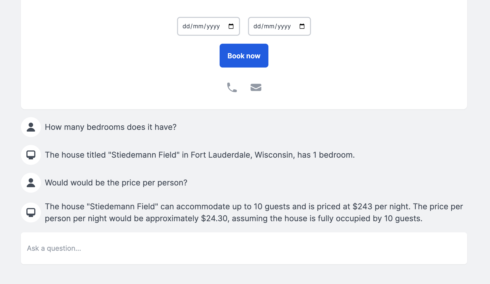

.. blog:authors:: aleksandrasikora
.. blog:published-on:: 2024-03-27 9:30 AM PT
.. blog:lead-image:: images/splash.jpg
.. blog:guid:: f58bb742-8bad-4e0a-9dee-0a7d8b5a05b1
.. blog:description::
   Learn how to build a vacation rental platform using Vercel AI SKD and EdgeDB.
   This combination enables an interactive user experience, allowing
   users to effortlessly browse, book, and add houses to their wishlists.

===========================================
Generative UI with Vercel AI SDK and EdgeDB
===========================================

The web development landscape is rapidly evolving, particularly when it comes to
building GenAI applications. With Vercel's recent release of AI SDK 3, they have
introduced **"Generative UI"** technology, enabling the integration of customized
interactive user interfaces with AI. You simply provide a set of functions,
and a large language model (LLM) determines which ones to call based on the
user's input. The Vercel AI SDK takes care of the intricate task of bridging
your application code with an LLM.

In this guide, we'll be building an example application — a vacation house
rental platform — to showcase how simple it is to create a fast, type-safe,
and maintainable  application using Vercel's exceptional SDK, EdgeDB, and
Next.js. Our example rental platform will be interactive, allowing users
to effortlessly browse, book, and add houses to their wishlists.

.. image:: images/intro.mp4
   :alt: Asking for a list of houses
   :align: center

By the end of this guide, you will:

- Learn how to set up a Next.js project integrated with Vercel AI SDK
  and EdgeDB.

- Design a database schema for an example application that is both
  comprehensive and realistic using EdgeDB.

- Implement generative UI functionality, enabling users to ask questions
  and interact with the application using natural language.

If you're eager to dive into the code, feel free to `explore it on
GitHub <https://github.com/beerose/edgedb-ai-booking-assistant>`__.
Additionally, our example application has been deployed to Vercel and
EdgeDB Cloud so you can `try it out
<https://edgedb-booking-assistant.vercel.app/>`__.

.. note::
   This blog post will skip details like styling and the UI implementation
   and will instead focus on building the core of an AI-powered application with
   EdgeDB.

Tech stack
==========

`Vercel AI SDK <https://github.com/vercel/ai_>`__ is a development kit to
build AI-powered apps with React. It provides a set of tools to
create interactive and dynamic user interfaces using AI models. The SDK
enables you to define actions, tools, and UI components to interact with
the AI model and render the UI based on the model's responses.

`EdgeDB <https://www.edgedb.com/>`__ is a next-generation,
high-performance database that introduces a modern data model and
a type-safe query language, effectively solving the n+1 problem.
EdgeDB is optimized to pair with TypeScript and React Server
Components making it an excellent choice for developers seeking efficiency
and reliability.

Setting up your project
=======================

Before diving into the code, ensure you have Node.js installed on your
system. Then, we can initialize a new Next.js project and install the
necessary dependencies:

.. code-block:: bash

  $ pnpm dlx create-next-app@canary edgedb-ai-app
  $ pnpm install ai openai zod edgedb @edgedb/generate

Next, create a file named ``.env.local`` and include your OpenAI API key
like so:

.. code-block:: dotenv

   OPENAI_KEY="<your-openai-api-key>"

After your Next.js project is ready, install the EdgeDB CLI and initialize
your project, which will create a new database:

.. code-block:: bash
  :caption: Install EdgeDB

  $ curl --proto '=https' --tlsv1.2 -sSf https://sh.edgedb.com | sh

.. code-block:: bash
  :caption: Initialize an EdgeDB project

  $ edgedb project init

Designing database schema with EdgeDB
=====================================

In EdgeDB, we define the data structure through a schema. For a rental
platform, we'll need to define *object types* (similar to tables in traditional
databases) for houses, reviews, and bookings. Below is an example schema:

.. code-block:: edgeql

  module default {
    type House {
      required title: str;
      required description: str;
      required location: str;
      required price_per_night: float64;
      required max_guests: int16;
      required no_of_rooms: int16;
      required no_of_beds: int16;
      required rating: float64;
      required amenities: array<str>;
      required photos: array<str>;

      multi reviews: Review;
      required no_of_reviews := count(.reviews);
    }

    type Review {
      required reviewer_name: str;
      required rating: float64;
      required comment: str;
      required house: House;
    }

    type Booking {
      required startDate: datetime;
      required endDate: datetime;
      required house: House;
    }
  }

To create and apply a migration for your schema, use:

.. code-block:: bash

  $ edgedb migration create
  $ edgedb migrate

Now, to generate an EdgeDB TypeScript query builder, run:

.. code-block:: bash

  $ npx @edgedb/generate edgeql-js

Implementing Generative UI
==========================

To integrate Generative UI functionalities into the application, we'll
begin by setting up the necessary functions in the ``app/action.tsx`` file.
This setup involves initializing AI clients, creating handler functions
for user inputs, and defining the AI state and UI components. Let's break
down these steps in detail.

Step 1: Initializing OpenAI and EdgeDB clients
----------------------------------------------

.. code-block:: typescript

  import { createClient } from "edgedb";
  import { OpenAI } from "openai";

  const openai = new OpenAI({
   apiKey: process.env.OPENAI_KEY,
  });

  const client = createClient();

- The OpenAI client (``openai``) is initialized with your OpenAI API key, which
  is securely stored in the ``.env.local`` file. This client will be used to
  send requests to OpenAI's API.
- ``client`` is an EdgeDB client we will use to run queries.

Step 2: Creating a handler function for user input
--------------------------------------------------

The core of the generative UI implementation is a handler function that
processes user inputs. This function, ``submitUserMessage``, takes the
user's input as a string and performs several key actions:

.. code-block:: typescript

  import { getMutableAIState, render } from "ai/rsc";

  async function submitUserMessage(userInput: string) {
    "use server";

    const aiState = getMutableAIState<typeof AI>();

    aiState.update([
      ...aiState.get(),
      {
        role: "user",
        content: userInput,
      },
    ]);

    const ui = render({
      model: "gpt-4-0125-preview",
      provider: openai,
      messages: [
        {
          role: "system",
          content: `\
    You are a house booking assistant. You can be asked to get information
    for a house or get a list of houses.
    If you can't find an appropriate function, tell the user to ask
    a different question.
      `,
        },
        { role: "user", content: userInput },
      ],
      text: ({ content, done }) => {
        if (done) {
          aiState.done([
            ...aiState.get(),
            {
              role: "assistant",
              content,
            },
          ]);
        }
        return <Message type="bot">{content}</Message>;
      },
      tools: {
        // Placeholder for future tool implementations
      },
    });
    return {
      id: Date.now(),
      display: ui,
    };
  }

- The ``'use server'`` directive indicates that this function should be
  executed on the server side, ensuring sensitive operations,
  like interacting with the OpenAI API, are not exposed to the client-side.
- ``getMutableAIState`` retrieves and updates the AI state with the user's
  input. This state acts as the memory for the conversation, storing each
  message's role (``user``, ``assistant``, or ``system``) and content.
- The ``render`` function generates a dynamic UI based on the conversation
  history. It uses the OpenAI model specified (``gpt-4-0125-preview``) to
  generate responses to the user's input. The function constructs a series
  of messages, including system-defined instructions and the user's latest
  input.
- The ``text`` callback within ``render`` specifies how to display messages
  from the AI assistant. When the AI has completed generating a response
  (``done`` is true), this response is added to the AI state and rendered as
  part of the UI.
- The ``tools`` key allows us to define custom functions to facilitate dynamic
  AI-driven UI updates within the app. We'll circle back to this later.

Step 3: Initializing AI and UI states
-------------------------------------

Before using the AI functionalities, you have to define the initial states.
``UIState`` is what the application uses to display the UI, while ``AIState``
is a JSON representation of all the context the LLM needs to read.

.. code-block:: typescript

  const initialAIState: {
    role: "user" | "assistant" | "system" | "function";
    content: string;
    id?: string;
    name?: string;
  }[] = [];

  const initialUIState: {
    id: number;
    display: React.ReactNode;
  }[] = [];

  export const AI = createAI({
    actions: {
      submitUserMessage,
    },
    initialUIState,
    initialAIState,
  });

- ``initialAIState`` and ``initialUIState`` are arrays that will hold the
  history of interactions (for AI) and the rendered UI components,
  respectively.
- ``createAI`` is a function from the ``ai/rsc`` library that initializes the
  AI context for your application, registering the ``submitUserMessage``
  function as an action and setting the initial states.

Step 4: Wrapping the application with the AI Provider
-----------------------------------------------------

Finally, to make the AI functionalities available throughout your
application, we must wrap our app's components with the AI provider.
This is typically done in a root layout component, ensuring that any
child component can access the AI context and state:

.. code-block:: tsx

  import type { Metadata } from "next";
  import { Inter } from "next/font/google";
  import { AI } from "./action";
  import "./globals.css";

  export default function RootLayout({
     children,
  }: Readonly<{
     children: React.ReactNode;
  }>) {
    return (
      <html lang="en">
        <body className={inter.className}>
          <AI>{children}</AI>
        </body>
      </html>
    );
  }

  export const dynamic = 'force-dynamic'

.. note::

  The ``force-dynamic`` setting is currently required to enable
  UI streaming in "node" environment on Vercel. It may not be 
  necessary in the future.

Fetching and displaying a list of houses
========================================

As our AI acts as booking assistant, we need to implement a feature that allows
users to fetch a list of available houses. This process involves querying
your database, filtering results based on certain criteria, and rendering
the fetched data in a user-friendly manner. Let's again break down the steps
and code involved in achieving this.

Step 1: Fetching houses from the database
-----------------------------------------

The ``getHouses`` function is designed to query your database for a list of
houses, with an optional limit on the number of results returned. This
function uses EdgeDB’s query builder to make the query programmatically
and infer its return type.

.. code-block:: typescript

  async function getHouses(limit?: number) {
    const housesQuery = e.select(e.House, (house) => ({
      ...e.House["*"],
      limit: limit,
      order_by: {
        expression: house.rating,
        direction: e.DESC,
      },
    }));

    const houses = await housesQuery.run(client);
    return houses;
  }

- The function accepts an optional ``limit`` parameter, allowing us to
  control the maximum number of houses the query returns.
- It constructs a query using EdgeDB's ``select`` method, fetching all
  properties of the ``House`` object and applying an optional limit.
- The results are ordered by the ``rating`` property in descending order,
  ensuring that higher-rated houses appear first.
- Finally, the query is executed using the ``run`` method on the ``client``
  instance, and the fetched houses are returned.

The types for the query builder are generated by the ``edgeql-js`` package
we installed earlier. The type of the ``house`` object is automatically
inferred based on the schema we defined.

.. image:: images/types.mp4
   :alt: Type inference in action
   :align: center

Step 2: Integrating the function into the Generative UI
-------------------------------------------------------

To make the ``getHouses`` function accessible within the Generative UI,
we define a tool called ``get_houses_list`` within the ``tools`` object.
We wanted it to be a bit more dynamic in terms of displayed UI, so this
function is also configured to accept parameters for selecting properties
of the houses to be displayed:

.. code-block:: typescript

    tools: {
     get_houses_list: {
       description: `
         Get the list of houses. You can filter the houses using
         EdgeQL query and filters. You can also select the properties
         you need.`,

       parameters: z.object({
         limit: z.number().optional(),
         propertiesToSelect: z.array(
           z.enum([
             'id',
             'title',
             'description',
             'location',
             'price_per_night',
             'max_guests',
             'no_of_rooms',
             'no_of_beds',
             'amenities',
             'photos',
             'no_of_reviews',
             'rating',
           ])
         )
       }),

       render: async function* ({ limit, propertiesToSelect }) {
         yield <Spinner />;
         const house = await getHouses(limit);
         aiState.done([
           ...aiState.get(),
           {
             role: 'function',
             name: 'get_houses_list',
             content: JSON.stringify(house),
           },
         ]);
         if (!house) {
           return 
House not found
;
         }
         return (
           <Houses
             houses={house}
             properties={propertiesToSelect}
           />
         );
       },
     },
   }

- ``parameters`` defines the inputs the tool accepts, such as ``limit`` and
  ``propertiesToSelect``. These parameters allow for flexible querying and
  filtering based on the user's request.
- The ``render`` function is an asynchronous generator function that first
  displays a loading indicator (``<Spinner />``). It then fetches the houses
  using the ``getHouses`` function with the specified ``limit``.
- After fetching the houses, the results are processed and added to the
  AI state. If no houses are found, a message is displayed.
- Finally, the fetched houses are rendered using a hypothetical ``<Houses />``
  component, which takes the houses and the selected properties as props. To
  see an example of implementing this component, refer to the
  `demo code <https://github.com/beerose/edgedb-ai-booking-assistant>`__.

.. image:: images/assistant.mp4
   :alt: Asking for a list of houses
   :align: center

Enhancing user interaction with detailed house inquiries
========================================================

To further improve the user experience in our rental platform application,
we can enable users to interact with specific houses listed in the ``Houses``
component. This interaction includes clicking on a house to view more details
and asking related questions, such as inquiries about amenities or
availability. This functionality can be achieved by appending a new system
message with the house's ID to the AI state and ensuring the LLM has the
context of all past messages. Let's delve into how this can be implemented.

Step 1: Extend the initial system message
-----------------------------------------

We provide a system message which serves as a guide for the LLM to understand
and respond to user queries. Let's update that to include additional
instructions for obtaining information about the houses:

.. code-block:: plaintext

  "'[houseId = "<houseId>"]' means that the user has selected a specific house.
  Use this houseId for detailed queries about that house.
  To get detailed information on a specific house, use get_house_info with
  the relevant houseId."

This would work great… except that the ``get_house_info`` tool we mentioned
doesn't exist yet! Let's build it…

Step 2: New tool for specific house details
-------------------------------------------

Next, we can define a new function to handle fetching more information
related to a currently displayed house.

.. code-block:: typescript

  tools: {
    get_house_info: {
      description: `Fetch detailed information about
                    a specific house using its houseId.`,
      parameters: z.object({
        houseId: z.string(),
      }),
      render: async function* ({ houseId }) {
        // Implementation to fetch and render
        // house information based on houseId.
      },
    },
    // Additional tools can be defined here to handle
    // other specific queries or actions.
  }

Additional tools can be added following a similar pattern to address other
specific queries or actions related to houses, such as checking availability
for specific dates, viewing reviews, and more.

Step 3: Passing context to the LLM
----------------------------------

To enable the LLM to generate responses based on the full conversation
history, including selecting a specific house, we can pass all past messages
as context when making requests to the LLM. This can be done by retrieving
the current AI state and including it in the list of messages sent to the LLM:

.. code-block:: typescript-diff

    async function submitUserMessage(userInput: string) {
      'use server'
      const aiState = getMutableAIState<typeof AI & AIState>()
  +   const pastMessages = aiState.get()

      aiState.update([
        ...aiState.get(),
        {
          role: 'user',
          content: userInput,
        },
      ])

      const ui = render({
        model: 'gpt-4-0125-preview',
        provider: openai,
        messages: [
          {
            role: 'system',
            content: `...`
          },
  +       ...pastMessages,
          { role: 'user', content: userInput },
        ],
        // ... rest of the code
    })

By maintaining a conversation history and marking specific actions like
house selection, the LLM can provide responses that are directly relevant
to the user's current interest or inquiry.

Step 3: Tracking house selection
--------------------------------

When a user clicks on a specific house in the ``Houses`` component, we can
track this action by appending a new system message to the AI state.
This message includes the selected house's ID, allowing the LLM to understand
which house the user selected:

.. code-block:: typescript

  const [aiState, setAIState] = useAIState();

  setAIState([
    ...aiState,
    {
      role: "system",
      content: `[houseId = "${house.id}"]`,
    },
  ]);

``useAIState`` is a hook that provides access to the current AI state and a
method to update it (``setAIState``).

Adding booking functionality
============================

The final functionality we'll implement is the ability for users to book a
house. This process involves creating a new function, ``confirmBooking``,
aimed at streamlining the booking process for users. This function
encapsulates the booking logic, including UI feedback during the booking
process and updating the AI state with the booking details.
Let's elaborate on how this function is structured and integrated into the
application.

Step 1: The ``confirmBooking`` Function
---------------------------------------

The ``confirmBooking`` function is designed to handle the booking process
asynchronously, providing visual feedback to the user and updating the
system's state with the booking details.

.. code-block:: tsx

  async function confirmBooking(
    from: Date,
    to: Date,
    houseId: string,
    houseName: string
  ) {
    "use server";

    const aiState = getMutableAIState<typeof AI>();
    const booking = createStreamableUI(
Booking {houseName}...
);
    const systemMessage = createStreamableUI(null);

    (async () => {
      booking.update(
Booking {houseName}...
);

      const bookingQuery = e.insert(e.Booking, {
        from_date: from,
        to_date: to,
        house: e.select(e.House, () => ({
          filter_single: {
            id: houseId,
          },
        })),
      });
      await bookingQuery.run(client);

      const message = `You have successfully booked ${houseName}
                       from ${from.toDateString()} to
                       ${to.toDateString()}. Enjoy your stay!`;

      booking.done(
{message}
);
      systemMessage.done(<Message type="bot">{message}</Message>);

      aiState.done([
        ...aiState.get(),
        {
          role: "system",
          content: `User has booked ${houseName} from ${from} to ${to}.`,
        },
      ]);
    })();

    return {
      ui: booking.value,
      newMessage: { id: Date.now(), display: systemMessage.value },
    };
  }

Here's a step-by-step breakdown:

- **Initialization**: The function begins by marking its execution context
  as server-side using ``'use server'``, ensuring sensitive operations are
  not exposed to the client. It then retrieves the mutable AI state, which
  will be updated upon successful booking.
- **Visual feedback**: Initially, a streamable UI component is created to
  indicate that the booking process has started. This component shows a
  simple animation with three bouncing dots and the message
  "Booking [houseName]".
- **Booking process**: The function then performs the booking operation.
  It constructs a query to insert a new booking record into the database,
  associating it with the selected house and the specified date range.
- **Success feedback**: Upon successful booking, the visual feedback is
  updated to inform the user that the booking has been successfully
  completed, displaying the house name and the booking dates.
- **System message update**: A system message is generated to reflect the
  successful booking in the AI state. This message includes the house name
  and the booking date range, providing a transaction record within the AI
  context.
- **AI state update**: The AI state is updated with the new system message,
  ensuring that the booking details are incorporated into the conversation
  history.

.. note::
   We're skipping some business logic here. In a more true-to-life scenario,
   we'd need to check availability first.

We also need to integrate the ``confirmBooking`` function into the ``AI`` context
so it can be used within the application:

.. code-block:: typescript

  export const AI = createAI({
    actions: {
      submitUserMessage,
      confirmBooking,
    },
    initialUIState,
    initialAIState,
  });

Step 2: Usage in a component
----------------------------

Let's say the component displaying the house details has a button to initiate
the booking process. Here's how the ``confirmBooking`` function can be used
in this component:

.. code-block:: tsx

  <button
    onClick={async () => {
      if (!bookingDates.startDate || !bookingDates.endDate) {
        return;
      }
      const response = await confirmBooking(
        startDate,
        endDate,
        house.id,
        house.title
      );
      setBookingUI(response.ui);
      setMessages((currentMessages) => [...currentMessages, response.newMessage]);
    }}
  >
    Book now
  </button>

- When the "Book now" button is clicked, ``confirmBooking`` is called with the
  selected dates, the house ID, and the house name.
- The function's response includes the updated booking UI and a new message
  for the AI state. These are used to update the component's state, provide
  immediate visual feedback, and update the conversation history with the
  booking details.

.. image:: images/booking.mp4
   :alt: Booking a house
   :align: center

LLMs that do more
=================

LLMs deal in language, and that means they generally return text. That text is
generated based on their training data. Those limitations are fine for some AI
applications but for others, we need LLMs to do more. As this app has
demonstrated, Vercel's AI SDK expands the possibility space for LLMs by
allowing them to call custom code and fetch data, rendering that with custom UI
components. It's a powerful new set of capabilities that can make LLMs useful
in many more scenarios. Add EdgeDB to the stack, and you'll have a performant
data store designed to allow you to iterate on your newly capable AI app with
greater speed and efficiency.

But it doesn't stop there. We can do even more!

Future improvements
-------------------

Looking ahead, there are several areas where this project can be further
enhanced:

- Incorporating more sophisticated AI capabilities to predict user preferences
  and suggest personalized house listings.
- Extending the EdgeDB schema to include more detailed property information,
  user profiles, and interaction histories for richer data analysis and
  feature development.
- Saving conversation history to the database so users can continue their
  conversations from where they left off.

Read more
---------

For more information on the technologies used in this guide, visit:

- `Vercel's Generative UI <https://sdk.vercel.ai/docs/concepts/ai-rsc#aistate>`__

- `EdgeDB Docs <https://www.edgedb.com/docs>`__

- `Repository with the source code <https://github.com/beerose/edgedb-ai-booking-assistant>`__

