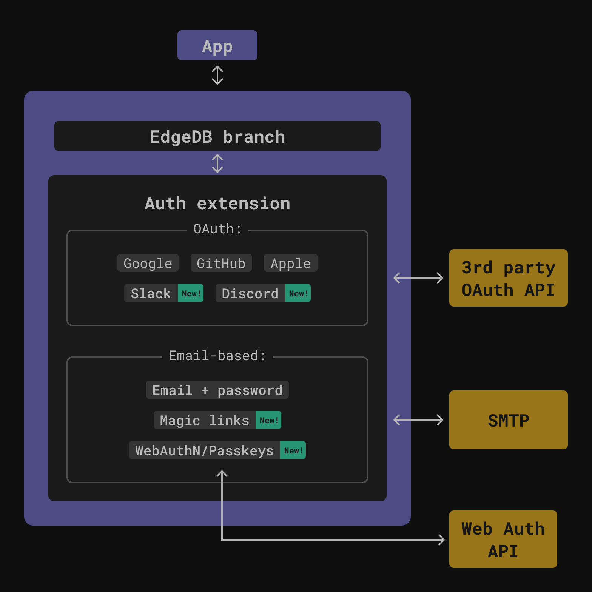

.. blog:authors:: scott
.. blog:published-on:: 2024-04-24 10:00 AM PT
.. blog:lead-image:: images/splash.jpg
.. blog:guid:: 6c777888-44ff-4962-b8df-1daedf540db8
.. blog:recommendations:: edgedb-cloud-free-tier-how-we-stack-up-vs-planetscale-supabase-neon, edgedb-5-introducing-branches
.. blog:description::
    EdgeDB 5.0 introduces secure, passwordless authentication options like
    WebAuthn and Magic Links and new OAuth providers for Slack and Discord

=======================================
EdgeDB 5: Introducing Passwordless Auth
=======================================

.. raw:: html

    

      Welcome to the third day of EdgeDB 5 and EdgeDB Cloud launch week!
    

In EdgeDB 5, EdgeDB Auth gains a couple of passwordless providers — WebAuthn and
Magic Links — as well as some new OAuth providers — Slack and Discord. Before we
dive into those, let's have a quick refresher on what EdgeDB Auth is and how it
works.

A Brief Introduction to EdgeDB Auth
===================================

Most apps need a way to identify and authenticate their users. When building
your app, setting up authentication is often one of the first hurdles. EdgeDB's
built-in auth extension makes this as easy as adding the extension to your
schema and configuring your desired authentication providers using our powerful
configuration system.

Unlike many other authentication systems, EdgeDB Auth is fully integrated with
the EdgeDB data model. This means that your authentication data is stored
directly in your EdgeDB database, alongside the rest of your application's data.
This allows you to leverage EdgeDB's powerful schema capabilities, like access
policies for role-based access control, and the ability to layer multiple
authentication factors onto a single unified User type. We handle the complexity
of the various authentication schemes and ceremonies, while still providing you
with full control over how your authentication data is stored and managed.

The auth extension also includes a beautifully designed, built-in authentication
UI, allowing you to quickly provide core authentication screens like signin,
signup, and password reset — no separate frontend work required. Simply
configure the UI once, and it integrates seamlessly with the rest of your
EdgeDB-powered application. And, if you want to build your own auth UI you can
do it with the nice high-level API that we expose. Bottom line: EdgeDB makes
implementing auth almost effortless.

Passwordless Authentication: The Future Is Here
===============================================

While email-based authentication is popular, relying on passwords introduces
security risks and friction for both users and developers. EdgeDB 5.0 introduces
support for two cutting-edge, passwordless authentication schemes.

The Web Authentication API (WebAuthn)
-------------------------------------

WebAuthn leverages public-key cryptography to allow users to authenticate
directly from their browser or device, with no shared secret like a password
ever transmitted. Users can authenticate using secure hardware security keys
like YubiKeys, or platform-based solutions like Passkeys provided by your user's
operating system, browser, or password manager.

After being proposed several years ago, WebAuthn has now reached mainstream
adoption across all major browsers and platforms. We're excited to offer a
seamless WebAuthn integration in EdgeDB 5.0, allowing you to implement this
secure authentication method in your applications today.

.. image:: images/webauthn.mp4
   :align: center

Magic Links
-----------

Another popular passwordless approach is "Magic Links" authentication. Rather
than entering a password, users simply provide an email address. A unique,
self-expiring login token is then emailed to them. Following the link in that
email automatically authenticates the user — no password required!

Magic Links provide a passwordless experience that combines high security (since
the links are scoped to originate from requesting device) with an effortless
authentication flow for end users. It's akin to the familiar "forgot password"
reset flow, but without the password at all.

.. image:: images/magiclink.mp4
   :align: center

New OAuth Providers: Slack and Discord
======================================

In EdgeDB 5.0, we've added support for allowing users to authenticate with their
existing Slack or Discord accounts. These integrations unlock new possibilities
for building applications and services that interact with these popular
chat/communication platforms.

Slack has become the standard for workplace communication and collaboration for
many businesses and teams. By allowing Slack authentication in your EdgeDB app,
you can build rich integrations that connect your app's data and workflows to
Slack channels, messaging, and bots. Automatically provision accounts based on
Slack workspace membership, or build Slack apps that leverage your app's data.

Discord has a rapidly growing user base, particularly among online communities.
If you're building a community app, game, or any service catering to these
users, the Discord OAuth integration allows a smooth onboarding experience by
authenticating with their existing Discord credentials. You can then customize
user experiences or integrate Discord capabilities based on roles, servers, and
other Discord data.

These new OAuth providers join existing support for authentication via Google,
GitHub, Apple, and Azure. Combined with EdgeDB Auth's ability to layer multiple
authentication providers onto a single user model, you have immense flexibility
in crafting the ideal authentication experience for your application's audience.

What's next?
============

The EdgeDB 5.0 release packed a lot of great new authentication capabilities,
but we're not stopping there! A few key improvements are already being planned
for EdgeDB 6.0:

Customizable Authentication Emails
----------------------------------

While the built-in auth UI provides a clean experience out-of-the-box, we know
emails are an important branding and user experience touchpoint. In EdgeDB 6.0,
we plan to add the ability to fully customize the email flows. This will allow
you to implement your own designs and messaging to provide a seamless transition
from your app's UI right into the inbox.

Generic OpenID Connect Support
------------------------------

EdgeDB 5.0 shipped with direct integration for popular OAuth providers like
Google, Github, Apple, Azure, and now Slack and Discord. But we recognize there
are countless other authentication providers out there. In EdgeDB 6.0, we plan
to investigate supporting a generic OpenID Connect integration that could allow
connecting EdgeDB Auth to any OpenID Connect compatible provider with just a few
configuration settings.

As always, we'd love to hear what authentication capabilities are most important
for your use cases. Authentication is a critical part of any application, and
we're committed to making it as secure, extensible, and painless as possible in
EdgeDB. The road to passwordless is an exciting one. We hope you'll join us!

By the way, the EdgeDB Launch week is still going strong! Keep an eye out for
some exciting announcements coming up on Thursday and Friday 🎉
