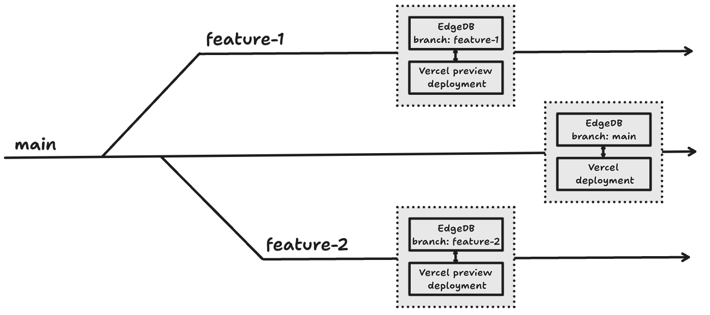
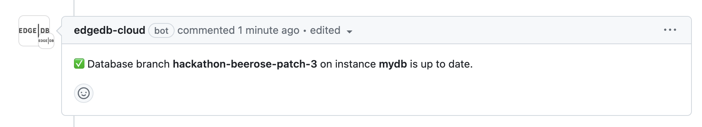
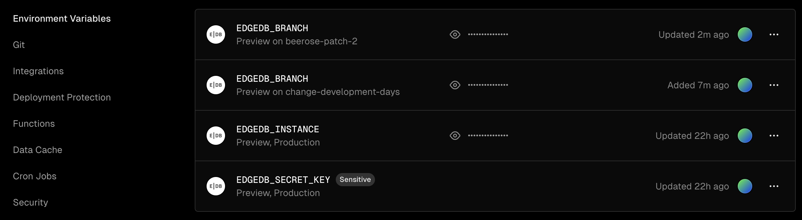
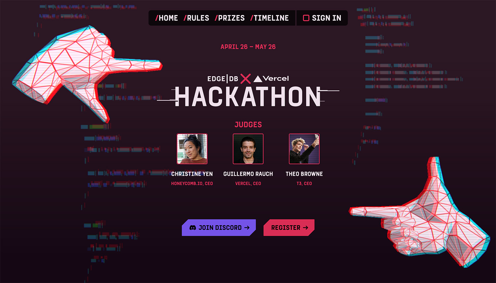
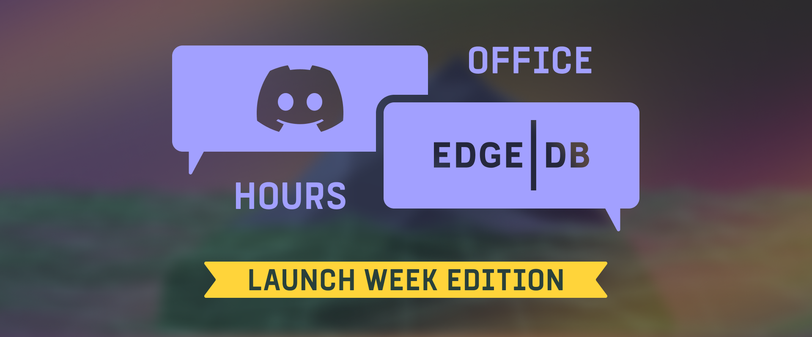

.. blog:authors:: aleksandrasikora
.. blog:published-on:: 2024-04-26 10:00 AM PT
.. blog:lead-image:: images/splash.jpg
.. blog:guid:: 41b01f5f-1f50-43e7-b5b2-1104f47c1af7
.. blog:description:: EdgeDB introduces integration with Vercel, and announces the Vercel + EdgeDB Hackathon.

======================================================
Vercel + EdgeDB: branches workflow and hackathon alert
======================================================

Today marks the 5th and final day of EdgeDB Launch week. It's been an exciting
week of new product releases and updates. Let's dive into today's
announcements!

EdgeDB + Vercel Integration
===========================

Following our recent announcement of schema and data branches in EdgeDB, which
introduces versioning of database schema, we are excited to further extend
these capabilities through our integrations with Vercel and GitHub. Let's dive
into how it can simplify your dev workflow!

Let's say you're building a new feature for your application. You create a new
branch in your GitHub repository to work on the feature. With the EdgeDB +
Vercel integration, a new database branch is automatically created in your
EdgeDB Cloud instance, allowing you to test new features in isolation without
affecting the main database schema ✨

Let's take a closer look at how the setup works:

GitHub integration
------------------

With our GitHub integration, you can work on different features with separate
schemas without affecting the main database. This isolation ensures that
experimental changes do not disrupt the overall functionality of your
application, providing a robust environment for testing and development.

.. image:: images/linking-github.mp4
   :alt: Linking GitHub

When you link an EdgeDB Cloud instance to a GitHub repository, a new branch in
your GitHub repo automatically triggers the creation of a corresponding
database branch in your EdgeDB instance. This branch's schema stays
synchronized with your migrations as you push changes to your GitHub branch.

Vercel integration
------------------

By integrating EdgeDB Cloud instances with your Vercel projects, we simplify the
management of environment variables and enhance security. Once you link your
Vercel projects to an EdgeDB instance, ``EDGEDB_INSTANCE`` and ``EDGEDB_SECRET_KEY``
environment variables are automatically managed for you. This setup allows
EdgeDB client libraries to securely connect to your EdgeDB Cloud instances,
removing the hassle of manual configuration.

.. image:: images/integration-vercel.mp4
   :alt: Installing EdgeDB in Vercel

Automated environment setup allows you to focus more on coding and less
on configuration tasks. This speeds up the development process and ensures that
your database connections are secure without additional effort.

Automated environment variables in Vercel
-----------------------------------------

When a new branch is created in GitHub, EdgeDB creates a new database branch
and sets the ``EDGEDB_BRANCH`` environment variable in Vercel for the preview
deployments. This ensures that the preview deployments connect to the correct
database branch, aligning with the specific feature you are developing in that
branch.

`Check out EdgeDB on Vercel's integration marketplace <https://vercel.com/integrations/edgedb>`_.

Conclusion: a new, streamlined workflow
---------------------------------------

EdgeDB, integrated with Vercel and GitHub, automates tedious tasks, enhances
security, and boosts productivity. It's a must-have for developers who want to
streamline their workflow and build faster, more secure, and more scalable
applications.

But... that's not all! We have one more exciting announcement to share with you.

Hackathon Alert! 🚨
===================

We are thrilled to announce `the EdgeDB Hackathon
<https://hackathon.edgedb.com/>`__! This event is for developers of all skill
levels to create, learn, and connect.

The hackathon will be judged by `Guillermo Rauch <https://twitter.com/rauchg>`_
(Vercel, CEO), `Theo Browne <https://twitter.com/t3dotgg>`_ (T3, CEO),
and `Christine Yen <https://twitter.com/cyen>`_ (Honeycomb.io, CEO).
Prizes range from $1,000 USD to $5,000. You'll have one month starting from
April 26 to May 26, 2024 to build and submit an app.

If you run into any questions or need a hand with your project, don't worry!
`Join us on Discord <https://discord.com/invite/edgedb>`_. We have a dedicated
**#hackathon** channel where you can get support, ask questions, and interact
with other participants and our team.

Check out `the hackathon website <https://hackathon.edgedb.com>`_ for more details
and to register. We can't wait to see what you build! 🚀

Wrapping up
===========

That's a wrap for today's announcements. We hope you're as excited as we are
about the new EdgeDB + Vercel integration and the upcoming hackathon. Stay
tuned for more updates and resources to help you get started with EdgeDB.

We're hosting an office hours session early next week to answer any questions
you may have about EdgeDB. Be sure to `join us <discord_>`_ and bring
your questions!

P.S. If you missed any of the announcements this week, here's a quick recap:

- `Day 1: EdgeDB Cloud Free Tier is now generally available 🎉 </blog/edgedb-cloud-free-tier-how-we-stack-up-vs-planetscale-supabase-neon>`_
  We've also expanded our IMDBench suite to include real-time tests
  against leading cloud services. See how we stack up in perf metrics
  against other popular databases. Spoiler: EdgeDB leads the pack! 👀
- `Day 2: Introducing EdgeDB Schema and Data Branches 🌿 </blog/edgedb-5-introducing-branches>`_
  We've reimagined the concept of a "database" within a server to a "branch,"
  streamlining vocabulary and expanding possibilities. Managing branches is now a
  breeze with the EdgeDB CLI. Create, switch, and manage your database branches
  with straightforward commands.
- `Day 3: EdgeDB Auth updates and new providers support 🛡️ </blog/edgedb-5-introducing-passwordless-auth>`_
  EdgeDB 5.0 introduces WebAuthn and Magic Links. WebAuthn leverages public-key
  cryptography for secure browser/device authentication. Magic Links?
  No passwords, just a unique login token sent via email. We also now
  support Slack and Discord authentication in EdgeDB 5.0.
- `Day 4: ext::ai extension for AI-powered applications 🤖 </blog/edgedb-5-introducing-ext-ai>`_
  The EdgeDB 5 extension ``ext::ai`` makes it possible to create AI-enabled
  apps in just minutes! Indexing and searching content using semantic similarity is
  now as simple as declaring an index on a text property. No more fiddling with embeddings!
- Day 5: well, that's today! 😉

Thank you for joining us this week for EdgeDB Launch. We appreciate your
support and feedback. We can't wait to see what you build with EdgeDB!

Until next time! 🚀

.. _hackathon: https://hackathon.edgedb.com
.. _discord: https://discord.gg/edgedb
