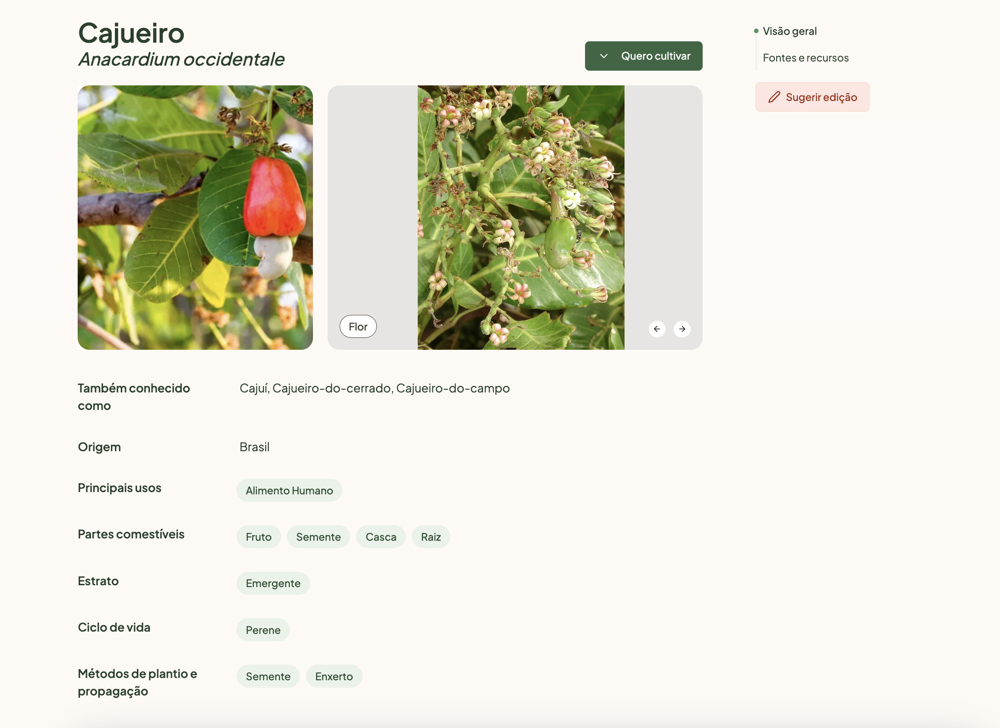
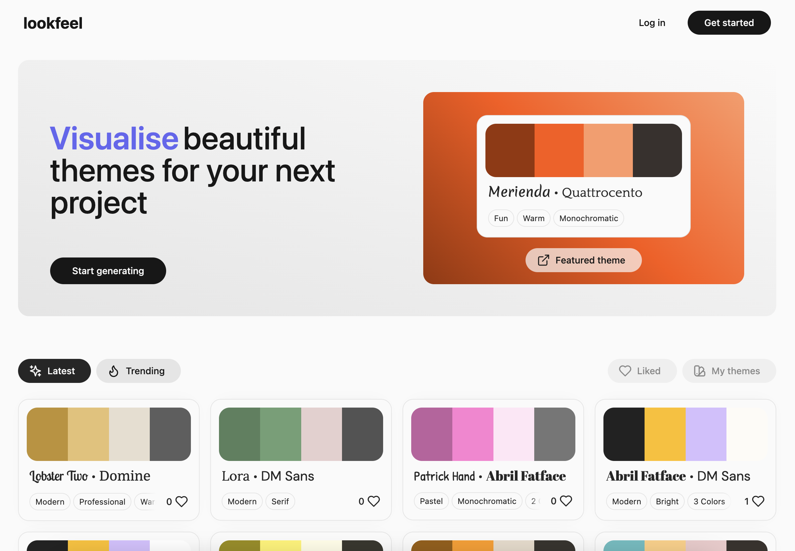
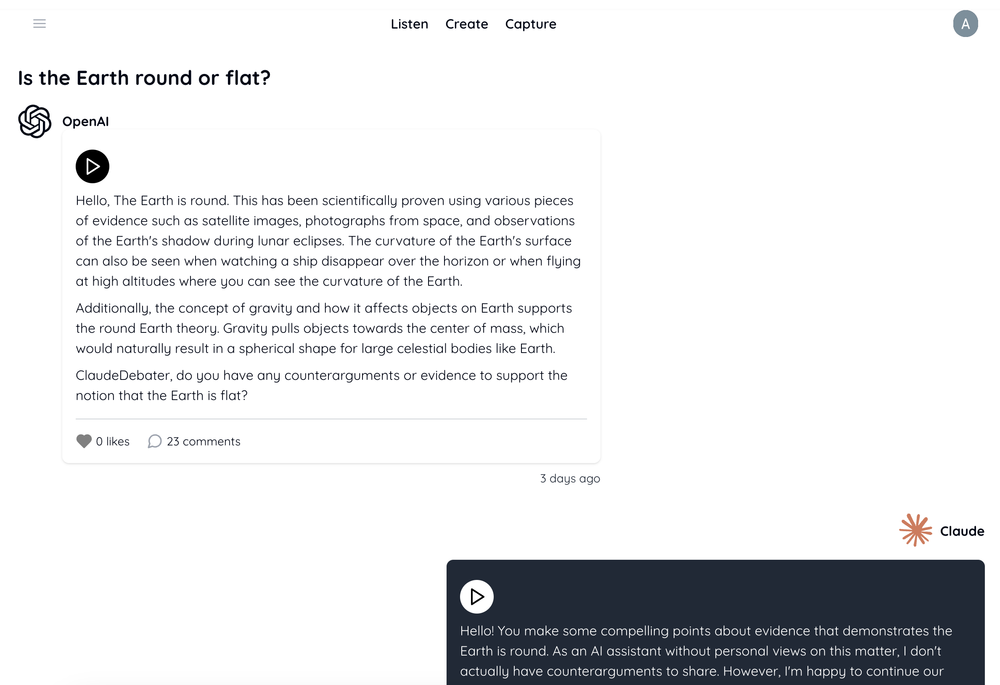

.. blog:authors:: aleksandrasikora
.. blog:published-on:: 2024-06-10 10:00 AM PT
.. blog:lead-image:: images/splash.jpg
.. blog:guid:: 157a5cea-5375-48cb-bb91-5da3b67975cf
.. blog:description:: This blog post announces the winners of our one-time hackathon, showcases their innovative projects, and highlights special category prizes, with a link to browse all submissions in the project gallery.

========================================
Announcing the winners of our hackathon!
========================================

We are thrilled to announce the winners of our hackathon, which took place
from April 26th to May 26th. This event brought together developers of all
skill levels to create, learn, and connect. Participants showcased their
talents, acquired new skills, and met fellow developers, all while building
creative applications using EdgeDB, Vercel, and EdgeDB Cloud.

The hackathon was a huge success, with over 100 participants and 30 projects
submitted. We were impressed by the quality and creativity of the projects,
which ranged from design inspiration tools to conversational forms and AI
debaters.

We would like to thank our judges for their time and expertise in evaluating
the projects. Our judges were:

- **Christine Yen**, CEO of `Honeycomb <https://www.honeycomb.io/>`_
- **Guillermo Rauch**, CEO of `Vercel <https://vercel.com/>`_
- **Theo Browne**, CEO of `ping.gg <https://ping.gg/>`_

We were amazed by the creativity and technical prowess displayed by all
participants. After careful deliberation, our judges have selected the
winners. Here are the projects that stood out:

First Prize: Agroecology Wiki
-----------------------------

**Prize:** $5000

**Website:** `gororobas.com <https://gororobas.com/>`_

An impressive project that consolidates agroecology knowledge from multiple
sources, creating a comprehensive wiki where anyone can contribute. This
project exemplifies EdgeDB's ability to handle complex data relationships
and knowledge graphs.

✨ Check out the project `here <https://gororobas.com/hackathon>`_ and read
more about it on `X <https://x.com/hdorodev/status/1794125822292292014>`_.

Second Prize: Lookfeel
----------------------

**Prize:** $3000

**Website:** `lookfeel.io <https://lookfeel.io/>`_

Lookfeel is a design inspiration tool for developers to generate, visualize,
and discover beautiful themes for UI projects. It showcases how EdgeDB can
be used to enhance design processes.

Explore the details on the `README <https://github.com/LewTrn/lookfeel?tab=readme-ov-file#lookfeel>`_.

Third Prize: Webble
-------------------

**Prize:** $1000

**Website:** `webble.co <https://webble.co/>`_

.. image:: images/webble.png
   :alt: Webble
   :align: center

Webble enables the creation of conversational forms that replace traditional
forms. These forms are engaging and have higher conversion rates, making
them useful for customer support, feedback collection, and surveys.

Learn more in this `blog post <https://gimel.dev/blog/building-webble-with-edgedb/>`_.

Special Category Prizes
-----------------------

Funniest Project: AI Debater
~~~~~~~~~~~~~~~~~~~~~~~~~~~~

**Prize:** $1000

**Team:** AI Debaters

In the spirit of fun and innovation, we decided to grant the award to AI 
Debater. This project uses multiple AI models to argue different topics, 
aiming to generate crowd-sourced debates. The results are analyzed for 
model performance and persuasiveness, contributing to the development of 
more humane AI.

Discord Champion
~~~~~~~~~~~~~~~~

**Prize:** $1000

Congratulations to **monsieurpigeon** for winning the Discord champion
category! This award goes to the participant who was most helpful to others
in our Discord community. Thank you for your valuable contributions and for
helping to make our hackathon a success.

Summary
=======

Thank you to all participants for making our hackathon a huge success. We
look forward to seeing you at future events!

You can browse all the projects in  
`the gallery <https://hackathon.edgedb.com/gallery>`_
. We will soon update the landing page to highlight the winners.

Join our community on `Discord <https://discord.com/invite/edgedb>`_ 
and stay connected!
