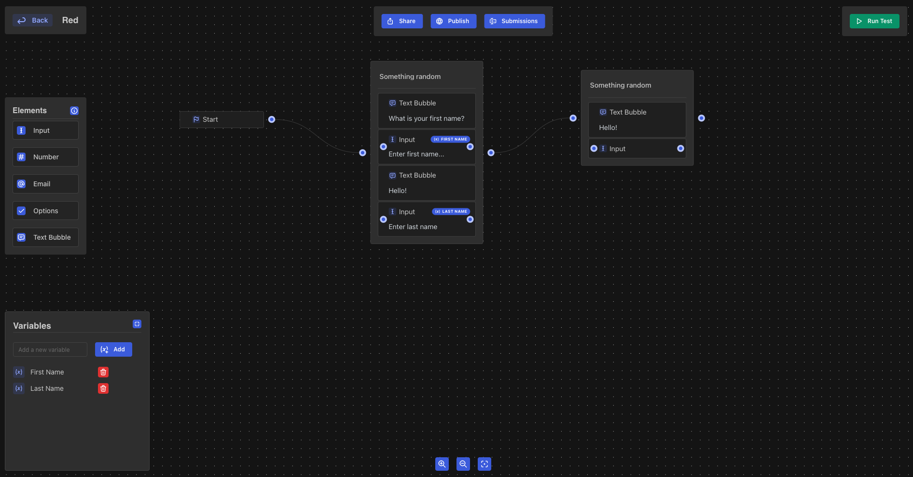
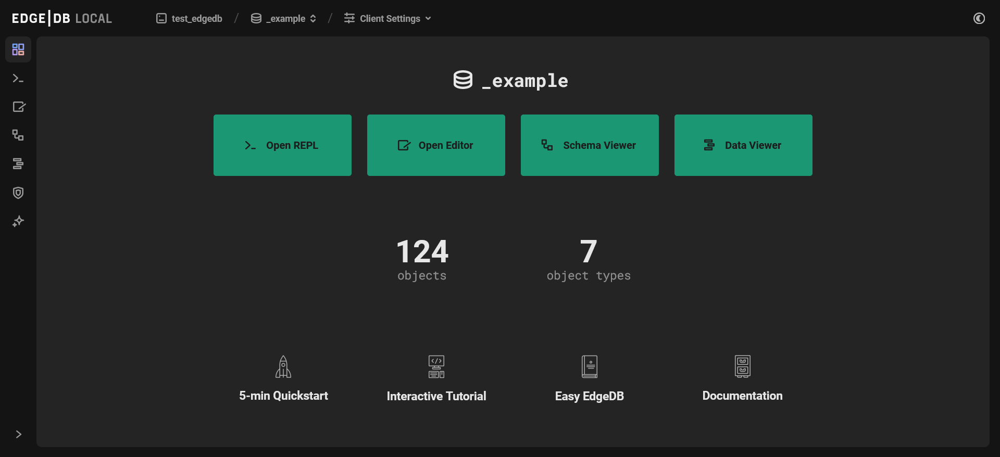

.. blog:authors:: gimeldick
.. blog:published-on:: 2024-06-28 10:00 AM PT
.. blog:lead-image:: images/splash.jpg
.. blog:guid:: 37392123-b96e-4195-8be3-4577d53bb9a9
.. blog:description:: Choosing the right database is hard. But why is that? Is it a fear of vendor lock-in? Maybe we're just tired of writing SQL? Perhaps it's simply because there are too many options to choose from.

Powering Webble's Growth: How EdgeDB Became the Cornerstone of Their Tech Stack
===============================================================================

.. note::
   This guest post is authored by `Gimel Dick <https://github.com/Gim3l>`_,
   a third-place winner in the recent `EdgeDB Hackathon <https://hackathon.edgedb.com/>`_,
   sharing their experience integrating EdgeDB into their project.

   Webble lets you create conversational forms instead of traditional ones.
   These forms are engaging and boost conversion rates. They can be used for customer
   support, feedback collection, and surveys.

Choosing the right database is hard. But why is that? Is it a fear of vendor
lock-in? Maybe we're just tired of writing SQL? Perhaps it's simply because
there are too many options to choose from.

Just choosing between PostgreSQL, MySQL, SQLite, and MongoDB poses a challenge
for many of us. Do we go with a relational database, a graph database, or a
NoSQL database? And with many spin-offs of PostgreSQL, how do we choose the
right flavor?

The correct answer to these questions is usually: it depends. We need to first
analyze the needs of our application if we're going to make the correct choice.
At `Webble <https://webble.co>`_, we also had to ask ourselves some of these
questions and more. Questions like:

- Do I want to write SQL by hand? *No, maybe an ORM is enough…*
- Do I want to write migrations by hand? *Again, no. An ORM might help…*
- Does the ORM/database offer type-safety?
- How easy is it to model data?
- What tooling is provided for quickly viewing the data?
- What additional benefits does one database offer over the other?
- How important is performance?
- Who else on my team are going to be using this?

These are just some of the few questions we've had to ask ourselves before
settling with EdgeDB. But why EdgeDB?

What sets EdgeDB Apart
----------------------

EdgeDB is a relatively new database with many unique selling points that
ticked all the right boxes for us. For instance, EdgeDB is built on a solid
foundation, PostgreSQL. It comes with a type-safe TypeScript client, a built-in
UI for writing queries, viewing data, and visualizing your application's data
schema. It includes polymorphic data modeling, access policies to support
advanced authorization modeling, password and social authentication, and more.
But perhaps most importantly for us, EdgeDB's biggest selling point was its
ease of use and how easy it was to get started.

One of the main challenges of writing production-level SQL is performance.
EdgeDB has a trick up its sleeve: all queries of arbitrary complexity are
compiled into a single highly optimized SQL query, so you worry less about
performance and more about your application's business logic. But if you do need
to debug the performance of a query, EdgeDB provides the necessary tools for
visualizing a query's performance.

Schema Modeling is Easy with EdgeDB
-----------------------------------

In EdgeDB, modeling data is simple. To do so, we use SDL, EdgeDB's Schema
Definition Language. All SDL code can be written in a file ending with ``.esdl``.
We can write our entire schema in one file, or we can split it into many.
Whichever approach you decide, SDL is intuitive to write and easy to read.

Example:

.. code-block:: edgeql

   module default {
      type User {
         required username: str {
            # usernames must be unique
            constraint exclusive;

            # max length (built-in)
            constraint max_len_value(25);
         };
         required email: str;
         projects := .<owner[is Project];
      }

      type Project {
         required name: str;
         required owner: User;
      }
   }

In the example above, we defined a User entity type and a ``Project`` entity type in
our schema. Using the concept of links in EdgeDB, we can link our User entity to
our ``Project`` entity by defining a single owner link, specifying a cardinality
of many-to-one. We also defined a computed field ``projects`` on the ``User`` entity that
returns all projects owned by the user.

EdgeDB's SDL also allows us to define constraints, access control, base entity
types for polymorphic data modeling, configure our EdgeDB application (e.g.,
authentication, GraphQL), define triggers, computed fields, and more. It's
extremely powerful!

Authentication is a Breeze with EdgeDB
--------------------------------------

Another reason we went with EdgeDB is because it allows us to ship code faster
by not having to build authentication from scratch. EdgeDB comes with an opt-in
authentication system that is tightly coupled with the EdgeDB data model. We can
skip the hurdle of setting up a third-party authentication solution, while
keeping all our users' data securely stored within the EdgeDB database.

It's easy to get started with EdgeDB auth — we enable it by adding a
single line to our schema. We can then configure it through EdgeDB UI.
It allows us to configure multiple authentication strategies
including OAuth, password and passwordless auth.

.. code-block:: sdl

  using extension auth;

The EdgeDB team provides various libraries for working with EdgeDB auth, but
they are not required. At Webble, we used the ``@edgedb/auth-remix`` package to
quickly integrate EdgeDB auth into our remix application.

EdgeDB comes with a UI
----------------------

As stated earlier, one of the primary reasons we decided to use EdgeDB is
because of its ease-of-use. EdgeDB's ease-of-use is manifested not just in
its DSLs, such as the SDL, but also in the tools that are bundled with it. EdgeDB UI
allows you to visualize complex relations between your defined types, browse
data, and run queries. Having the EdgeDB UI at our disposal was a major
productivity boost for us.

Querying with EdgeDB
--------------------

When querying databases with EdgeDB, we use EdgeQL, a query language provided by
EdgeDB designed to match SQL in power while being clearer and more concise. You
can experiment with EdgeQL by using the EdgeDB UI. At Webble, we opted not to
write EdgeQL but instead decided to use the EdgeDB TypeScript query builder.
Writing type-safe queries in a clean and efficient manner was one of our top
priorities. Luckily, with the EdgeDB TypeScript client, doing so was surprisingly
easy. Arguably, it's one of EdgeDB's greatest selling points. And here's why:

**You don't have to write EdgeQL…but you can.**

The TypeScript library gives you the option of writing EdgeQL if you prefer
that approach. You can write all of your queries in ``*.edgeql`` files and then
run a simple command to generate TypeScript functions from your EdgeDB queries.
This approach is particularly useful because you can execute your queries on the
EdgeDB UI to see the results and, once you're comfortable, you can add them to
your application code without fear of getting a completely different result at
runtime.

The other approach to writing queries in EdgeDB is using the provided query
builder. The query builder is a **code-first** approach where we write code and
the EdgeQL query is generated for us, rather than the other way around. It is
just as powerful as writing EdgeQL queries.

As of the time this article was written, there is currently a lack of a language
server extension for EdgeQL for VSCode and other IDEs. As a result, you don't
get autocompletion in your IDE and errors or warnings when writing queries by
hand. Therefore, there is a clear advantage to the code-first approach, which
leverages TypeScript for autocompletion, type inference, and type checking.
Thankfully, the team at EdgeDB is currently working on bridging this gap.

Luckily for us, because the TypeScript client is designed to be as close to
EdgeQL as possible, we don't lose much by going the code-first route. We can
still experiment with EdgeQL queries in the EdgeDB UI and easily translate them
to the query builder.

**To illustrate this:**

Below is a query to filter all ***projects*** in our database and sort them by
***name*** in ascending order.

.. code-block:: edgeql

   select Project {
     name,
     owner: {
       email,
       id,
       username
     }
   }
   order by .name

And here's the code for that using the query builder…

.. code-block:: python

   const query = e.select(e.Project, (project) => ({
      name: true,
      owner: {
          email: true,
          id: true,
          username: true,
      },
      order_by: project.name
   }));

   const result = await query.run(client)

The query above yields the following result:

.. code-block:: json

   [
     {
       "name": "EdgeDB",
       "owner": {
         "email": "gimel@mail.com",
         "id": "d2a6ee0c-3489-11ef-9605-2321f051e381",
         "username": "gim3l"
       }
     },
     {
       "name": "TrueSelph",
       "owner": {
         "email": "gimel@mail.com",
         "id": "d2a6ee0c-3489-11ef-9605-2321f051e381",
         "username": "gim3l"
       }
     },
     {
       "name": "Webble",
       "owner": {
         "email": "gimel@mail.com",
         "id": "d2a6ee0c-3489-11ef-9605-2321f051e381",
         "username": "gim3l"
       }
     }
   ]

As you can see, writing queries in EdgeDB is not only intuitive, but the result
also carries the same shape as our query. This is akin to writing queries in
GraphQL, where we write the query in a hierarchical fashion.

Conclusion
----------

EdgeDB is not just a database; it's a stack of tools for handling data for your
application, designed for productivity.
Overall, the experience of using EdgeDB versus using other disparate technologies
is unmatched. For Webble, the EdgeDB experience is not just good enough; it’s
superior. So, it was sensible to use EdgeDB to build Webble.

Are you tired of the traditional challenges associated with SQL? Are you looking
for a modern, developer-friendly database solution? Then, I strongly urge you to
give EdgeDB a shot. You can get started by checking out the `EdgeDB documentation
<https://docs.edgedb.com/>`_.

Visit `Webble <https://webble.co>`_ to see how we're using EdgeDB to power our
application.
