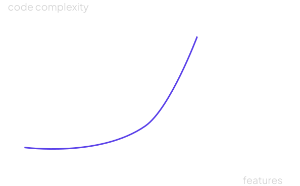
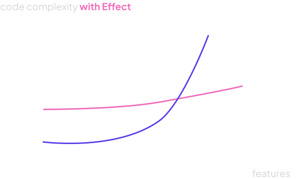

.. blog:authors:: aleksandrasikora
.. blog:published-on:: 2024-12-06 10:00 AM PT
.. blog:lead-image:: images/splash.jpg
.. blog:guid:: a29a8f5a-27a4-40da-9436-a226f17491e8
.. blog:description:: Learn how to use Effect with EdgeDB to build complex functionality in a type-safe way.

===========================================
Building with Effect and EdgeDB: Part 1
===========================================

Let's start with a common scenario: building a user profile page that needs to fetch user data, update analytics, and send notifications. Here's how you might write this in TypeScript:

.. code-block:: typescript

   async function loadUser(userId: string) {
     try {
       const user = await getUserData(userId)
       await updateUserAnalytics(userId)
       await notifyUser(userId)
       return user
     } catch (error) {
       console.error("Failed to load user:", error)
       throw error
     }
   }

Simple enough, right? But what if we want to:

* Automatically retry failed analytics updates
* Continue loading if notifications fail
* Handle different types of errors differently

The code could quickly become complex and hard to maintain.

This is where `Effect <https://effect.website/>`_ comes in.
Effect is a powerful TypeScript framework for building
type-safe, composable, and maintainable applications. You can think of it as a meta-framework for TypeScript, similar to how
Next.js extends React or Nuxt extends Vue.

In this three-part series, we'll explore Effect from the ground up:

* Part 1 (this post): Core concepts and basic error handling
* Part 2: Integrating Effect with EdgeDB and using Effect's dependency injection
* Part 3: Real-world applications and advanced patterns

This post is a dive into the fundamental concepts behind Effect. We'll cover:

* Where traditional error handling falls short
* Effect's approach to managing errors and side effects
* How to create effects that succeed or fail, and compose them using ``pipe`` or generators
* How to handle errors using ``catchAll`` or ``catchTags``, and retry operations using the ``retryOrElse`` method

Let's dive in!

Why Effect?
-----------

In programming, we often deal with operations that can have side effects like
calling 3rd-party APIs, mutating states, etc. Managing these side effects
predictably and safely can be challenging. As our app evolves with new features, so does the
complexity of our codebase and handling it becomes more difficult.

Effect is meant to help you write all the complex stuff like async code,
composability, concurrency, observability, and dependency injection easier than
before while keeping it type-safe.

But because it's so powerful and has a broad API, it might be tricky to get your
head around it. One thing that resonated with me was comparing it to something
like Next.js for React or Nuxt for Vue - but for TypeScript: **a meta-framework for TypeScript**.

Traditional error handling
==========================

Let's go back to our original example:

.. code-block:: typescript

   async function loadUser(userId: string) {
     try {
       const user = await getUserData(userId)
       await updateUserAnalytics(userId)
       await notifyUser(userId)
       return user
     } catch (error) {
       console.error("Failed to load user:", error)
       throw error
     }
   }

The code looks simple, but each function call is a potential point of failure. To understand
all possible failure scenarios, we'd need to examine each function's implementation
and consider network issues, database connection problems, and data validation errors.

We could try to recover from failures, but with traditional ``async/await`` code, we can't
easily "branch" our logic to handle different scenarios.

In a real application, you'd want more granular error handling. Maybe return the
user data even if analytics fails, or continue if notifications couldn't be sent.
Handling this with pure TypeScript could get messy quickly:

.. code-block:: typescript

   async function loadUser(userId: string) {
     let user
     try {
       user = await getUserData(userId)
     } catch {
       throw new Error("User not found")
     }
     
     try {
       await updateAnalytics(userId)
     } catch {
       // Continue without analytics
     }
   
     try {
       await notifyTeam(userId)
     } catch {
       // Continue without notification
     }
   
     return user
   }

What if we could handle these scenarios more elegantly, with proper typing and
composable error handling? Effect is designed for exactly this.

What is Effect and how does it work?
------------------------------------

The main thing to know is that handling exceptions differs from managing errors.
Every program can run into errors safely; it's about how you manage those errors.
Throwing them as exceptions and potentially cancelling the computation is just
one approach.

One thing you could do is to return an error as a value, but that requires you
to handle it immediately.

   
What if we disconnect the two? And what if we can have the best of the two worlds?

With Effect, we can have composable building blocks describing what job needs to be done. 
Still, you can specify how the system should handle any side effects or errors within a unified framework.

Using Effect
------------

Let's see how Effect can help us handle operations more elegantly.

Creating an Effect
==================

Here's how we might fetch a user, handling potential errors in a type-safe way. 
Notice the return type of the function: it's an ``Effect``
that can either:

* succeed with an object of type ``User``
* fail with an ``Error`` object

.. code-block:: typescript

   import { Effect } from "effect"
    
   const getUserData = (id: string): Effect.Effect<User, Error> =>
     Effect.promise(async () => {
       const query = e.select(e.User, user => ({
         filter_single: e.op(user.id, "=", e.uuid(id)),
         ...e.User['*'],
         posts: user.posts['*']
       }))
       const user = await query.run(client)
       if (!user) {
         throw new Error("User not found")
       }

       return user
     })

In the ``getUserData`` function, we're using the ``Effect.promise`` method to create an effect
that wraps an async operation. If there's no user with the given ID, we throw an error.

.. note:: 
   In the above example, we provided an ``Error`` type to the effect as we expect it may fail.
   In the opposite case, if we expected the operation to never fail, it would default to a ``never`` instead.

Custom Errors
=============

Now, it would be nice to have a more specific error type for the case when the user is not found 
or when the database operation fails.

We can use the ``Data.TaggedError`` class from the Effect library to create a custom error:

.. code-block:: typescript

   import { Data } from "effect"
    
   class DatabaseError extends Data.TaggedError("DatabaseError")<{
     readonly message: string
     readonly cause: unknown
   }> { }

   class UserNotFoundError extends Data.TaggedError("UserNotFoundError")<{
     readonly userId: string
   }> { }

.. note:: 
   There are also other utilities to handle errors. 
   Check the `Effect documentation <https://effect.website/docs/error-management/two-error-types/>`_ for more details.

That lets us update the ``getUserData`` function to throw a more specific error:

.. code-block:: typescript

   const getUserData = (id: string): Effect.Effect<User, DatabaseError | UserNotFoundError> =>
     Effect.tryPromise({
       try: async () => {
         const query = e.select(e.User, user => ({
           filter_single: e.op(user.id, "=", e.uuid(id)),
           ...e.User['*'],
           posts: user.posts['*']
         }))

         const user = await query.run(client)
         if (!user) {
           throw new UserNotFoundError({ userId: id })
         }

         return user
       },
       catch: (error) => new DatabaseError({
         cause: error,
         message: `Failed to fetch user ${id}`
       })
     })

This time we use an overload of ``Effect.tryPromise`` that gives us more 
granular control over error handling.

Creating an Effect with ``pipe``
================================

Another way to create an effect is to use the ``pipe`` function, which lets you
compose multiple effects:

.. code-block:: typescript

   const callAnalyticsService = (userId: string) =>
     Effect.tryPromise(() => fetch(`https://my-analytics-service.com/user/${userId}`))

   const updateAnalytics = (
     userId: string
   ): Effect.Effect<void, Error> =>
     pipe(
       Effect.log("Updating analytics"),
       Effect.tap(() => callAnalyticsService(userId)),
       Effect.tap(() => Effect.log("Analytics updated"))
     )

Here we're using an alternative form of ``tryPromise`` that automatically wraps any thrown 
errors in an ``UnknownException``, which can be simpler when you don't need custom error handling.

For the ``updateAnalytics`` function, we're using ``pipe`` to compose multiple effects. 

Notice, that we've used ``Effect.log`` to log the steps of the computation. Effect has
a built-in logging system that can be used to trace the execution of the program. We'll see
more of how it works in the next sections.

Another new method we're using is ``Effect.tap``. The ``tap`` method is used when chaining effects. 
It ensures that each step produces a new ``Effect`` while flattening any nested effects. It's useful 
when you want to perform a side effect without changing the result of the computation.
In our example, we're using it to call the analytics service, 
and we don't care about the result of the operation.

Running the Effect
==================

Now, let's first combine the effects we've created into a single operation:

.. code-block:: typescript

   const loadUser = (id: string): Effect.Effect<User, DatabaseError | UserNotFoundError | Error> =>
     pipe(
       Effect.log("Fetching user"),
       Effect.flatMap(() => getUserData(id)),
       Effect.tap((user) => Effect.log(`Fetched user ${JSON.stringify(user, null, 2)}`)),
       Effect.tap((user) => updateAnalytics(user.id))
     )

In the ``loadUser`` function, we're again using the ``pipe`` function to compose multiple effects.

We're also using the ``Effect.flatMap`` method to chain the ``getUserData`` effect with the next effect.
It's similar to the ``tap`` method, but it allows you to pass the result of the previous effect to the next one.
We're using it as we want the ``loadUser`` effect to return the user.

Finally, we can run it using the ``Effect.runPromise`` method:

.. code-block:: typescript

   Effect.runPromise(loadUser("USER_ID"))

You should see a following output:

.. code-block:: shell

  $ timestamp=2024-12-10T13:48:53.073Z level=INFO fiber=#0 message="Fetching user"
  $ timestamp=2024-12-10T13:48:53.134Z level=INFO fiber=#0 message="Fetched user {
     \"avatar_url\": null,
     ...
    }"
  $ timestamp=2024-12-10T13:48:53.135Z level=INFO fiber=#0 message="Updating analytics"
  $ # Analytics service error

Currently the program will fail because we're not handling the error from the analytics service
(unless you have a real analytics service running and replaced the URL). 
We'll see how to handle errors in the next sections.

Using generators
================

While pipe and do notation are powerful ways to compose effects, Effect also supports generators, 
which offer a more familiar and intuitive syntax for developers used to async/await. 
Instead of chaining operations with pipe, you can write code that looks 
similar to regular async JavaScript:

.. code-block:: typescript

   const loadUserGenerator = (id: string) => Effect.gen(
     function* () {
       yield* Effect.log("Fetching user")
       const user = yield* getUserData(id)
       yield* Effect.log(`Fetched user ${user}`)
       yield* updateAnalytics(user.id)
       return user
     })

The generator syntax is particularly helpful when dealing with complex control flow 
or when you need to use the results of previous operations in multiple places. Compare these approaches:

.. code-block:: typescript
   
   // With pipe - need to thread values through
   const processUserPipe = (id: string) => pipe(
     getUserData(id),
     Effect.flatMap((user) => pipe(
       getPermissions(user.role),
       Effect.map((permissions) => ({ user, permissions }))
     )),
     Effect.flatMap(({ user, permissions }) =>
       validateAccess(user, permissions)
     )
   )
   
   // With generators
   const processUserGen = (id: string) => Effect.gen(function* () {
     const user = yield* getUserData(id)
     const permissions = yield* getPermissions(user.role)
     yield* validateAccess(user, permissions)
     return user
   })

Generators are particularly useful when:

* You're working with sequential operations that depend on previous results
* You want code that closely resembles traditional async/await patterns
* You need to make complex control flow more readable
* You're introducing Effect to a team already familiar with async/await

Error handling
==============

There are multiple ways to handle errors in Effect. One way is to use the
``Effect.catchAll`` method to catch all errors and handle them in a single place:

.. code-block:: typescript

   const loadUser = (id: string): Effect.Effect<User, Error> =>
     pipe(
       Effect.log("Fetching user"),
       Effect.flatMap(() => getUserData(id)),
       Effect.tap((user) => Effect.log(`Fetched user ${JSON.stringify(user, null, 2)}`)),
       Effect.tap((user) => updateAnalytics(user.id)),
       Effect.catchAll((error) => {
         // Handle error
       })
     )

Another way is to use the ``Effect.catchTags`` method to handle specific errors:

.. code-block:: typescript

   const loadUser = (id: string): Effect.Effect<User, DatabaseError | UserNotFoundError | Error> =>
     pipe(
       Effect.log("Fetching user"),
       Effect.flatMap(() => getUserData(id)),
       Effect.catchTags({
         DatabaseError: (error) =>
           Effect.logError(`Cannot fetch user data. Aborting.`).pipe(
             Effect.flatMap(() => Effect.fail(error))
           ),
         UserNotFoundError: () =>
           Effect.log(`User missing. Defaulting to an anonymous user.`).pipe(
             Effect.map(() => ({
               id,
               username: "Anonymous",
             }) as User)
           ),
       }),
       Effect.tap((user) => Effect.log(`Fetched user ${JSON.stringify(user, null, 2)}`)),
       Effect.tap((user) => updateAnalytics(user.id)),
     )

In this example, we're looking for specific errors and handling them accordingly.
If the error is a ``DatabaseError``, we log an error message and fail the effect.
If the error is a ``UserNotFoundError``, we log a message and return an anonymous user.

Retrying
========

Some operations might need retry logic:

Effect also has a built-in retry mechanism. We can use the
``Schedule`` module to add a delay between retries, and a ``retryOrElse``
method to handle the retry logic. It takes three arguments:

* the effect to retry
* a policy that specifies how to retry the effect
* a function to handle the error if the effect fails after all retries
  
We will use it to retry sending notifications to the user:

.. code-block:: typescript

   const policy = Schedule.addDelay(
     Schedule.recurs(3),
     () => "100 millis"
   )
   
   const notifyUser = (userId: string) =>
     Effect.tryPromise(() => fetch(`https://my-notification-service.com/user/${userId}`))

   const retryNotifyUser = (userId: string) => Effect.retryOrElse(
     pipe(
       Effect.log("Notifying user"),
       Effect.flatMap(() => notifyUser(userId)),
     ),
     policy,
     (e) => Effect.fail(e)
   )

Next steps: dependency injection and EdgeDB
-------------------------------------------

In addition to these patterns, Effect provides powerful dependency injection capabilities that are particularly useful when working with databases and other services. We'll explore this in depth in the next post, where we'll dive into:

* Managing database connections
* Writing testable database code using Effect's dependency injection
* Building real-world features by combining EdgeDB's querying power with Effect's error handling

For now, let's wrap up with what we've learned about Effect's core concepts.

Summary
-------

Let's recap what we've learned:

* Traditional error handling can be cumbersome and error-prone, especially when dealing with complex side effects.
* Effect provides a powerful way to manage errors and side effects in a type-safe way.
* We can create effects that succeed or fail, and compose them using ``pipe`` or generators.
* We can handle errors using ``catchAll`` or ``catchTags``, and retry operations using the ``retryOrElse`` method.

Effect gives you a safer way to code without handling exceptions, model the
absence of things, and compose functions in a type-safe way, compared to un-typed
JavaScript Promises.

It's true that it requires some initial effort. While it's incredibly powerful,
getting to grips with how it works means you'll need to invest some time and
energy at the start. But once you get the hang of it, you'll be able to build
complex functionality in a type-safe way.

If you're interested in learning more about Effect, check out `the official
documentation <https://effect.website/>`_.

Stay tuned for Part 2!
