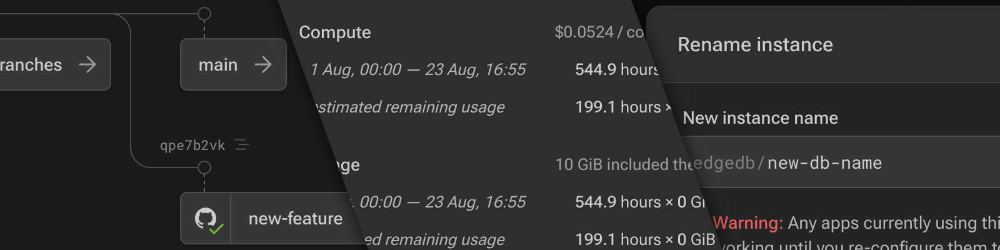

.. blog:published-on:: 2024-08-23 10:00 AM PST

======================================================================
New in Cloud: branch graph, updated billing page, and instance renames
======================================================================

We've recently added a bunch of updates to EdgeDB Cloud, including these few
highlights:

- A new branch graph that lets you visualise your database branches, just like
  Git, and allows you to easily navigate the migration history of any branch.
  If you have the GitHub integration installed, we now also show you which
  of your database branches are automatically mirroring your branches in 
  GitHub, showing you their sync status, and letting you jump straight to the
  associated PR.
- An updated billing page with an improved upcoming invoice section, which
  now gives a fine-grained breakdown of your current and estimated usage and
  costs for the month.
- Don't like the name of your cloud instance? You can now rename instances from
  the instance dashboard.
- The secret keys page has received a bit of a redesign to make it easier
  for you to manage your personal secret keys, logged in web and CLI sessions,
  and secret keys being used by installed integrations.

There have also been many other small bug fixes, and we've given some pages a
fresh coat of paint to make everything a little more consistent.
